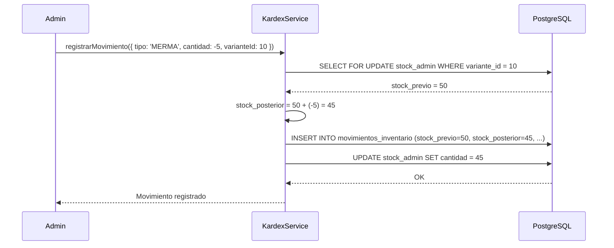
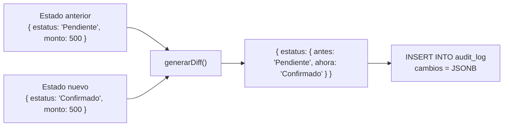

# Auditoria y Trazabilidad Forense

RazoConnect mantiene dos registros de auditoria paralelos e independientes: el Kardex para movimientos de inventario y el auditLogger para cambios en entidades de negocio. Ambos son append-only: ninguna entrada puede ser modificada ni eliminada despues de insertada.

---

## Tabla de Contenidos

- [Kardex — Movimientos de Inventario](#kardex--movimientos-de-inventario)
- [auditLogger — Diff Tracking](#auditlogger--diff-tracking)
- [Tipos de Eventos Registrados](#tipos-de-eventos-registrados)
- [Propiedades del Sistema de Auditoria](#propiedades-del-sistema-de-auditoria)
- [Casos de Uso Forense](#casos-de-uso-forense)

---

## Kardex — Movimientos de Inventario

El Kardex registra cada movimiento de inventario con el stock previo y posterior, formando un historial inmutable que permite reconstruir el estado del stock en cualquier momento del pasado.

El `SELECT FOR UPDATE` garantiza que no haya condiciones de carrera cuando dos operaciones intentan modificar el mismo stock simultaneamente. El stock previo se captura con el lock activo, el calculo se hace en memoria y el INSERT en `movimientos_inventario` y el UPDATE en `stock_admin` ocurren en la misma transaccion.

---

## auditLogger — Diff Tracking

El auditLogger genera un diff entre el estado anterior y el estado nuevo de cualquier entidad antes de persistir el cambio. Este diff se almacena en la columna `cambios` de la tabla `audit_log` como JSONB.

Solo se almacenan los campos que cambiaron. Un pedido con 20 campos del que solo cambia el estatus genera un log con un solo campo en el JSONB, no con los 20. Esto mantiene el volumen de los logs bajo control sin perder informacion.

---

## Tipos de Eventos Registrados

| Tipo | Descripcion |
|---|---|
| CREAR | Creacion de una nueva entidad (pedido, cliente, producto, etc.) |
| EDITAR | Modificacion de campos en una entidad existente; incluye diff |
| ELIMINAR | Eliminacion logica o fisica de una entidad |
| LOGIN | Inicio de sesion exitoso o fallido, con IP y agente de usuario |
| LOGOUT | Cierre de sesion |
| OTRO | Acciones que no encajan en las categorias anteriores (cambios de configuracion, exportaciones, etc.) |

---

## Propiedades del Sistema de Auditoria

**Append-only.** La tabla `audit_log` y la tabla `movimientos_inventario` no tienen operaciones de UPDATE ni DELETE en el codigo de aplicacion ni en los permisos de la base de datos. Una vez insertada, una entrada es permanente.

**No falla silenciosamente.** El auditLogger esta implementado con try/catch que captura errores del logging sin interrumpir el flujo principal. Si el logging falla (por ejemplo, por un problema transitorio de red con la base de datos), la operacion de negocio continua y el error se registra en `errores_sincronizacion` para revision posterior.

**Aislado por tenant.** Cada entrada en `audit_log` incluye `tenant_id`. Un administrador de un tenant solo puede ver los logs de su propio tenant.

**Incluye contexto completo.** Cada entrada registra: usuario, accion, tipo de recurso, id del recurso, cambios en JSONB, IP del cliente, timestamp en UTC y resultado de la operacion.

---

## Casos de Uso Forense

**Discrepancia de inventario.** Si el stock fisico no coincide con el stock teorico, el Kardex permite reconstruir exactamente cuando ocurrio la discrepancia, que operacion la genero, quien la ejecuto y desde que IP.

**Reclamo de cliente.** Si un cliente afirma que un pedido fue modificado sin su autorizacion, el `audit_log` muestra el diff completo del cambio, quien lo hizo y cuando.

**Auditoria regulatoria.** Los logs de los ultimos N anos pueden exportarse en formato estructurado para presentarlos a auditores externos. La propiedad append-only hace que los logs sean evidencia forense valida.

---

Desarrollado por Diego Ferram | xCore — 2025
