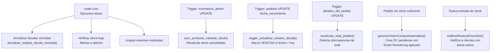
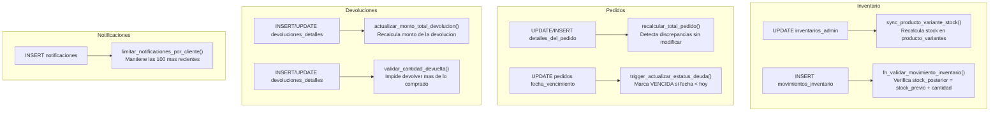
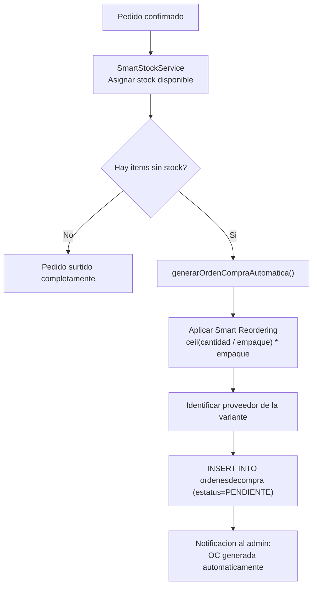

# Automatizaciones del Sistema / System Automations

🇲🇽 Español

RazoConnect automatiza una parte significativa de su operacion a traves de tres mecanismos que trabajan en paralelo: tareas programadas con node-cron, tareas de base de datos con pg_cron y triggers PL/pgSQL, y logica de aplicacion que genera acciones automaticas en respuesta a eventos de negocio.

---

## Tabla de Contenidos

- [Mapa de Automatizaciones](#mapa-de-automatizaciones)
- [Tareas Cron](#tareas-cron)
- [Triggers de Base de Datos](#triggers-de-base-de-datos)
- [Generacion Automatica de Ordenes de Compra](#generacion-automatica-de-ordenes-de-compra)
- [Notificaciones Automaticas](#notificaciones-automaticas)
- [OptimizationService](#optimizationservice)

---

## Mapa de Automatizaciones

---

## Tareas Cron

node-cron ejecuta `scheduleDailyMaintenance` una vez al dia. Esta funcion coordina las tareas de mantenimiento que deben ejecutarse en el contexto de la aplicacion.

| Tarea | Descripcion |
|---|---|
| Verificar stock bajo | Consulta variantes con stock por debajo del minimo configurado por tenant y crea notificaciones para los admins correspondientes |
| Limpiar sesiones expiradas | Elimina registros de sesion con fecha de expiracion anterior a la fecha actual |

Las tareas de deuda vencida y suspension de clientes se ejecutan directamente en PostgreSQL via pg_cron, sin pasar por la aplicacion. Ver [DATABASE_DESIGN.md](DATABASE_DESIGN.md) para el detalle de esas funciones.

---

## Triggers de Base de Datos

Los triggers de PostgreSQL son la forma mas confiable de garantizar consistencia porque se ejecutan dentro de la misma transaccion que la operacion que los dispara, sin posibilidad de ser omitidos.

---

## Generacion Automatica de Ordenes de Compra

Cuando un pedido de cliente no puede ser surtido completamente por falta de stock, el sistema genera automaticamente una orden de compra al proveedor correspondiente.

La orden de compra queda en estado PENDIENTE para que el administrador la revise y la convierta en una compra real al proveedor. El sistema no envia ordenes directamente a proveedores: genera el documento interno y notifica al responsable.

---

## Notificaciones Automaticas

El sistema genera notificaciones in-app automaticas en respuesta a los siguientes eventos:

| Evento | Destinatario | Tipo de Notificacion |
|---|---|---|
| Nueva entrada de stock en variante con alertas activas | Clientes con alerta en favoritos | restock |
| Cambio de estatus de pedido | Cliente dueno del pedido | actualizacion_pedido |
| Orden de compra generada automaticamente | Admins del tenant | oc_automatica |
| Stock por debajo del minimo | Admins del tenant | stock_bajo |
| Devolucion aprobada o rechazada | Cliente solicitante | devolucion_resultado |
| Deuda proxima a vencer | Cliente con credito activo | deuda_por_vencer |

---

## OptimizationService

El OptimizationService no genera acciones automaticas; genera sugerencias que el administrador puede aprobar. Analiza las ordenes de compra pendientes y detecta dos tipos de oportunidades:

**Consolidacion de ordenes.** Cuando hay multiples ordenes de compra pendientes para el mismo proveedor, calcula si consolidarlas en una sola orden reduce la cantidad total necesaria (considerando el empaque del proveedor) y cuanto ahorro representa.

**Deteccion de sobrestock potencial.** Si consolidar varias ordenes resultaria en un sobrestock significativo de alguna variante, el servicio lo indica para que el administrador ajuste las cantidades antes de aprobar.

La sugerencia incluye: ordenes involucradas, cantidad actual vs cantidad optimizada, ahorro estimado y el impacto en cada pedido de cliente pendiente.

---

Desarrollado por Fernando Ramírez | <a href="https://xcore-byg8fkdve4eyatbz.mexicocentral-01.azurewebsites.net/">xCore</a>

🇺🇸 English

RazoConnect automates a significant portion of its operation through three mechanisms working in parallel: scheduled tasks with node-cron, database tasks with pg_cron and PL/pgSQL triggers, and application logic that generates automatic actions in response to business events.

---

## Table of Contents

- [Automation Map](#automation-map)
- [Cron Tasks](#cron-tasks)
- [Database Triggers](#database-triggers)
- [Automatic Purchase Order Generation](#automatic-purchase-order-generation)
- [Automatic Notifications](#automatic-notifications)
- [OptimizationService](#optimizationservice-1)

---

## Automation Map

---

## Cron Tasks

node-cron executes `scheduleDailyMaintenance` once a day. This function coordinates the maintenance tasks that must run in the application context.

| Task | Description |
|---|---|
| Check low stock | Queries variants with stock below the tenant-configured minimum and creates notifications for the corresponding admins |
| Clean expired sessions | Removes session records with an expiration date prior to the current date |

The overdue debt and client suspension tasks run directly in PostgreSQL via pg_cron, without going through the application. See [DATABASE_DESIGN.md](DATABASE_DESIGN.md) for details on those functions.

---

## Database Triggers

PostgreSQL triggers are the most reliable way to guarantee consistency because they execute within the same transaction as the operation that triggers them, with no possibility of being omitted.

---

## Automatic Purchase Order Generation

When a client order cannot be fully fulfilled due to lack of stock, the system automatically generates a purchase order to the corresponding supplier.

The purchase order remains in PENDING state for the administrator to review and convert into a real purchase from the supplier. The system does not send orders directly to suppliers: it generates the internal document and notifies the responsible party.

---

## Automatic Notifications

The system generates automatic in-app notifications in response to the following events:

| Event | Recipient | Notification Type |
|---|---|---|
| New stock entry for variant with active alerts | Clients with favorite alert | restock |
| Order status change | Order owner client | actualizacion_pedido |
| Automatically generated purchase order | Tenant admins | oc_automatica |
| Stock below minimum | Tenant admins | stock_bajo |
| Return approved or rejected | Requesting client | devolucion_resultado |
| Debt about to expire | Client with active credit | deuda_por_vencer |

---

## OptimizationService

The OptimizationService does not generate automatic actions; it generates suggestions that the administrator can approve. It analyzes pending purchase orders and detects two types of opportunities:

**Order consolidation.** When there are multiple pending purchase orders for the same supplier, it calculates whether consolidating them into a single order reduces the total quantity needed (considering the supplier's packaging) and how much savings it represents.

**Potential overstock detection.** If consolidating several orders would result in significant overstock of any variant, the service indicates this so the administrator can adjust quantities before approving.

The suggestion includes: involved orders, current quantity vs. optimized quantity, estimated savings, and the impact on each pending client order.

---

Developed by Fernando Ramírez | <a href="https://xcore-byg8fkdve4eyatbz.mexicocentral-01.azurewebsites.net/">xCore</a>

