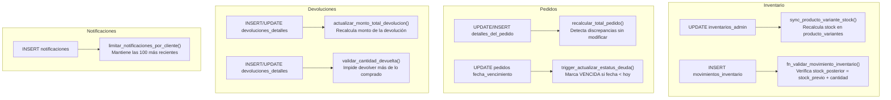
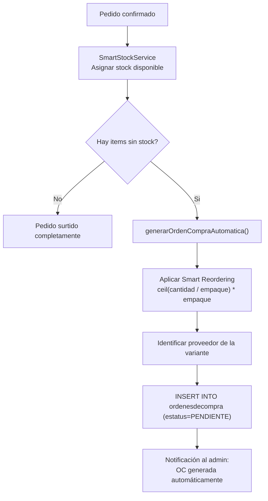
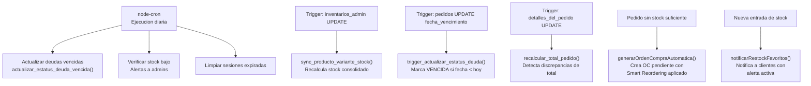

# Automatizaciones del Sistema / System Automations

<details open>
<summary>🇲🇽 Español</summary>

RazoConnect automatiza una parte significativa de su operación a través de tres mecanismos que trabajan en paralelo: tareas programadas con node-cron, tareas de base de datos con pg_cron y triggers PL/pgSQL, y lógica de aplicación que genera acciones automáticas en respuesta a eventos de negocio.

---

## Tabla de Contenidos

- [Mapa de Automatizaciones](#mapa-de-automatizaciones)
- [Tareas Cron](#tareas-cron)
- [Triggers de Base de Datos](#triggers-de-base-de-datos)
- [Generación Automática de Ordenes de Compra](#generación-automática-de-ordenes-de-compra)
- [Notificaciones Automáticas](#notificaciones-automáticas)
- [OptimizationService](#optimizationservice)

---

## Mapa de Automatizaciones


```mermaid
flowchart TD
    Cron["node-cron\nEjecución diaria"] --> D1["Actualizar deudas vencidas\nactualizar_estatus_deuda_vencida()"]
    Cron --> D2["Verificar stock bajo\nAlertas a admins"]
    Cron --> D3["Limpiar sesiones expiradas"]

    Trigger1["Trigger: inventarios_admin UPDATE"] --> T1["sync_producto_variante_stock()\nRecalcula stock consolidado"]

    Trigger2["Trigger: pedidos UPDATE fecha_vencimiento"] --> T2["trigger_actualizar_estatus_deuda()\nMarca VENCIDA si fecha < hoy"]

    Trigger3["Trigger: detalles_del_pedido UPDATE"] --> T3["recalcular_total_pedido()\nDetecta discrepancias de total"]

    Pedido["Pedido sin stock suficiente"] --> OC["generarOrdenCompraAutomatica()\nCrea OC pendiente con\nSmart Reordering aplicado"]

    Stock["Nueva entrada de stock"] --> Restock["notificarRestockFavoritos()\nNotifica a clientes con\nalerta activa"]
```

---

## Tareas Cron

node-cron ejecuta `scheduleDailyMaintenance` una vez al día. Esta función coordina las tareas de mantenimiento que deben ejecutarse en el contexto de la aplicación.

| Tarea | Descripción |
|---|---|
| Verificar stock bajo | Consulta variantes con stock por debajo del mínimo configurado por tenant y crea notificaciones para los admins correspondientes |
| Limpiar sesiones expiradas | Elimina registros de sesión con fecha de expiración anterior a la fecha actual |

### Tareas pg_cron Reales

Las tareas de deuda vencida y suspensión de clientes se ejecutan directamente en PostgreSQL via pg_cron, sin pasar por la aplicación. Esto garantiza que se ejecuten aunque la aplicación esté reiniciando.

```sql
-- Configuración real de pg_cron en RazoConnect

-- 1. Actualizar estado de deudas vencidas (diario a las 1:00 AM)
SELECT cron.schedule(
    'actualizar-deudas-vencidas',
    '0 1 * * *',
    $$SELECT actualizar_estatus_deuda_vencida()$$
);

-- 2. Suspender clientes morosos (diario a las 2:00 AM)
-- Suspende clientes con deuda vencida > 15 días y bloquea nuevo crédito
SELECT cron.schedule(
    'suspender-clientes-morosos',
    '0 2 * * *',
    $$SELECT suspender_clientes_morosos()$$
);

-- 3. Limpiar sesiones de inventario expiradas (diario a las 3:00 AM)
SELECT cron.schedule(
    'limpiar-sesiones-inventario',
    '0 3 * * *',
    $$
    DELETE FROM sesiones_inventario
    WHERE ultima_actividad < NOW() - INTERVAL '7 days'
    $$
);
```

```sql
-- Función suspender_clientes_morosos() — Lógica completa
CREATE OR REPLACE FUNCTION suspender_clientes_morosos()
RETURNS void AS $$
BEGIN
    -- Actualizar estado de crédito a SUSPENDIDO para clientes con deuda vencida > 15 días
    UPDATE cliente_creditos cc
    SET estatus = 'SUSPENDIDO',
        fecha_suspension = NOW(),
        motivo_suspension = 'Deuda vencida mayor a 15 días'
    FROM pedidos p
    WHERE cc.cliente_id = p.cliente_id
        AND p.estatus_pago = 'VENCIDO'
        AND p.fecha_vencimiento < NOW() - INTERVAL '15 days'
        AND cc.estatus = 'ACTIVO';

    -- Registrar en audit_log
    INSERT INTO audit_log (accion, tabla_afectada, descripcion, created_at)
    VALUES (
        'SUSPENSION_AUTOMATICA',
        'cliente_creditos',
        'Suspensión automática por pg_cron: clientes morosos > 15 días',
        NOW()
    );
END;
$$ LANGUAGE plpgsql;
```

Ver [DATABASE_DESIGN.md](DATABASE_DESIGN.md) para el detalle de esas funciones.

---

## Triggers de Base de Datos

Los triggers de PostgreSQL son la forma más confiable de garantizar consistencia porque se ejecutan dentro de la misma transacción que la operación que los dispara, sin posibilidad de ser omitidos.


```mermaid
flowchart TD
    subgraph Inventario
        I1["UPDATE inventarios_admin"] --> I2["sync_producto_variante_stock()\nRecalcula stock en producto_variantes"]
        I3["INSERT movimientos_inventario"] --> I4["fn_validar_movimiento_inventario()\nVerifica stock_posterior = stock_previo + cantidad"]
    end

    subgraph Pedidos
        P1["UPDATE/INSERT detalles_del_pedido"] --> P2["recalcular_total_pedido()\nDetecta discrepancias sin modificar"]
        P3["UPDATE pedidos fecha_vencimiento"] --> P4["trigger_actualizar_estatus_deuda()\nMarca VENCIDA si fecha < hoy"]
    end

    subgraph Devoluciones
        D1["INSERT/UPDATE devoluciones_detalles"] --> D2["actualizar_monto_total_devolucion()\nRecalcula monto de la devolución"]
        D3["INSERT/UPDATE devoluciones_detalles"] --> D4["validar_cantidad_devuelta()\nImpide devolver más de lo comprado"]
    end

    subgraph Notificaciones
        N1["INSERT notificaciones"] --> N2["limitar_notificaciones_por_cliente()\nMantiene las 100 más recientes"]
    end
```

---

## Generación Automática de Órdenes de Compra

Cuando un pedido de cliente no puede ser surtido completamente por falta de stock, el sistema genera automáticamente una orden de compra al proveedor correspondiente.


```mermaid
flowchart TD
    Pedido["Pedido confirmado"] --> Stock["SmartStockService\nAsignar stock disponible"]
    Stock --> Backorder{"Hay items sin stock?"}
    Backorder -->|No| Completo["Pedido surtido completamente"]
    Backorder -->|Si| OC["generarOrdenCompraAutomatica()"]
    OC --> Smart["Aplicar Smart Reordering\nceil(cantidad / empaque) * empaque"]
    Smart --> Proveedor["Identificar proveedor de la variante"]
    Proveedor --> Insert["INSERT INTO ordenesdecompra (estatus=PENDIENTE)"]
    Insert --> Notif["Notificación al admin:\nOC generada automáticamente"]
```

La orden de compra queda en estado PENDIENTE para que el administrador la revise y la convierta en una compra real al proveedor. El sistema no envía órdenes directamente a proveedores: genera el documento interno y notifica al responsable.

---

## Notificaciones Automáticas

El sistema genera notificaciones in-app automáticas en respuesta a los siguientes eventos:

| Evento | Destinatario | Tipo de Notificación |
|---|---|---|
| Nueva entrada de stock en variante con alertas activas | Clientes con alerta en favoritos | restock |
| Cambio de estatus de pedido | Cliente dueño del pedido | actualizacion_pedido |
| Orden de compra generada automáticamente | Admins del tenant | oc_automatica |
| Stock por debajo del mínimo | Admins del tenant | stock_bajo |
| Devolución aprobada o rechazada | Cliente solicitante | devolucion_resultado |
| Deuda próxima a vencer | Cliente con crédito activo | deuda_por_vencer |

---

## OptimizationService

El OptimizationService no genera acciones automáticas; genera sugerencias que el administrador puede aprobar. Analiza las órdenes de compra pendientes y detecta dos tipos de oportunidades:

**Consolidación de órdenes.** Cuando hay múltiples órdenes de compra pendientes para el mismo proveedor, calcula si consolidarlas en una sola orden reduce la cantidad total necesaria (considerando el empaque del proveedor) y cuánto ahorro representa.

**Detección de sobrestock potencial.** Si consolidar varias órdenes resultaría en un sobrestock significativo de alguna variante, el servicio lo indica para que el administrador ajuste las cantidades antes de aprobar.

La sugerencia incluye: órdenes involucradas, cantidad actual vs cantidad optimizada, ahorro estimado y el impacto en cada pedido de cliente pendiente.

---

Desarrollado por Fernando Ramírez | <a href="https://xcore-byg8fkdve4eyatbz.mexicocentral-01.azurewebsites.net/">xCore</a>

</details>

<details>
<summary>🇺🇸 English</summary>

RazoConnect automates a significant portion of its operation through three mechanisms working in parallel: scheduled tasks with node-cron, database tasks with pg_cron and PL/pgSQL triggers, and application logic that generates automatic actions in response to business events.

---

## Table of Contents

- [Automation Map](#automation-map)
- [Cron Tasks](#cron-tasks)
- [Database Triggers](#database-triggers)
- [Automatic Purchase Order Generation](#automatic-purchase-order-generation)
- [Automatic Notifications](#automatic-notifications)
- [OptimizationService](#optimizationservice-1)

---

## Automation Map


```mermaid
flowchart TD
    Cron["node-cron\nEjecucion diaria"] --> D1["Actualizar deudas vencidas\nactualizar_estatus_deuda_vencida()"]
    Cron --> D2["Verificar stock bajo\nAlertas a admins"]
    Cron --> D3["Limpiar sesiones expiradas"]

    Trigger1["Trigger: inventarios_admin UPDATE"] --> T1["sync_producto_variante_stock()\nRecalcula stock consolidado"]

    Trigger2["Trigger: pedidos UPDATE fecha_vencimiento"] --> T2["trigger_actualizar_estatus_deuda()\nMarca VENCIDA si fecha < hoy"]

    Trigger3["Trigger: detalles_del_pedido UPDATE"] --> T3["recalcular_total_pedido()\nDetecta discrepancias de total"]

    Pedido["Pedido sin stock suficiente"] --> OC["generarOrdenCompraAutomatica()\nCrea OC pendiente con\nSmart Reordering aplicado"]

    Stock["Nueva entrada de stock"] --> Restock["notificarRestockFavoritos()\nNotifica a clientes con\nalerta activa"]
```

---

## Cron Tasks

node-cron executes `scheduleDailyMaintenance` once a day. This function coordinates the maintenance tasks that must run in the application context.

| Task | Description |
|---|---|
| Check low stock | Queries variants with stock below the tenant-configured minimum and creates notifications for the corresponding admins |
| Clean expired sessions | Removes session records with an expiration date prior to the current date |

The overdue debt and client suspension tasks run directly in PostgreSQL via pg_cron, without going through the application. See [DATABASE_DESIGN.md](DATABASE_DESIGN.md) for details on those functions.

---

## Database Triggers

PostgreSQL triggers are the most reliable way to guarantee consistency because they execute within the same transaction as the operation that triggers them, with no possibility of being omitted.


```mermaid
flowchart TD
    subgraph Inventario
        I1["UPDATE inventarios_admin"] --> I2["sync_producto_variante_stock()\nRecalcula stock en producto_variantes"]
        I3["INSERT movimientos_inventario"] --> I4["fn_validar_movimiento_inventario()\nVerifica stock_posterior = stock_previo + cantidad"]
    end

    subgraph Pedidos
        P1["UPDATE/INSERT detalles_del_pedido"] --> P2["recalcular_total_pedido()\nDetecta discrepancias sin modificar"]
        P3["UPDATE pedidos fecha_vencimiento"] --> P4["trigger_actualizar_estatus_deuda()\nMarca VENCIDA si fecha < hoy"]
    end

    subgraph Devoluciones
        D1["INSERT/UPDATE devoluciones_detalles"] --> D2["actualizar_monto_total_devolucion()\nRecalcula monto de la devolucion"]
        D3["INSERT/UPDATE devoluciones_detalles"] --> D4["validar_cantidad_devuelta()\nImpide devolver mas de lo comprado"]
    end

    subgraph Notificaciones
        N1["INSERT notificaciones"] --> N2["limitar_notificaciones_por_cliente()\nMantiene las 100 mas recientes"]
    end
```

---

## Automatic Purchase Order Generation

When a client order cannot be fully fulfilled due to lack of stock, the system automatically generates a purchase order to the corresponding supplier.


```mermaid
flowchart TD
    Pedido["Pedido confirmado"] --> Stock["SmartStockService\nAsignar stock disponible"]
    Stock --> Backorder{"Hay items sin stock?"}
    Backorder -->|No| Completo["Pedido surtido completamente"]
    Backorder -->|Si| OC["generarOrdenCompraAutomatica()"]
    OC --> Smart["Aplicar Smart Reordering\nceil(cantidad / empaque) * empaque"]
    Smart --> Proveedor["Identificar proveedor de la variante"]
    Proveedor --> Insert["INSERT INTO ordenesdecompra (estatus=PENDIENTE)"]
    Insert --> Notif["Notificacion al admin:\nOC generada automaticamente"]
```

The purchase order remains in PENDING state for the administrator to review and convert into a real purchase from the supplier. The system does not send orders directly to suppliers: it generates the internal document and notifies the responsible party.

---

## Automatic Notifications

The system generates automatic in-app notifications in response to the following events:

| Event | Recipient | Notification Type |
|---|---|---|
| New stock entry for variant with active alerts | Clients with favorite alert | restock |
| Order status change | Order owner client | actualizacion_pedido |
| Automatically generated purchase order | Tenant admins | oc_automatica |
| Stock below minimum | Tenant admins | stock_bajo |
| Return approved or rejected | Requesting client | devolucion_resultado |
| Debt about to expire | Client with active credit | deuda_por_vencer |

---

## OptimizationService

The OptimizationService does not generate automatic actions; it generates suggestions that the administrator can approve. It analyzes pending purchase orders and detects two types of opportunities:

**Order consolidation.** When there are multiple pending purchase orders for the same supplier, it calculates whether consolidating them into a single order reduces the total quantity needed (considering the supplier's packaging) and how much savings it represents.

**Potential overstock detection.** If consolidating several orders would result in significant overstock of any variant, the service indicates this so the administrator can adjust quantities before approving.

The suggestion includes: involved orders, current quantity vs. optimized quantity, estimated savings, and the impact on each pending client order.

---

Developed by Fernando Ramírez | <a href="https://xcore-byg8fkdve4eyatbz.mexicocentral-01.azurewebsites.net/">xCore</a>

</details>
