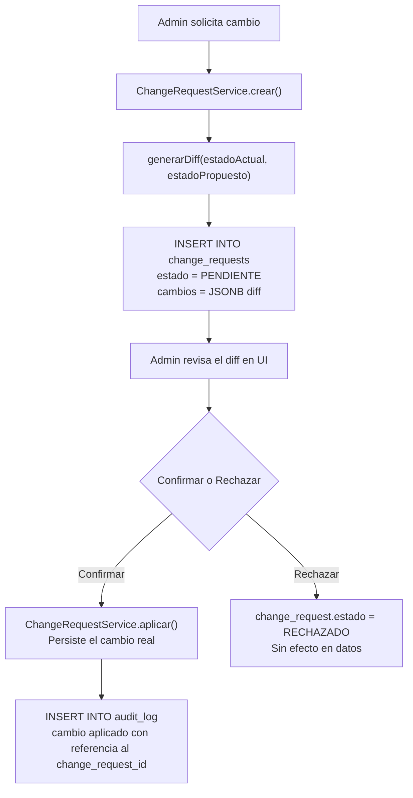

# Control de Cambios Auditado — ChangeRequestService / Audited Change Control — ChangeRequestService

<details open>
<summary>🇲🇽 Español</summary>

RazoConnect implementa un patrón de control de cambios donde las modificaciones críticas no se aplican directamente a la base de datos. En su lugar, se registran primero como solicitudes de cambio con un diff del estado anterior y el estado propuesto, y solo se persisten despues de una confirmación explicita.

---

## Tabla de Contenidos

- [Por Que Existe Este Patrón](#por-que-existe-este-patrón)
- [Flujo General](#flujo-general)
- [Estructura de la Tabla change_requests](#estructura-de-la-tabla-change_requests)
- [Propiedades del Sistema](#propiedades-del-sistema)
- [Casos de Uso](#casos-de-uso)

---

## Por Que Existe Este Patrón

Las operaciones críticas de negocio — ajustar el limite de crédito de un cliente, cambiar el precio de un producto, modificar el esquema de comision de un agente — tienen consecuencias financieras directas. Un error de escritura o una acción accidental no deberia ser irreversible. El ChangeRequestService crea un punto de confirmación obligatorio antes de que cualquier cambio de este tipo se aplique.

---

## Flujo General



---

## Estructura de la Tabla change_requests

```sql
CREATE TABLE change_requests (
    request_id    SERIAL PRIMARY KEY,
    tenant_id     INTEGER NOT NULL,
    entidad       VARCHAR(50) NOT NULL,   -- 'cliente_credito', 'producto_precio', etc.
    entidad_id    INTEGER NOT NULL,
    cambios       JSONB NOT NULL,         -- { campo: { antes: valor, despues: valor } }
    estado        VARCHAR(20) NOT NULL DEFAULT 'PENDIENTE',
    solicitado_por INTEGER NOT NULL,      -- usuario que pidio el cambio
    aplicado_por  INTEGER,               -- usuario que confirmo
    created_at    TIMESTAMP DEFAULT NOW(),
    applied_at    TIMESTAMP
);
```

---

## Propiedades del Sistema

- Los diffs solo almacenan los campos que cambian, no el objeto completo
- Un change_request PENDIENTE puede ser rechazado sin efecto en datos
- Cada aplicación genera automáticamente un registro en audit_log con referencia al change_request_id
- Los change_requests son inmutables una vez aplicados o rechazados

---

## Casos de Uso

- Modificación de limite de crédito de cliente
- Cambio de precio de producto activo con pedidos pendientes
- Ajuste de esquema de comision de agente con comisiones en curso

---

Desarrollado por Fernando Ramírez | <a href="https://xcore-byg8fkdve4eyatbz.mexicocentral-01.azurewebsites.net/">xCore</a>

</details>

<details>
<summary>🇺🇸 English</summary>

RazoConnect implements a change control pattern where critical modifications are not applied directly to the database. Instead, they are first recorded as change requests with a diff of the previous state and the proposed state, and only persisted after an explicit confirmation.

---

## Table of Contents

- [Why This Pattern Exists](#why-this-pattern-exists)
- [General Flow](#general-flow)
- [change_requests Table Structure](#change_requests-table-structure)
- [System Properties](#system-properties)
- [Use Cases](#use-cases)

---

## Why This Pattern Exists

Critical business operations — adjusting a client's credit limit, changing a product's price, modifying an agent's commission scheme — have direct financial consequences. A typo or an accidental action should not be irreversible. The ChangeRequestService creates a mandatory confirmation checkpoint before any such change is applied.

---

## General Flow


---

## change_requests Table Structure

```sql
CREATE TABLE change_requests (
    request_id    SERIAL PRIMARY KEY,
    tenant_id     INTEGER NOT NULL,
    entidad       VARCHAR(50) NOT NULL,   -- 'cliente_credito', 'producto_precio', etc.
    entidad_id    INTEGER NOT NULL,
    cambios       JSONB NOT NULL,         -- { campo: { antes: valor, despues: valor } }
    estado        VARCHAR(20) NOT NULL DEFAULT 'PENDIENTE',
    solicitado_por INTEGER NOT NULL,      -- usuario que pidio el cambio
    aplicado_por  INTEGER,               -- usuario que confirmo
    created_at    TIMESTAMP DEFAULT NOW(),
    applied_at    TIMESTAMP
);
```

---

## System Properties

- Diffs only store the fields that change, not the entire object
- A PENDING change_request can be rejected with no effect on data
- Each application automatically generates a record in audit_log with a reference to the change_request_id
- change_requests are immutable once applied or rejected

---

## Use Cases

- Client credit limit modification
- Price change for an active product with pending orders
- Agent commission scheme adjustment with ongoing commissions

---

Developed by Fernando Ramírez | <a href="https://xcore-byg8fkdve4eyatbz.mexicocentral-01.azurewebsites.net/">xCore</a>

</details>
