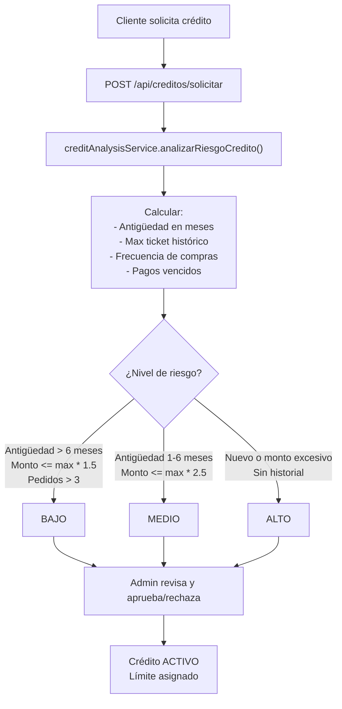
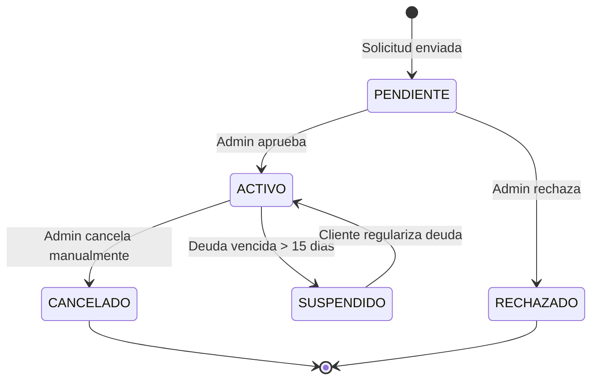
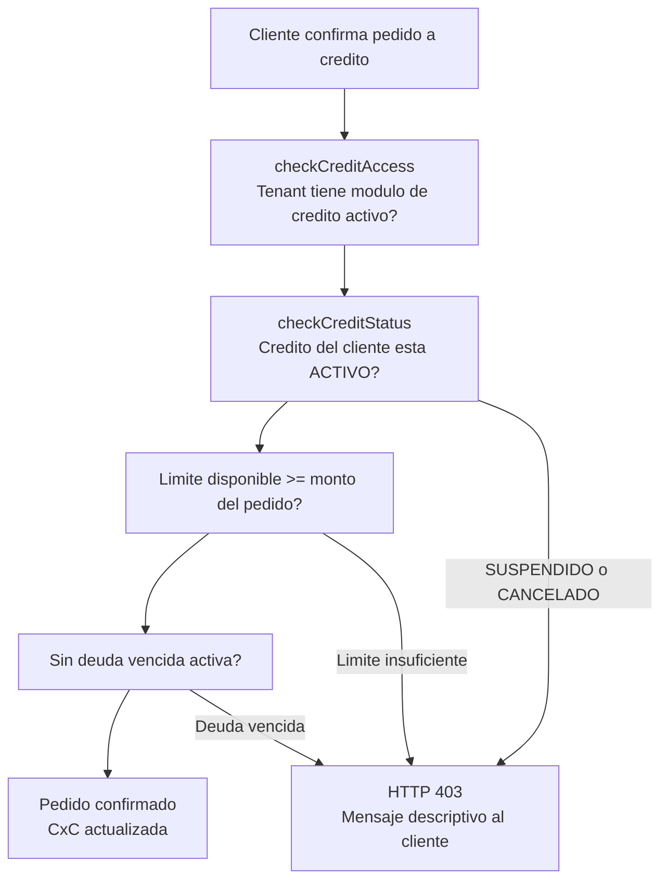

# Sistema de Credito y Devoluciones

RazoConnect incluye un modulo de credito completo que cubre el ciclo de vida desde la solicitud hasta la suspension, y un modulo RMA (Return Merchandise Authorization) para gestionar devoluciones con reintegro automatico de inventario y ajuste de cuentas por cobrar.

---

## Tabla de Contenidos

- [Flujo de Solicitud de Credito](#flujo-de-solicitud-de-credito)
- [Scoring de Riesgo Crediticio](#scoring-de-riesgo-crediticio)
- [Estados del Credito](#estados-del-credito)
- [Middleware checkCreditStatus](#middleware-checkcreditstatus)
- [Flujo RMA — Devoluciones](#flujo-rma--devoluciones)

---

## Flujo de Solicitud de Credito

El sistema genera una recomendacion automatica pero no aprueba ni rechaza de forma autonoma. El administrador siempre tiene la decision final. Esto preserva el control humano sobre compromisos financieros mientras elimina el trabajo manual de recopilar y calcular los factores de riesgo.

---

## Scoring de Riesgo Crediticio

El `creditAnalysisService` evalua cuatro factores del historial del cliente para calcular un nivel de riesgo.

| Factor | Indicador de Riesgo Bajo | Indicador de Riesgo Alto |
|---|---|---|
| Antiguedad en la plataforma | Mas de 6 meses | Menos de 1 mes |
| Frecuencia de compras | Mas de 3 pedidos al mes | Sin historial de pedidos |
| Monto solicitado vs max historico | Dentro de 1.5x el maximo historico | Mas de 2.5x el maximo historico |
| Pagos vencidos | Sin deudas vencidas | Deuda activa o historial de incumplimiento |

Un cliente con riesgo BAJO puede ver aprobado su credito rapidamente. Un cliente con riesgo ALTO probablemente sea rechazado, aunque el administrador puede override la recomendacion con justificacion.

---

## Estados del Credito

| Estado | Descripcion |
|---|---|
| ACTIVO | El cliente puede realizar pedidos a credito dentro de su limite |
| SUSPENDIDO | Credito bloqueado automaticamente por deuda vencida; se reactiva al regularizar |
| CANCELADO | Credito cancelado permanentemente por el administrador |

La suspension automatica es ejecutada por la funcion PL/pgSQL `suspender_clientes_morosos()` que corre diariamente via pg_cron.

---

## Middleware checkCreditStatus

Antes de confirmar un pedido con pago a credito, el middleware `checkCreditStatus` verifica:

---

## Flujo RMA — Devoluciones

El modulo de devoluciones implementa un flujo RMA completo con cuatro validaciones antes de crear la solicitud y procesamiento automatico al ser aprobada por el administrador.

Al aprobar una devolucion, el sistema ejecuta las cuatro acciones de forma atomica dentro de una transaccion. Si cualquiera de ellas falla (por ejemplo, el reintegro de inventario), la transaccion completa se revierte y la devolucion permanece en estado PENDIENTE con el error registrado.

---

Desarrollado por Fernando Ramírez | <a href="https://xcore-byg8fkdve4eyatbz.mexicocentral-01.azurewebsites.net/">xCore</a>
