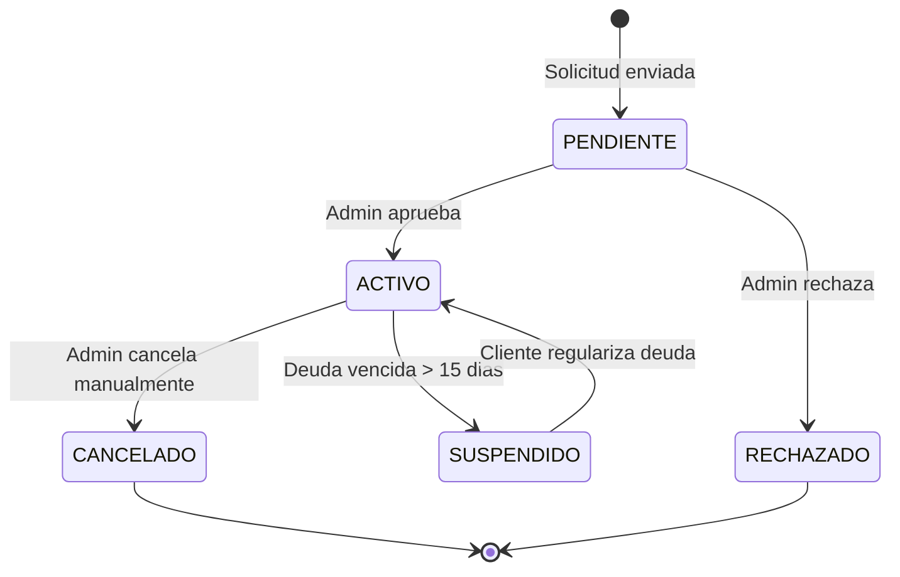
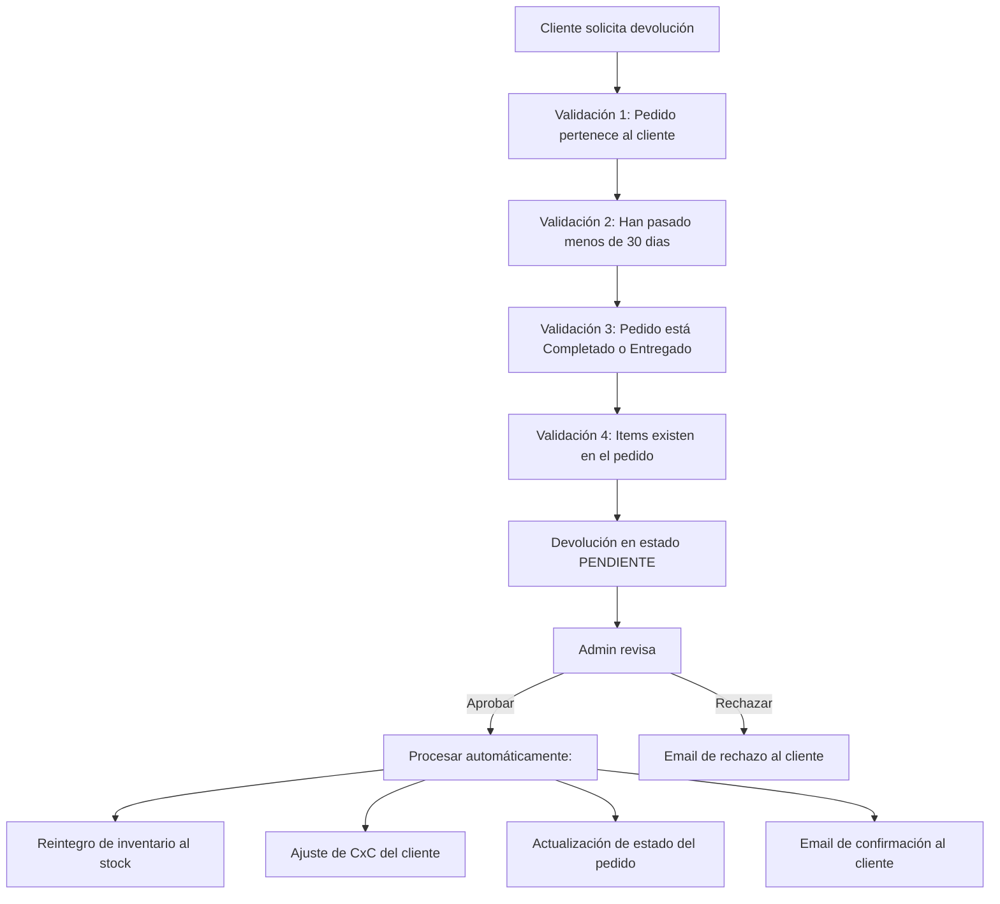
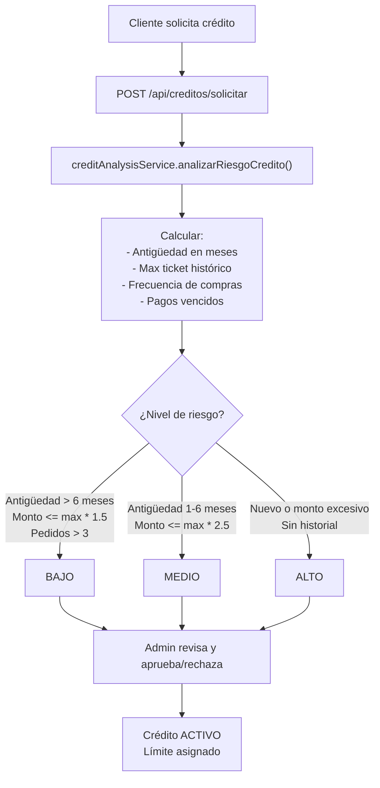
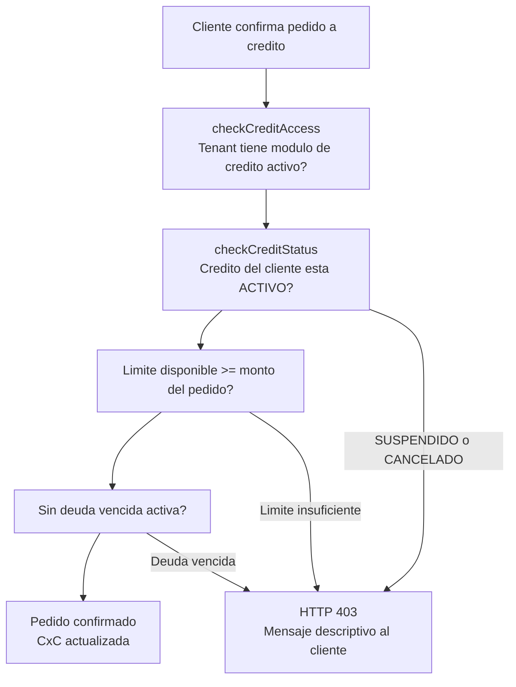
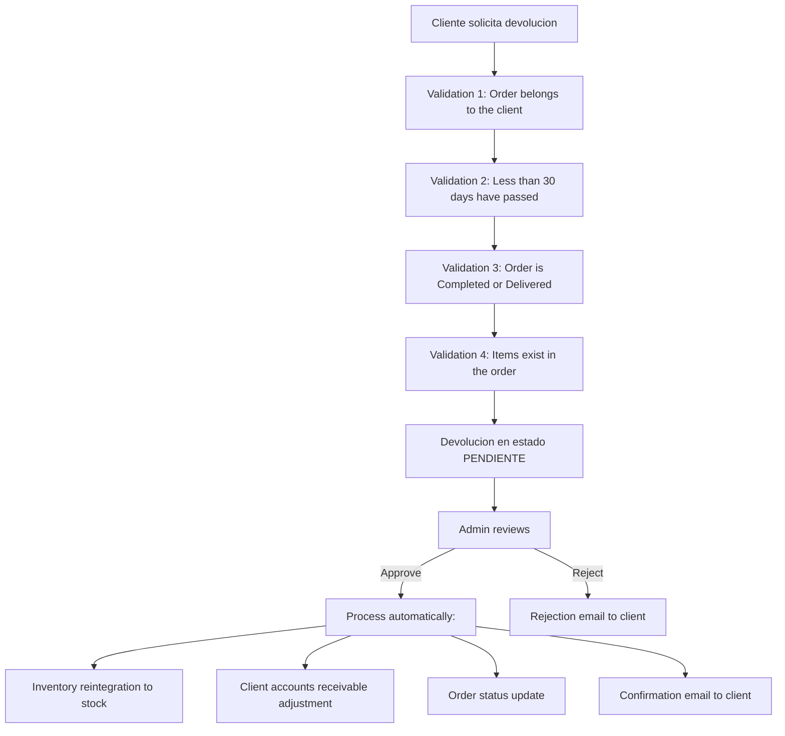

# Sistema de Credito y Devoluciones / Credit and Returns System

🇲🇽 Español

RazoConnect incluye un módulo de crédito completo que cubre el ciclo de vida desde la solicitud hasta la suspensión, y un módulo RMA (Return Merchandise Authorization) para gestionar devoluciones con reintegro automático de inventario y ajuste de cuentas por cobrar.

---

## Tabla de Contenidos

- [Flujo de Solicitud de Crédito](#flujo-de-solicitud-de-crédito)
- [Scoring de Riesgo Crediticio](#scoring-de-riesgo-crediticio)
- [Estados del Crédito](#estados-del-crédito)
- [Middleware checkCreditStatus](#middleware-checkcreditstatus)
- [Flujo RMA — Devoluciones](#flujo-rma--devoluciones)

---

## Flujo de Solicitud de Crédito

```mermaid
flowchart TD
    Cliente["Cliente solicita crédito"] --> Solicitud["POST /api/créditos/solicitar"]
    Solicitud --> Análisis["creditAnalysisService.analizarRiesgoCredito()"]
    Análisis --> Factores["Calcular:\n- Antigüedad en meses\n- Max ticket histórico\n- Frecuencia de compras\n- Pagos vencidos"]
    Factores --> Nivel{"¿Nivel de riesgo?"}
    
    Nivel -->|"Antigüedad > 6 meses\nMonto <= max * 1.5\nPedidos > 3"| Bajo["BAJO"]
    Nivel -->|"Antigüedad 1-6 meses\nMonto <= max * 2.5"| Medio["MEDIO"]
    Nivel -->|"Nuevo o monto excesivo\nSin historial"| Alto["ALTO"]
    
    Bajo --> Admin["Admin revisa y aprueba/rechaza"]
    Medio --> Admin
    Alto --> Admin
    
    Admin --> Aprobado["Crédito ACTIVO\nLímite asignado"]
```

El sistema genera una recomendación automática pero no aprueba ni rechaza de forma autónoma. El administrador siempre tiene la decisión final. Esto preserva el control humano sobre compromisos financieros mientras elimina el trabajo manual de recopilar y calcular los factores de riesgo.

---

## Scoring de Riesgo Crediticio

El `creditAnalysisService` evalua cuatro factores del historial del cliente para calcular un nivel de riesgo.

| Factor | Indicador de Riesgo Bajo | Indicador de Riesgo Alto |
|---|---|---|
| Antigüedad en la plataforma | Más de 6 meses | Menos de 1 mes |
| Frecuencia de compras | Más de 3 pedidos al mes | Sin historial de pedidos |
| Monto solicitado vs max histórico | Dentro de 1.5x el máximo histórico | Más de 2.5x el máximo histórico |
| Pagos vencidos | Sin deudas vencidas | Deuda activa o historial de incumplimiento |

Un cliente con riesgo BAJO puede ver aprobado su crédito rápidamente. Un cliente con riesgo ALTO probablemente sea rechazado, aunque el administrador puede override la recomendación con justificación.

---

## Estados del Crédito

```mermaid
stateDiagram-v2
    [*] --> PENDIENTE : Solicitud enviada
    PENDIENTE --> ACTIVO : Admin aprueba
    PENDIENTE --> RECHAZADO : Admin rechaza
    ACTIVO --> SUSPENDIDO : Deuda vencida > 15 dias
    SUSPENDIDO --> ACTIVO : Cliente regulariza deuda
    ACTIVO --> CANCELADO : Admin cancela manualmente
    CANCELADO --> [*]
    RECHAZADO --> [*]
```

| Estado | Descripción |
|---|---|
| ACTIVO | El cliente puede realizar pedidos a crédito dentro de su límite |
| SUSPENDIDO | Crédito bloqueado automáticamente por deuda vencida; se reactiva al regularizar |
| CANCELADO | Crédito cancelado permanentemente por el administrador |

La suspensión automática es ejecutada por la función PL/pgSQL `suspender_clientes_morosos()` que corre diariamente via pg_cron.

---

## Middleware checkCreditStatus

Antes de confirmar un pedido con pago a crédito, el middleware `checkCreditStatus` verifica:

```mermaid
flowchart TD
    Pedido["Cliente confirma pedido a crédito"] --> C1["checkCreditAccess\nTenant tiene módulo de crédito activo?"]
    C1 --> C2["checkCreditStatus\nCrédito del cliente está ACTIVO?"]
    C2 --> C3["Limite disponible >= monto del pedido?"]
    C3 --> C4["Sin deuda vencida activa?"]
    C4 --> Confirmado["Pedido confirmado\nCxC actualizada"]
    C2 -->|"SUSPENDIDO o CANCELADO"| Rechazo["HTTP 403\nMensaje descriptivo al cliente"]
    C3 -->|"Limite insuficiente"| Rechazo
    C4 -->|"Deuda vencida"| Rechazo
```

---

## Flujo RMA — Devoluciones

El módulo de devoluciones implementa un flujo RMA completo con cuatro validaciones antes de crear la solicitud y procesamiento automático al ser aprobada por el administrador.

```mermaid
flowchart TD
    Cliente["Cliente solicita devolución"] --> V1["Validación 1: Pedido pertenece al cliente"]
    V1 --> V2["Validación 2: Han pasado menos de 30 dias"]
    V2 --> V3["Validación 3: Pedido está Completado o Entregado"]
    V3 --> V4["Validación 4: Items existen en el pedido"]
    V4 --> Pendiente["Devolución en estado PENDIENTE"]
    Pendiente --> Admin["Admin revisa"]
    Admin -->|"Aprobar"| Proceso["Procesar automáticamente:"]
    Proceso --> I1["Reintegro de inventario al stock"]
    Proceso --> I2["Ajuste de CxC del cliente"]
    Proceso --> I3["Actualización de estado del pedido"]
    Proceso --> I4["Email de confirmación al cliente"]
    Admin -->|"Rechazar"| Rechazo["Email de rechazo al cliente"]
```

Al aprobar una devolución, el sistema ejecuta las cuatro acciones de forma atómica dentro de una transacción. Si cualquiera de ellas falla (por ejemplo, el reintegro de inventario), la transacción completa se revierte y la devolución permanece en estado PENDIENTE con el error registrado.

---

Desarrollado por Fernando Ramírez | <a href="https://xcore-byg8fkdve4eyatbz.mexicocentral-01.azurewebsites.net/">xCore</a>

🇺🇸 English

RazoConnect includes a complete credit module that covers the lifecycle from request to suspension, and an RMA (Return Merchandise Authorization) module to manage returns with automatic inventory reintegration and accounts receivable adjustment.

---

## Table of Contents

- [Credit Request Flow](#credit-request-flow)
- [Credit Risk Scoring](#credit-risk-scoring)
- [Credit States](#credit-states)
- [checkCreditStatus Middleware](#checkcreditstatus-middleware)
- [RMA Flow — Returns](#rma-flow--returns)

---

## Credit Request Flow

```mermaid
flowchart TD
    Cliente["Cliente solicita crédito"] --> Solicitud["POST /api/creditos/solicitar"]
    Solicitud --> Analisis["creditAnalysisService.analizarRiesgoCredito()"]
    Analisis --> Factores["Calcular:\n- Antigüedad en meses\n- Max ticket histórico\n- Frecuencia de compras\n- Pagos vencidos"]
    Factores --> Nivel{"¿Nivel de riesgo?"}
    
    Nivel -->|"Antigüedad > 6 meses\nMonto <= max * 1.5\nPedidos > 3"| Bajo["BAJO"]
    Nivel -->|"Antigüedad 1-6 meses\nMonto <= max * 2.5"| Medio["MEDIO"]
    Nivel -->|"Nuevo o monto excesivo\nSin historial"| Alto["ALTO"]
    
    Bajo --> Admin["Admin revisa y aprueba/rechaza"]
    Medio --> Admin
    Alto --> Admin
    
    Admin --> Aprobado["Crédito ACTIVO\nLímite asignado"]
```

The system generates an automatic recommendation but does not approve or reject autonomously. The administrator always has the final decision. This preserves human control over financial commitments while eliminating the manual work of gathering and calculating risk factors.

---

## Credit Risk Scoring

The `creditAnalysisService` evaluates four factors from the client's history to calculate a risk level.

| Factor | Low Risk Indicator | High Risk Indicator |
|---|---|---|
| Time on the platform | More than 6 months | Less than 1 month |
| Purchase frequency | More than 3 orders per month | No order history |
| Requested amount vs historical max | Within 1.5x the historical maximum | More than 2.5x the historical maximum |
| Overdue payments | No overdue debts | Active debt or history of non-payment |

A client with LOW risk can have their credit approved quickly. A client with HIGH risk will likely be rejected, although the administrator can override the recommendation with justification.

---

## Credit States

```mermaid
stateDiagram-v2
    [*] --> PENDIENTE : Solicitud enviada
    PENDIENTE --> ACTIVO : Admin aprueba
    PENDIENTE --> RECHAZADO : Admin rechaza
    ACTIVO --> SUSPENDIDO : Deuda vencida > 15 dias
    SUSPENDIDO --> ACTIVO : Cliente regulariza deuda
    ACTIVO --> CANCELADO : Admin cancela manualmente
    CANCELADO --> [*]
    RECHAZADO --> [*]
```

| State | Description |
|---|---|
| ACTIVO | The client can place credit orders within their limit |
| SUSPENDIDO | Credit automatically blocked due to overdue debt; reactivated upon regularization |
| CANCELADO | Credit permanently cancelled by the administrator |

Automatic suspension is executed by the PL/pgSQL function `suspender_clientes_morosos()` which runs daily via pg_cron.

---

## checkCreditStatus Middleware

Before confirming an order with credit payment, the `checkCreditStatus` middleware verifies:

```mermaid
flowchart TD
    Pedido["Cliente confirma pedido a credito"] --> C1["checkCreditAccess\nTenant tiene modulo de credito activo?"]
    C1 --> C2["checkCreditStatus\nCredito del cliente esta ACTIVO?"]
    C2 --> C3["Limite disponible >= monto del pedido?"]
    C3 --> C4["Sin deuda vencida activa?"]
    C4 --> Confirmado["Pedido confirmado\nCxC actualizada"]
    C2 -->|"SUSPENDIDO o CANCELADO"| Rechazo["HTTP 403\nMensaje descriptivo al cliente"]
    C3 -->|"Limite insuficiente"| Rechazo
    C4 -->|"Deuda vencida"| Rechazo
```

---

## RMA Flow — Returns

The returns module implements a complete RMA flow with four validations before creating the request and automatic processing when approved by the administrator.

```mermaid
flowchart TD
    Cliente["Cliente solicita devolucion"] --> V1["Validation 1: Order belongs to the client"]
    V1 --> V2["Validation 2: Less than 30 days have passed"]
    V2 --> V3["Validation 3: Order is Completed or Delivered"]
    V3 --> V4["Validation 4: Items exist in the order"]
    V4 --> Pendiente["Devolucion en estado PENDIENTE"]
    Pendiente --> Admin["Admin reviews"]
    Admin -->|"Approve"| Proceso["Process automatically:"]
    Proceso --> I1["Inventory reintegration to stock"]
    Proceso --> I2["Client accounts receivable adjustment"]
    Proceso --> I3["Order status update"]
    Proceso --> I4["Confirmation email to client"]
    Admin -->|"Reject"| Rechazo["Rejection email to client"]
```

When approving a return, the system executes all four actions atomically within a transaction. If any of them fails (for example, the inventory reintegration), the entire transaction is rolled back and the return remains in PENDING state with the error recorded.

---

Developed by Fernando Ramírez | <a href="https://xcore-byg8fkdve4eyatbz.mexicocentral-01.azurewebsites.net/">xCore</a>

