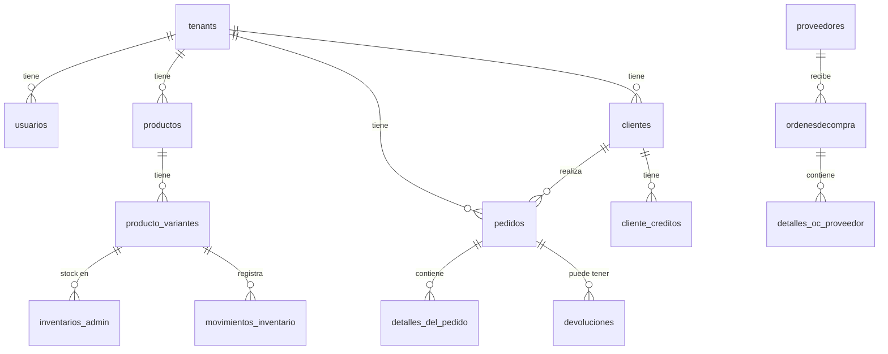
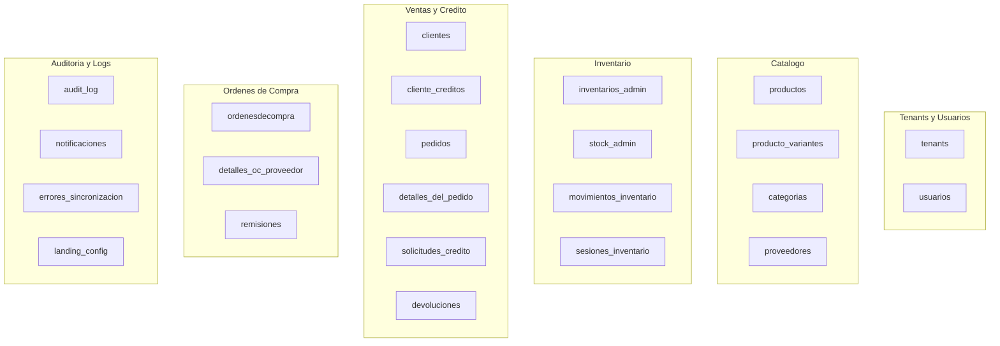

# Diseno de Base de Datos / Database Design

🇲🇽 Español

RazoConnect utiliza PostgreSQL como único motor de base de datos. El schema está organizado en seis dominios funcionales con más de 20 tablas, 20+ funciones PL/pgSQL, 10+ triggers y tareas diarias via pg_cron. La base de datos no es un almacen pasivo: válida, sincroniza y mantiene la consistencia de los datos de forma autonoma.

---

## Tabla de Contenidos

- [Dominios y Tablas](#dominios-y-tablas)
- [Diagrama ER](#diagrama-er)
- [Funciones PL/pgSQL](#funciones-plpgsql)
- [Triggers Automáticos](#triggers-automáticos)
- [Tareas pg_cron](#tareas-pgcron)
- [Decisiones de Diseño](#decisiones-de-diseño)

---

## Dominios y Tablas

El schema está dividido en seis dominios que agrupan tablas por responsabilidad funcional.

---

## Diagrama ER

Las relaciones principales entre dominios muestran como `tenants` es el nodo central del que dependen todas las entidades de negocio.

---

## Funciones PL/pgSQL

Las funciones de base de datos encapsulan lógica crítica que no debe depender del código de aplicación para garantizar consistencia.

| Función | Descripción |
|---|---|
| `actualizar_estatus_deuda_vencida()` | Actualiza diariamente el estado de deudas, calcula dias de atraso y suspende clientes con más de 15 dias sin pagar |
| `trigger_actualizar_estatus_deuda()` | Se dispara al cambiar la fecha de vencimiento de un pedido; marca la deuda como VENCIDA si la fecha es anterior a hoy |
| `get_stock_admin(admin_id, variante_id)` | Consulta rápida del stock disponible para un admin y variante específicos |
| `upsert_inventario_admin(admin_id, variante_id, cantidad)` | Inserta o incrementa stock usando INSERT ... ON CONFLICT ... DO UPDATE; garantiza consistencia ante condiciones de carrera |
| `sync_producto_variante_stock()` | Trigger que recalcula `producto_variantes.stock` cada vez que cambia `inventarios_admin` |
| `fn_validar_movimiento_inventario()` | Trigger que verifica que `stock_posterior = stock_previo + cantidad` en cada movimiento; previene inconsistencias matemáticas |
| `recalcular_total_pedido()` | Trigger que detecta discrepancias en el monto total de un pedido sin modificarlo automáticamente; registra en `errores_sincronizacion` si hay problema |
| `validar_agrupacion_ordenes(orden_ids[])` | Válida si múltiples ordenes de compra pueden agruparse; verifica que todas sean del mismo proveedor |
| `calcular_monto_total_devolucion(devolucion_id)` | Suma todos los detalles de una devolución y actualiza el monto total en la tabla `devoluciones` |
| `validar_cantidad_devuelta()` | Trigger que verifica que la cantidad devuelta no excede la cantidad original comprada, sumando devoluciones previas |
| `generar_folio_remision(tenant_id)` | Genera folios únicos con formato REM-YYYY-NNNNN, aislados por tenant |
| `obtener_siguiente_sku(categoria_id)` | Genera SKUs únicos basados en las primeras tres letras de la categoria; previene duplicados |
| `suspender_clientes_morosos()` | Job diario que suspende clientes con deuda vencida mayor a 15 dias y bloquea nuevo crédito |

---

## Triggers Automáticos

Los triggers garantizan consistencia sin requerir que el código de aplicación recuerde ejecutar pasos adicionales despues de cada operación.

| Trigger | Evento | Acción |
|---|---|---|
| `actualizar_timestamp_inventario` | UPDATE en inventarios_admin | Actualiza `ultima_actualizacion` automáticamente |
| `sync_producto_variante_stock` | INSERT/UPDATE/DELETE en inventarios_admin | Recalcula el stock consolidado en producto_variantes |
| `fn_validar_movimiento_inventario` | INSERT en movimientos_inventario | Válida consistencia matemática del movimiento |
| `recalcular_total_pedido` | INSERT/UPDATE/DELETE en detalles_del_pedido | Detecta discrepancias en el total del pedido |
| `actualizar_timestamp_devolucion` | UPDATE en devoluciones | Actualiza el timestamp de modificación |
| `actualizar_monto_total_devolucion` | INSERT/UPDATE en devoluciones_detalles | Recalcula el monto total de la devolución |
| `validar_cantidad_devuelta` | INSERT/UPDATE en devoluciones_detalles | Impide devolver más de la cantidad original |
| `trigger_actualizar_estatus_deuda` | UPDATE en pedidos | Marca la deuda como VENCIDA si la fecha ya paso |
| `limitar_notificaciones_por_cliente` | INSERT en notificaciones | Mantiene solo las 100 notificaciones más recientes por cliente |

---

## Tareas pg_cron

pg_cron ejecuta funciones de mantenimiento directamente en la base de datos, sin depender de que la aplicación este activa.

| Tarea | Frecuencia | Función |
|---|---|---|
| Actualizar deudas vencidas | Diaria | `actualizar_estatus_deuda_vencida()` |
| Suspender clientes morosos | Diaria | `suspender_clientes_morosos()` |
| Limpiar sesiones de inventario expiradas | Diaria | Elimina sesiones con más de 7 dias sin actividad |

---

## Decisiones de Diseño

**Por que PostgreSQL y no MongoDB.** La auditoría forense requiere garantias ACID. MongoDB ofrece mayor flexibilidad de schema pero no puede garantizar que una transacción que actualiza stock y registra un movimiento de kardex sea atómica sin configuración adicional. PostgreSQL tiene transacciones ACID nativas, stored procedures, triggers y row-level security, todo lo que RazoConnect necesita.

**Por que funciones PL/pgSQL para lógica crítica.** La sincronización de stock entre `inventarios_admin` y `producto_variantes` no puede depender de que el código de aplicación recuerde llamar una función extra. Un trigger en la base de datos garantiza que la sincronización ocurre siempre, sin importar que parte del código modifique el inventario.

**Por que tablas append-only para auditoría.** `movimientos_inventario` y `audit_log` no tienen operaciones de UPDATE ni DELETE permitidas. Esto no es solo una convención: es una garantia de que el historial no puede ser alterado, lo que hace que los logs sean evidencia forense válida.

---

Desarrollado por Fernando Ramírez | <a href="https://xcore-byg8fkdve4eyatbz.mexicocentral-01.azurewebsites.net/">xCore</a>

🇺🇸 English

RazoConnect uses PostgreSQL as its only database engine. The schema is organized into six functional domains with more than 20 tables, 20+ PL/pgSQL functions, 10+ triggers, and daily tasks via pg_cron. The database is not a passive store: it validates, synchronizes, and maintains data consistency autonomously.

---

## Table of Contents

- [Domains and Tables](#domains-and-tables)
- [ER Diagram](#er-diagram)
- [PL/pgSQL Functions](#plpgsql-functions)
- [Automatic Triggers](#automatic-triggers)
- [pg_cron Tasks](#pgcron-tasks)
- [Design Decisions](#design-decisions)

---

## Domains and Tables

The schema is divided into six domains that group tables by functional responsibility.

---

## ER Diagram

The main relationships between domains show how `tenants` is the central node on which all business entities depend.

---

## PL/pgSQL Functions

The database functions encapsulate critical logic that must not depend on application code to guarantee consistency.

| Function | Description |
|---|---|
| `actualizar_estatus_deuda_vencida()` | Daily updates debt status, calculates overdue days, and suspends clients with more than 15 days without payment |
| `trigger_actualizar_estatus_deuda()` | Fires when an order's due date changes; marks the debt as OVERDUE if the date is in the past |
| `get_stock_admin(admin_id, variante_id)` | Quick query of available stock for a specific admin and variant |
| `upsert_inventario_admin(admin_id, variante_id, cantidad)` | Inserts or increments stock using INSERT ... ON CONFLICT ... DO UPDATE; guarantees consistency against race conditions |
| `sync_producto_variante_stock()` | Trigger that recalculates `producto_variantes.stock` every time `inventarios_admin` changes |
| `fn_validar_movimiento_inventario()` | Trigger that verifies `stock_posterior = stock_previo + cantidad` in each movement; prevents mathematical inconsistencies |
| `recalcular_total_pedido()` | Trigger that detects discrepancies in an order's total amount without automatically modifying it; records in `errores_sincronizacion` if there is a problem |
| `validar_agrupacion_ordenes(orden_ids[])` | Validates whether multiple purchase orders can be grouped; verifies they all belong to the same supplier |
| `calcular_monto_total_devolucion(devolucion_id)` | Sums all details of a return and updates the total amount in the `devoluciones` table |
| `validar_cantidad_devuelta()` | Trigger that verifies the returned quantity does not exceed the originally purchased quantity, summing previous returns |
| `generar_folio_remision(tenant_id)` | Generates unique folios in REM-YYYY-NNNNN format, isolated by tenant |
| `obtener_siguiente_sku(categoria_id)` | Generates unique SKUs based on the first three letters of the category; prevents duplicates |
| `suspender_clientes_morosos()` | Daily job that suspends clients with overdue debt greater than 15 days and blocks new credit |

---

## Automatic Triggers

Triggers guarantee consistency without requiring application code to remember executing additional steps after each operation.

| Trigger | Event | Action |
|---|---|---|
| `actualizar_timestamp_inventario` | UPDATE on inventarios_admin | Updates `ultima_actualizacion` automatically |
| `sync_producto_variante_stock` | INSERT/UPDATE/DELETE on inventarios_admin | Recalculates consolidated stock in producto_variantes |
| `fn_validar_movimiento_inventario` | INSERT on movimientos_inventario | Validates mathematical consistency of the movement |
| `recalcular_total_pedido` | INSERT/UPDATE/DELETE on detalles_del_pedido | Detects discrepancies in the order total |
| `actualizar_timestamp_devolucion` | UPDATE on devoluciones | Updates the modification timestamp |
| `actualizar_monto_total_devolucion` | INSERT/UPDATE on devoluciones_detalles | Recalculates the total amount of the return |
| `validar_cantidad_devuelta` | INSERT/UPDATE on devoluciones_detalles | Prevents returning more than the original quantity |
| `trigger_actualizar_estatus_deuda` | UPDATE on pedidos | Marks the debt as OVERDUE if the date has passed |
| `limitar_notificaciones_por_cliente` | INSERT on notificaciones | Keeps only the 100 most recent notifications per client |

---

## pg_cron Tasks

pg_cron runs maintenance functions directly in the database, without depending on the application being active.

| Task | Frequency | Function |
|---|---|---|
| Update overdue debts | Daily | `actualizar_estatus_deuda_vencida()` |
| Suspend delinquent clients | Daily | `suspender_clientes_morosos()` |
| Clean expired inventory sessions | Daily | Removes sessions with more than 7 days of inactivity |

---

## Design Decisions

**Why PostgreSQL and not MongoDB.** Forensic auditing requires ACID guarantees. MongoDB offers greater schema flexibility but cannot guarantee that a transaction that updates stock and records a kardex movement is atomic without additional configuration. PostgreSQL has native ACID transactions, stored procedures, triggers, and row-level security — everything RazoConnect needs.

**Why PL/pgSQL functions for critical logic.** Stock synchronization between `inventarios_admin` and `producto_variantes` cannot depend on application code remembering to call an extra function. A database trigger guarantees that synchronization always occurs, regardless of which part of the code modifies the inventory.

**Why append-only tables for auditing.** `movimientos_inventario` and `audit_log` have no UPDATE or DELETE operations allowed. This is not just a convention: it is a guarantee that the history cannot be altered, making the logs valid forensic evidence.

---

Developed by Fernando Ramírez | <a href="https://xcore-byg8fkdve4eyatbz.mexicocentral-01.azurewebsites.net/">xCore</a>

