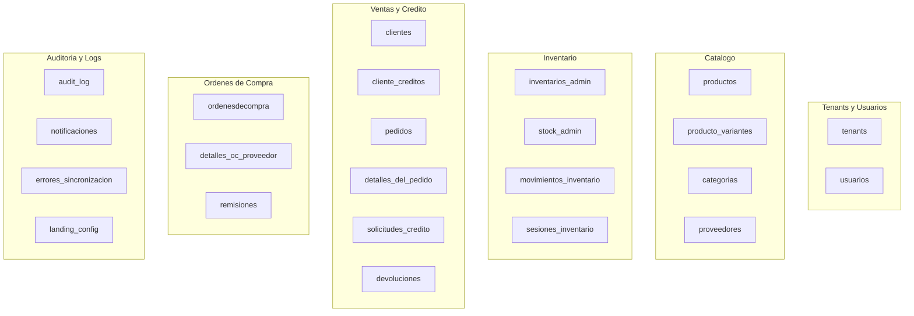
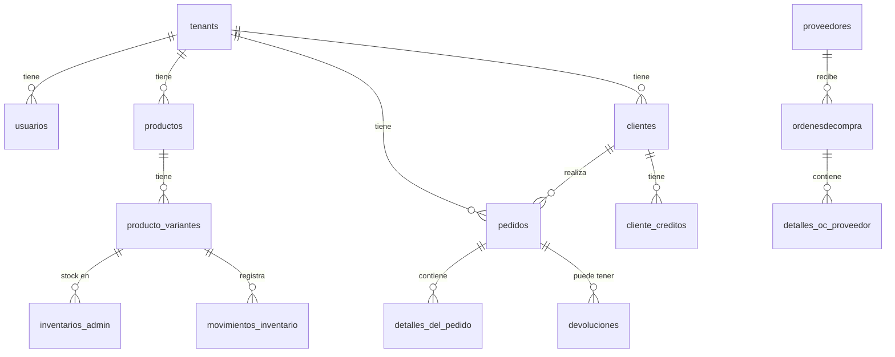

# Diseno de Base de Datos

RazoConnect utiliza PostgreSQL como unico motor de base de datos. El schema esta organizado en seis dominios funcionales con mas de 20 tablas, 20+ funciones PL/pgSQL, 10+ triggers y tareas diarias via pg_cron. La base de datos no es un almacen pasivo: valida, sincroniza y mantiene la consistencia de los datos de forma autonoma.

---

## Tabla de Contenidos

- [Dominios y Tablas](#dominios-y-tablas)
- [Diagrama ER](#diagrama-er)
- [Funciones PL/pgSQL](#funciones-plpgsql)
- [Triggers Automaticos](#triggers-automaticos)
- [Tareas pg_cron](#tareas-pgcron)
- [Decisiones de Diseno](#decisiones-de-diseno)

---

## Dominios y Tablas

El schema esta dividido en seis dominios que agrupan tablas por responsabilidad funcional.

---

## Diagrama ER

Las relaciones principales entre dominios muestran como `tenants` es el nodo central del que dependen todas las entidades de negocio.

---

## Funciones PL/pgSQL

Las funciones de base de datos encapsulan logica critica que no debe depender del codigo de aplicacion para garantizar consistencia.

| Funcion | Descripcion |
|---|---|
| `actualizar_estatus_deuda_vencida()` | Actualiza diariamente el estado de deudas, calcula dias de atraso y suspende clientes con mas de 15 dias sin pagar |
| `trigger_actualizar_estatus_deuda()` | Se dispara al cambiar la fecha de vencimiento de un pedido; marca la deuda como VENCIDA si la fecha es anterior a hoy |
| `get_stock_admin(admin_id, variante_id)` | Consulta rapida del stock disponible para un admin y variante especificos |
| `upsert_inventario_admin(admin_id, variante_id, cantidad)` | Inserta o incrementa stock usando INSERT ... ON CONFLICT ... DO UPDATE; garantiza consistencia ante condiciones de carrera |
| `sync_producto_variante_stock()` | Trigger que recalcula `producto_variantes.stock` cada vez que cambia `inventarios_admin` |
| `fn_validar_movimiento_inventario()` | Trigger que verifica que `stock_posterior = stock_previo + cantidad` en cada movimiento; previene inconsistencias matematicas |
| `recalcular_total_pedido()` | Trigger que detecta discrepancias en el monto total de un pedido sin modificarlo automaticamente; registra en `errores_sincronizacion` si hay problema |
| `validar_agrupacion_ordenes(orden_ids[])` | Valida si multiples ordenes de compra pueden agruparse; verifica que todas sean del mismo proveedor |
| `calcular_monto_total_devolucion(devolucion_id)` | Suma todos los detalles de una devolucion y actualiza el monto total en la tabla `devoluciones` |
| `validar_cantidad_devuelta()` | Trigger que verifica que la cantidad devuelta no excede la cantidad original comprada, sumando devoluciones previas |
| `generar_folio_remision(tenant_id)` | Genera folios unicos con formato REM-YYYY-NNNNN, aislados por tenant |
| `obtener_siguiente_sku(categoria_id)` | Genera SKUs unicos basados en las primeras tres letras de la categoria; previene duplicados |
| `suspender_clientes_morosos()` | Job diario que suspende clientes con deuda vencida mayor a 15 dias y bloquea nuevo credito |

---

## Triggers Automaticos

Los triggers garantizan consistencia sin requerir que el codigo de aplicacion recuerde ejecutar pasos adicionales despues de cada operacion.

| Trigger | Evento | Accion |
|---|---|---|
| `actualizar_timestamp_inventario` | UPDATE en inventarios_admin | Actualiza `ultima_actualizacion` automaticamente |
| `sync_producto_variante_stock` | INSERT/UPDATE/DELETE en inventarios_admin | Recalcula el stock consolidado en producto_variantes |
| `fn_validar_movimiento_inventario` | INSERT en movimientos_inventario | Valida consistencia matematica del movimiento |
| `recalcular_total_pedido` | INSERT/UPDATE/DELETE en detalles_del_pedido | Detecta discrepancias en el total del pedido |
| `actualizar_timestamp_devolucion` | UPDATE en devoluciones | Actualiza el timestamp de modificacion |
| `actualizar_monto_total_devolucion` | INSERT/UPDATE en devoluciones_detalles | Recalcula el monto total de la devolucion |
| `validar_cantidad_devuelta` | INSERT/UPDATE en devoluciones_detalles | Impide devolver mas de la cantidad original |
| `trigger_actualizar_estatus_deuda` | UPDATE en pedidos | Marca la deuda como VENCIDA si la fecha ya paso |
| `limitar_notificaciones_por_cliente` | INSERT en notificaciones | Mantiene solo las 100 notificaciones mas recientes por cliente |

---

## Tareas pg_cron

pg_cron ejecuta funciones de mantenimiento directamente en la base de datos, sin depender de que la aplicacion este activa.

| Tarea | Frecuencia | Funcion |
|---|---|---|
| Actualizar deudas vencidas | Diaria | `actualizar_estatus_deuda_vencida()` |
| Suspender clientes morosos | Diaria | `suspender_clientes_morosos()` |
| Limpiar sesiones de inventario expiradas | Diaria | Elimina sesiones con mas de 7 dias sin actividad |

---

## Decisiones de Diseno

**Por que PostgreSQL y no MongoDB.** La auditoria forense requiere garantias ACID. MongoDB ofrece mayor flexibilidad de schema pero no puede garantizar que una transaccion que actualiza stock y registra un movimiento de kardex sea atomica sin configuracion adicional. PostgreSQL tiene transacciones ACID nativas, stored procedures, triggers y row-level security, todo lo que RazoConnect necesita.

**Por que funciones PL/pgSQL para logica critica.** La sincronizacion de stock entre `inventarios_admin` y `producto_variantes` no puede depender de que el codigo de aplicacion recuerde llamar una funcion extra. Un trigger en la base de datos garantiza que la sincronizacion ocurre siempre, sin importar que parte del codigo modifique el inventario.

**Por que tablas append-only para auditoria.** `movimientos_inventario` y `audit_log` no tienen operaciones de UPDATE ni DELETE permitidas. Esto no es solo una convencion: es una garantia de que el historial no puede ser alterado, lo que hace que los logs sean evidencia forense valida.

---

Desarrollado por Diego Ferram | xCore — 2025
