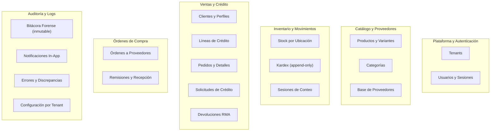
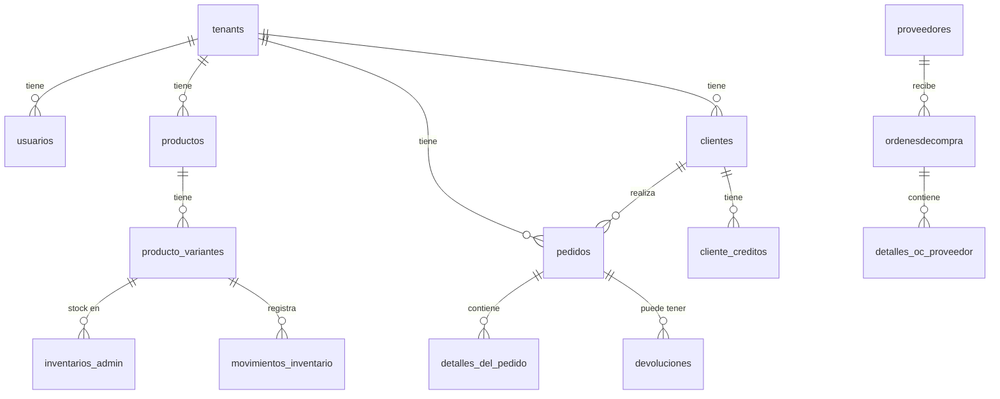
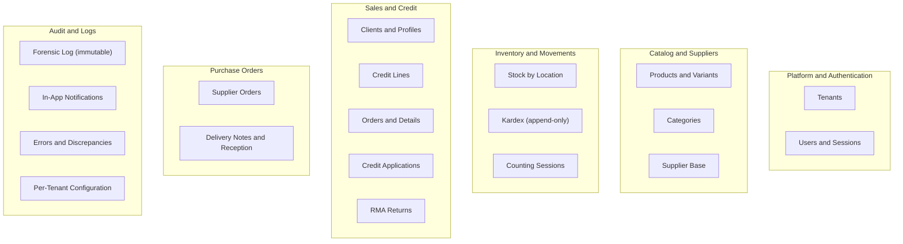

# Diseño de Base de Datos / Database Design

🇲🇽 Español

RazoConnect utiliza PostgreSQL como único motor de base de datos. El schema está organizado en seis dominios funcionales con 70+ tablas, 20+ funciones PL/pgSQL, 10+ triggers y tareas diarias via pg_cron. La base de datos no es un almacén pasivo: valida, sincroniza y mantiene la consistencia de los datos de forma autónoma.

---

## Tabla de Contenidos

- [Escala de la Base de Datos](#escala-de-la-base-de-datos)
- [Dominios Funcionales](#dominios-funcionales)
- [Diagrama ER](#diagrama-er)
- [Funciones PL/pgSQL Críticas](#funciones-plpgsql-críticas)
- [Triggers Automáticos](#triggers-automáticos)
- [Tareas pg_cron](#tareas-pgcron)
- [Decisiones de Diseño](#decisiones-de-diseño)

---

## Escala de la Base de Datos

RazoConnect gestiona una base de datos relacional con:
- **70+ tablas** distribuidas en 6 dominios funcionales
- **20+ funciones PL/pgSQL críticas** que ejecutan lógica de negocio
- **10+ triggers automáticos** garantizando consistencia ACID
- **Tareas pg_cron diarias** de sincronización y reporte
- **Esquema multi-tenant**: cada tabla con isolation key (tenant_id)
- **Append-only audit tables** (trail forense inmutable)

**Volumen en producción:**
- Miles de movimientos de inventario diarios
- Decenas de miles de transacciones mensuales
- Millones de registros en audit trail
- Respuesta <100ms en queries críticas

Esta escala requiere:
✓ Funciones PL/pgSQL para lógica que no puede fallar
✓ Triggers para mantener consistencia sin delegar al código
✓ Índices estratégicos y query optimization
✓ Aislamiento Row-Level en base de datos
✓ Append-only tables para auditoría forense

---

## Dominios Funcionales

El schema está organizado en **6 dominios funcionales** con responsabilidades claras:

```mermaid
flowchart TD
    subgraph D1["Plataforma y Autenticación"]
        A["Tenants"]
        B["Usuarios y Sesiones"]
    end
    subgraph D2["Catálogo y Proveedores"]
        C["Productos y Variantes"]
        D["Categorías"]
        E["Base de Proveedores"]
    end
    subgraph D3["Inventario y Movimientos"]
        F["Stock por Ubicación"]
        G["Kardex (append-only)"]
        H["Sesiones de Conteo"]
    end
    subgraph D4["Ventas y Crédito"]
        I["Clientes y Perfiles"]
        J["Líneas de Crédito"]
        K["Pedidos y Detalles"]
        L["Solicitudes de Crédito"]
        M["Devoluciones RMA"]
    end
    subgraph D5["Órdenes de Compra"]
        N["Órdenes a Proveedores"]
        O["Remisiones y Recepción"]
    end
    subgraph D6["Auditoría y Logs"]
        P["Bitácora Forense (inmutable)"]
        Q["Notificaciones In-App"]
        R["Errores y Discrepancias"]
        S["Configuración por Tenant"]
    end
```

1. **Plataforma y Autenticación**
   - Gestión de tenants
   - Usuarios y sesiones
   - Isolation keys por tenant

2. **Catálogo y Proveedores**
   - Productos y variantes (colores, tallas, etc.)
   - Categorías y clasificación
   - Base de proveedores

3. **Inventario y Movimientos**
   - Stock por ubicación/admin
   - Kardex de movimientos (append-only)
   - Sesiones de conteo físico
   - Historial completo sin UPDATE/DELETE

4. **Ventas y Crédito**
   - Clientes y perfiles
   - Líneas de crédito con límites
   - Pedidos y detalles
   - Solicitudes de crédito con flujos de aprobación
   - Devoluciones (RMA) con trazabilidad

5. **Órdenes de Compra**
   - Órdenes a proveedores
   - Detalles y variantes
   - Remisiones y recepción

6. **Auditoría y Logs**
   - Bitácora forense (inmutable)
   - Notificaciones in-app
   - Errores y discrepancias detectados
   - Configuración visual por tenant

---

## Diagrama ER

Las relaciones principales entre dominios muestran cómo `tenants` es el nodo central del que dependen todas las entidades de negocio.

```mermaid
erDiagram
    tenants ||--o{ usuarios : "tiene"
    tenants ||--o{ productos : "tiene"
    tenants ||--o{ clientes : "tiene"
    tenants ||--o{ pedidos : "tiene"
    productos ||--o{ producto_variantes : "tiene"
    producto_variantes ||--o{ inventarios_admin : "stock en"
    producto_variantes ||--o{ movimientos_inventario : "registra"
    clientes ||--o{ pedidos : "realiza"
    clientes ||--o{ cliente_creditos : "tiene"
    pedidos ||--o{ detalles_del_pedido : "contiene"
    pedidos ||--o{ devoluciones : "puede tener"
    proveedores ||--o{ ordenesdecompra : "recibe"
    ordenesdecompra ||--o{ detalles_oc_proveedor : "contiene"
```

---

## Funciones PL/pgSQL Críticas (20+)

Las funciones de base de datos encapsulan lógica que DEBE ejecutarse en la BD sin depender del código de aplicación. Garantizan consistencia ACID incluso si el servidor crashea.

### Categorías de Funciones

**Gestión Financiera:**
- Actualización automática de estados de deuda
- Cálculo de intereses y comisiones
- Validación de límites de crédito
- Identificación de clientes en riesgo
- Bloqueo de líneas de crédito por incumplimiento

**Validación de Inventario:**
- Verificación de consistencia matemática (stock_final = stock_inicial ± delta)
- Prevención de stock negativo no autorizado
- Sincronización automática de stock consolidado
- Detección de discrepancias en movimientos

**Generación de Identifiers Únicos:**
- SKUs con formato único por categoría (prevención de duplicados)
- Folios de remisión con numeración secuencial aislada por tenant
- Números de factura para compliance fiscal

**Cálculos de Negocio:**
- Suma de totales de pedidos con detección de fraudes
- Cálculo de montos devueltos respetando límites
- Agrupación automática de órdenes de compra
- Limpieza automática de datos expirados

**¿Por qué en base de datos?**
- SQL garantiza ACID: si una transacción empieza, termina consistentemente o no termina
- No depende de que el código de aplicación recuerde ejecutar pasos adicionales
- Si el servidor Node.js crashea, pg_cron sigue ejecutando tareas críticas
- La lógica está escrita UNA VEZ, no replicada en múltiples versiones de código

---

## Triggers Automáticos (10+)

Los triggers se disparan automáticamente en eventos de BD, garantizando que ciertos invariantes NUNCA se violen, incluso si el código de aplicación tiene bugs.

**Ejemplos de invariantes garantizados:**
- El timestamp de modificación SIEMPRE se actualiza (no puede quedar desactualizado)
- El stock consolidado SIEMPRE refleja la suma de stock por ubicación
- El total de un pedido NUNCA puede quedar inconsistente con sus detalles
- Las devoluciones NUNCA pueden exceder la cantidad original
- La deuda NUNCA se marca como "vencida" antes de su fecha de vencimiento

| Trigger | Evento | Invariante que protege |
|---|---|---|
| Timestamp de inventario | UPDATE en stock | Timestamp siempre actualizado |
| Sincronización de stock | INSERT/UPDATE/DELETE en stock por ubicación | Stock consolidado siempre consistente |
| Validación de movimiento | INSERT en kardex | Consistencia matemática del movimiento |
| Recálculo de pedido | INSERT/UPDATE/DELETE en detalles | Total de pedido siempre correcto |
| Timestamp de devolución | UPDATE en devoluciones | Timestamp siempre actualizado |
| Monto total de devolución | INSERT/UPDATE en detalles de devolución | Monto siempre refleja detalles |
| Validación de cantidad devuelta | INSERT/UPDATE en detalles de devolución | No devolver más de lo comprado |
| Estado de deuda | UPDATE en pedidos | Deuda vencida solo cuando corresponde |
| Límite de notificaciones | INSERT en notificaciones | Máximo 100 notificaciones por cliente |

---

## Tareas pg_cron (Automatización en Base de Datos)

pg_cron es una extensión de PostgreSQL que ejecuta funciones en la BD según un schedule (cron). No depende de que Node.js esté corriendo.

**Impacto:** Si tu servidor de aplicación falla, estas tareas siguen ejecutándose, evitando inconsistencias de estado.

| Tarea | Frecuencia | Propósito |
|---|---|---|
| Actualizar deudas vencidas | Diaria | Marcar pedidos con fecha de vencimiento pasada |
| Gestión de clientes morosos | Diaria | Suspender acceso a crédito por incumplimiento |
| Limpiar sesiones expiradas | Diaria | Eliminar sesiones de inventario inactivas (7+ días) |

---

## Decisiones de Diseño

**Por qué PostgreSQL y no MongoDB.** La auditoría forense requiere garantías ACID. MongoDB ofrece mayor flexibilidad de schema pero no puede garantizar que una transacción que actualiza stock y registra un movimiento de kardex sea atómica sin configuración adicional. PostgreSQL tiene transacciones ACID nativas, stored procedures, triggers y row-level security, todo lo que RazoConnect necesita.

**Por qué 70+ tablas en lugar de pocos documentos desnormalizados.** Una arquitectura OLTP (transaccional) requiere normalización para garantizar ACID. Cada tabla con su responsabilidad clara. Esto es el opuesto a OLAP (data warehouse) donde sí desnormalizas para velocidad de lectura.

**Por qué 20+ funciones PL/pgSQL en lugar de validar todo en código.** Las funciones en BD son el "single source of truth" de las reglas de negocio. Si validas solo en Node.js:
- Alguien conecta directamente a la BD y bypasea tu validación
- Múltiples versiones de código pueden divergir en cómo validan
- Si hay una actualización de regla, tienes que hacer redeploy del servidor
- Si el servidor crashea durante validación, la BD queda inconsistente

Las funciones en BD garantizan que NINGUNA entrada de datos viola reglas, sin importar cómo llegó.

**Por qué tablas append-only para auditoría.** Las tablas de kardex y audit_log no tienen operaciones de UPDATE ni DELETE permitidas. Esto no es solo una convención: es una garantía de que el historial no puede ser alterado, lo que hace que los logs sean evidencia forense válida.

---

Desarrollado por Fernando Ramírez | <a href="https://xcore-byg8fkdve4eyatbz.mexicocentral-01.azurewebsites.net/">xCore</a>

🇺🇸 English

RazoConnect uses PostgreSQL as its only database engine. The schema is organized into six functional domains with 70+ tables, 20+ PL/pgSQL functions, 10+ triggers, and daily tasks via pg_cron. The database is not a passive store: it validates, synchronizes, and maintains data consistency autonomously.

---

## Table of Contents

- [Database Scale](#database-scale)
- [Functional Domains](#functional-domains)
- [ER Diagram](#er-diagram)
- [Critical PL/pgSQL Functions](#critical-plpgsql-functions)
- [Automatic Triggers](#automatic-triggers)
- [pg_cron Tasks](#pgcron-tasks)
- [Design Decisions](#design-decisions)

---

## Database Scale

RazoConnect manages a relational database with:
- **70+ tables** distributed across 6 functional domains
- **20+ critical PL/pgSQL functions** executing business logic
- **10+ automatic triggers** guaranteeing ACID consistency
- **Daily pg_cron tasks** for synchronization and reporting
- **Multi-tenant schema**: every table with an isolation key (tenant_id)
- **Append-only audit tables** (immutable forensic trail)

**Production volume:**
- Thousands of inventory movements per day
- Tens of thousands of transactions per month
- Millions of records in audit trail
- <100ms response on critical queries

This scale requires:
✓ PL/pgSQL functions for logic that cannot fail
✓ Triggers to maintain consistency without delegating to application code
✓ Strategic indexes and query optimization
✓ Row-Level isolation in the database
✓ Append-only tables for forensic auditing

---

## Functional Domains

The schema is organized into **6 functional domains** with clear responsibilities:

```mermaid
flowchart TD
    subgraph D1["Platform and Authentication"]
        A["Tenants"]
        B["Users and Sessions"]
    end
    subgraph D2["Catalog and Suppliers"]
        C["Products and Variants"]
        D["Categories"]
        E["Supplier Base"]
    end
    subgraph D3["Inventory and Movements"]
        F["Stock by Location"]
        G["Kardex (append-only)"]
        H["Counting Sessions"]
    end
    subgraph D4["Sales and Credit"]
        I["Clients and Profiles"]
        J["Credit Lines"]
        K["Orders and Details"]
        L["Credit Applications"]
        M["RMA Returns"]
    end
    subgraph D5["Purchase Orders"]
        N["Supplier Orders"]
        O["Delivery Notes and Reception"]
    end
    subgraph D6["Audit and Logs"]
        P["Forensic Log (immutable)"]
        Q["In-App Notifications"]
        R["Errors and Discrepancies"]
        S["Per-Tenant Configuration"]
    end
```

1. **Platform and Authentication**
   - Tenant management
   - Users and sessions
   - Isolation keys per tenant

2. **Catalog and Suppliers**
   - Products and variants (colors, sizes, etc.)
   - Categories and classification
   - Supplier base

3. **Inventory and Movements**
   - Stock by location/admin
   - Movement Kardex (append-only)
   - Physical counting sessions
   - Complete history without UPDATE/DELETE

4. **Sales and Credit**
   - Clients and profiles
   - Credit lines with limits
   - Orders and details
   - Credit applications with approval flows
   - Returns (RMA) with full traceability

5. **Purchase Orders**
   - Supplier orders
   - Details and variants
   - Delivery notes and reception

6. **Audit and Logs**
   - Forensic log (immutable)
   - In-app notifications
   - Detected errors and discrepancies
   - Visual configuration per tenant

---

## ER Diagram

The main relationships between domains show how `tenants` is the central node on which all business entities depend.

```mermaid
erDiagram
    tenants ||--o{ usuarios : "tiene"
    tenants ||--o{ productos : "tiene"
    tenants ||--o{ clientes : "tiene"
    tenants ||--o{ pedidos : "tiene"
    productos ||--o{ producto_variantes : "tiene"
    producto_variantes ||--o{ inventarios_admin : "stock en"
    producto_variantes ||--o{ movimientos_inventario : "registra"
    clientes ||--o{ pedidos : "realiza"
    clientes ||--o{ cliente_creditos : "tiene"
    pedidos ||--o{ detalles_del_pedido : "contiene"
    pedidos ||--o{ devoluciones : "puede tener"
    proveedores ||--o{ ordenesdecompra : "recibe"
    ordenesdecompra ||--o{ detalles_oc_proveedor : "contiene"
```

---

## Critical PL/pgSQL Functions (20+)

Database functions encapsulate logic that MUST execute in the DB without depending on application code. They guarantee ACID consistency even if the server crashes.

### Function Categories

**Financial Management:**
- Automatic debt status updates
- Interest and commission calculations
- Credit limit validation
- At-risk client identification
- Credit line blocking for non-compliance

**Inventory Validation:**
- Mathematical consistency verification (final_stock = initial_stock ± delta)
- Prevention of unauthorized negative stock
- Automatic consolidated stock synchronization
- Discrepancy detection in movements

**Unique Identifier Generation:**
- SKUs with unique format per category (duplicate prevention)
- Delivery note folios with sequential numbering isolated by tenant
- Invoice numbers for fiscal compliance

**Business Calculations:**
- Order total summation with fraud detection
- Returned amount calculation respecting limits
- Automatic purchase order grouping
- Automatic expired data cleanup

**Why in the database?**
- SQL guarantees ACID: if a transaction starts, it finishes consistently or not at all
- Does not depend on application code remembering additional steps
- If the Node.js server crashes, pg_cron keeps executing critical tasks
- The logic is written ONCE, not replicated across multiple code versions

---

## Automatic Triggers (10+)

Triggers fire automatically on DB events, guaranteeing that certain invariants are NEVER violated, even if application code has bugs.

**Examples of guaranteed invariants:**
- The modification timestamp is ALWAYS updated (can never be stale)
- Consolidated stock ALWAYS reflects the sum of stock per location
- An order total can NEVER be inconsistent with its details
- Returns can NEVER exceed the original quantity
- Debt is NEVER marked as "overdue" before its due date

| Trigger | Event | Invariant Protected |
|---|---|---|
| Inventory timestamp | UPDATE on stock | Timestamp always current |
| Stock synchronization | INSERT/UPDATE/DELETE on stock by location | Consolidated stock always consistent |
| Movement validation | INSERT on kardex | Mathematical consistency of movement |
| Order recalculation | INSERT/UPDATE/DELETE on details | Order total always correct |
| Return timestamp | UPDATE on returns | Timestamp always current |
| Return total amount | INSERT/UPDATE on return details | Amount always reflects details |
| Returned quantity validation | INSERT/UPDATE on return details | Cannot return more than purchased |
| Debt status | UPDATE on orders | Debt overdue only when applicable |
| Notification limit | INSERT on notifications | Max 100 notifications per client |

---

## pg_cron Tasks (Database Automation)

pg_cron is a PostgreSQL extension that runs functions in the DB on a cron schedule. It does not depend on Node.js running.

**Impact:** If your application server fails, these tasks keep running, preventing state inconsistencies.

| Task | Frequency | Purpose |
|---|---|---|
| Update overdue debts | Daily | Mark orders with past due dates |
| Delinquent client management | Daily | Suspend credit access for non-compliance |
| Clean expired sessions | Daily | Remove inactive inventory sessions (7+ days) |

---

## Design Decisions

**Why PostgreSQL and not MongoDB.** Forensic auditing requires ACID guarantees. MongoDB offers greater schema flexibility but cannot guarantee that a transaction that updates stock and records a kardex movement is atomic without additional configuration. PostgreSQL has native ACID transactions, stored procedures, triggers, and row-level security — everything RazoConnect needs.

**Why 70+ tables instead of a few denormalized documents.** An OLTP (transactional) architecture requires normalization to guarantee ACID. Each table has a clear responsibility. This is the opposite of OLAP (data warehouse) where you denormalize for read speed.

**Why 20+ PL/pgSQL functions instead of validating everything in code.** Database functions are the "single source of truth" for business rules. If you only validate in Node.js:
- Someone connects directly to the DB and bypasses your validation
- Multiple code versions can diverge in how they validate
- If a rule changes, you must redeploy the server
- If the server crashes during validation, the DB is left inconsistent

Database functions guarantee that NO incoming data violates rules, regardless of how it arrived.

**Why append-only tables for auditing.** The kardex and audit_log tables have no UPDATE or DELETE operations allowed. This is not just a convention: it is a guarantee that the history cannot be altered, making the logs valid forensic evidence.

---

Developed by Fernando Ramírez | <a href="https://xcore-byg8fkdve4eyatbz.mexicocentral-01.azurewebsites.net/">xCore</a>

