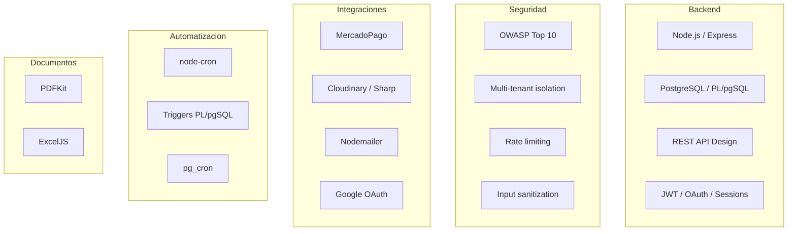

# Fernando Ramírez - Perfil Técnico / Fernando Ramírez - Technical Profile

<details open>
<summary>🇲🇽 Español</summary>

---

## Tabla de Contenidos

- [Quien es Fernando Ramírez](#quien-es-fernando-ramírez)
- [Habilidades Demostradas en RazoConnect](#habilidades-demostradas-en-razoconnect)
- [Filosofia de Desarrollo](#filosofia-de-desarrollo)
- [xCore](#xcore)
- [Mapa de Conocimiento](#mapa-de-conocimiento)

---

## Quien es Fernando Ramírez

Soy un desarrollador de software fullstack con especializacion en backend, sistemas empresariales y arquitecturas multi-tenant. Soy el fundador de <a href="https://xcore-byg8fkdve4eyatbz.mexicocentral-01.azurewebsites.net/">xCore</a>, empresa de desarrollo de software enfocada en soluciones backend-heavy para el mercado mexicano y latinoamericano.

Mi enfoque no se limita a escribir codigo que funcione. Cada decision en mis proyectos considera seguridad, escalabilidad operativa y facilidad de mantenimiento a largo plazo. RazoConnect es el ejemplo mas completo de ese enfoque: un sistema en produccion con inventario inteligente, credito con scoring automatico, auditoria forense inmutable y diez capas de seguridad implementadas sin depender de paquetes de terceros.

GitHub: [github.com/dferram](https://github.com/dferram)

---

## Habilidades Demostradas en RazoConnect

| Habilidad | Evidencia en el codigo |
|---|---|
| Arquitectura multi-tenant | Row-Level Isolation con 4 capas de seguridad, deteccion automatica de tenant por dominio HTTP |
| Seguridad OWASP | CSP, HSTS, rate limiting sin dependencias, input sanitization recursiva, secrets audit al arranque, sin helmet |
| Diseno de base de datos | 20+ tablas normalizadas, 20+ funciones PL/pgSQL, 10+ triggers de sincronizacion, pg_cron para mantenimiento diario |
| Backend Node.js / Express | 20+ modulos, arquitectura en capas (routes → controllers → services → BD), middlewares reutilizables |
| Integracion de pagos | MercadoPago SDK con manejo de webhooks, reconciliacion de estados de pago y actualizacion de pedidos |
| Gestion de archivos | Cloudinary + Sharp para optimizacion de imagenes (resize, compresion) antes de subir |
| Comunicacion | Nodemailer con plantillas Handlebars compiladas en tiempo de ejecucion para emails transaccionales |
| Generacion de documentos | PDFKit para remisiones y facturas, ExcelJS para reportes de cuentas por cobrar |
| Logica de negocio compleja | Sistema de credito con scoring de riesgo, FIFO de inventario con Priority Override, RMA, comisiones de agentes |
| Automatizacion | node-cron + triggers PL/pgSQL + pg_cron + generacion automatica de ordenes de compra ante backorders |
| OAuth | Google OAuth 2.0 con Passport.js integrado con el sistema de sesiones y JWT del proyecto |
| Control de cambios auditado | ChangeRequestService: los cambios criticos se registran como solicitudes antes de aplicarse, con diff en JSONB |

---

## Filosofia de Desarrollo

No escribo codigo para que compile, lo escribo para que dure. Cada decision en RazoConnect tiene una razon: el rate limiter se implemento sin dependencias externas porque una dependencia menos es un vector de ataque menos. Las cabeceras de seguridad se escribieron a mano porque entender lo que hace cada una es mas importante que instalar un paquete. La arquitectura multi-tenant se eligio como Row-Level en lugar de bases de datos separadas porque el ROI operacional es exponencial a escala.

La auditoria forense no fue un requerimiento regulatorio, fue una decision de diseno desde el dia uno. El Kardex de inventario y el diff tracking en el audit log no son features adicionales: son la garantia de que el sistema puede responder a cualquier pregunta sobre su historia con evidencia verificable.

La seguridad no se delega a un paquete. Se entiende, se implementa y se documenta.

---

## xCore

<a href="https://xcore-byg8fkdve4eyatbz.mexicocentral-01.azurewebsites.net/">xCore</a> es mi estudio de desarrollo de software. Me especializo en sistemas empresariales backend-heavy para el mercado mexicano y latinoamericano: plataformas de ventas, sistemas de inventario, integraciones de pago, y soluciones SaaS multi-tenant.

Mi enfoque en <a href="https://xcore-byg8fkdve4eyatbz.mexicocentral-01.azurewebsites.net/">xCore</a> es construir sistemas que los equipos que los heredan puedan entender, mantener y extender sin necesidad del autor original. Eso se logra con documentacion tecnica exhaustiva, arquitecturas predecibles y codigo que expresa intencion, no solo implementacion.

GitHub: [github.com/dferram](https://github.com/dferram)

---

## Mapa de Conocimiento



---

Desarrollado por Fernando Ramírez | <a href="https://xcore-byg8fkdve4eyatbz.mexicocentral-01.azurewebsites.net/">xCore</a>

</details>

<details>
<summary>🇺🇸 English</summary>

---

## Table of Contents

- [Who is Fernando Ramírez](#who-is-fernando-ramírez)
- [Skills Demonstrated in RazoConnect](#skills-demonstrated-in-razoconnect)
- [Development Philosophy](#development-philosophy)
- [xCore](#xcore-1)
- [Knowledge Map](#knowledge-map)

---

## Who is Fernando Ramírez

I am a fullstack software developer specializing in backend, enterprise systems, and multi-tenant architectures. I am the founder of <a href="https://xcore-byg8fkdve4eyatbz.mexicocentral-01.azurewebsites.net/">xCore</a>, a software development company focused on backend-heavy solutions for the Mexican and Latin American market.

My approach is not limited to writing code that works. Every decision in my projects considers security, operational scalability, and long-term maintainability. RazoConnect is the most complete example of that approach: a production system with smart inventory, credit with automatic scoring, immutable forensic audit, and ten security layers implemented without relying on third-party packages.

GitHub: [github.com/dferram](https://github.com/dferram)

---

## Skills Demonstrated in RazoConnect

| Skill | Evidence in the code |
|---|---|
| Multi-tenant architecture | Row-Level Isolation with 4 security layers, automatic tenant detection by HTTP domain |
| OWASP Security | CSP, HSTS, rate limiting without dependencies, recursive input sanitization, secrets audit on startup, no helmet |
| Database design | 20+ normalized tables, 20+ PL/pgSQL functions, 10+ synchronization triggers, pg_cron for daily maintenance |
| Node.js / Express backend | 20+ modules, layered architecture (routes → controllers → services → DB), reusable middlewares |
| Payment integration | MercadoPago SDK with webhook handling, payment state reconciliation, and order updates |
| File management | Cloudinary + Sharp for image optimization (resize, compression) before uploading |
| Communication | Nodemailer with Handlebars templates compiled at runtime for transactional emails |
| Document generation | PDFKit for delivery receipts and invoices, ExcelJS for accounts receivable reports |
| Complex business logic | Credit system with risk scoring, inventory FIFO with Priority Override, RMA, agent commissions |
| Automation | node-cron + PL/pgSQL triggers + pg_cron + automatic purchase order generation for backorders |
| OAuth | Google OAuth 2.0 with Passport.js integrated with the project's session and JWT system |
| Audited change control | ChangeRequestService: critical changes are recorded as requests before being applied, with diff in JSONB |

---

## Development Philosophy

I don't write code for it to compile, I write it to last. Every decision in RazoConnect has a reason: the rate limiter was implemented without external dependencies because one fewer dependency is one fewer attack vector. Security headers were written by hand because understanding what each one does is more important than installing a package. The multi-tenant architecture was chosen as Row-Level instead of separate databases because the operational ROI is exponential at scale.

Forensic auditing was not a regulatory requirement; it was a design decision from day one. The inventory Kardex and diff tracking in the audit log are not additional features: they are the guarantee that the system can answer any question about its history with verifiable evidence.

Security is not delegated to a package. It is understood, implemented, and documented.

---

## xCore

<a href="https://xcore-byg8fkdve4eyatbz.mexicocentral-01.azurewebsites.net/">xCore</a> is my software development studio. I specialize in backend-heavy enterprise systems for the Mexican and Latin American market: sales platforms, inventory systems, payment integrations, and multi-tenant SaaS solutions.

My approach at <a href="https://xcore-byg8fkdve4eyatbz.mexicocentral-01.azurewebsites.net/">xCore</a> is to build systems that the teams who inherit them can understand, maintain, and extend without the original author. This is achieved through exhaustive technical documentation, predictable architectures, and code that expresses intent, not just implementation.

GitHub: [github.com/dferram](https://github.com/dferram)

---

## Knowledge Map


---

Developed by Fernando Ramírez | <a href="https://xcore-byg8fkdve4eyatbz.mexicocentral-01.azurewebsites.net/">xCore</a>

</details>\n
<details>\n<summary>🇺🇸 English</summary>\n\n---\n\n## Table of Contents\n\n- [Who is Fernando Ramírez](#who-is-fernando-ramírez)\n- [Skills Demonstrated in RazoConnect](#skills-demonstrated-in-razoconnect)\n- [Development Philosophy](#development-philosophy)\n- [xCore](#xcore-1)\n- [Knowledge Map](#knowledge-map)\n\n---\n\n## Who is Fernando Ramírez\n\nI am a fullstack software developer specializing in backend, enterprise systems, and multi-tenant architectures. I am the founder of <a href="https://xcore-byg8fkdve4eyatbz.mexicocentral-01.azurewebsites.net/">xCore</a>, a software development company focused on backend-heavy solutions for the Mexican and Latin American market.\n\nMy approach is not limited to writing code that works. Every decision in my projects considers security, operational scalability, and long-term maintainability. RazoConnect is the most complete example of that approach: a production system with smart inventory, credit with automatic scoring, immutable forensic audit, and ten security layers implemented without relying on third-party packages.\n\nGitHub: [github.com/dferram](https://github.com/dferram)\n\n---\n\n## Skills Demonstrated in RazoConnect\n\n| Skill | Evidence in the code |\n|---|---|\n| Multi-tenant architecture | Row-Level Isolation with 4 security layers, automatic tenant detection by HTTP domain |\n| OWASP Security | CSP, HSTS, rate limiting without dependencies, recursive input sanitization, secrets audit on startup, no helmet |\n| Database design | 20+ normalized tables, 20+ PL/pgSQL functions, 10+ synchronization triggers, pg_cron for daily maintenance |\n| Node.js / Express backend | 20+ modules, layered architecture (routes → controllers → services → DB), reusable middlewares |\n| Payment integration | MercadoPago SDK with webhook handling, payment state reconciliation, and order updates |\n| File management | Cloudinary + Sharp for image optimization (resize, compression) before uploading |\n| Communication | Nodemailer with Handlebars templates compiled at runtime for transactional emails |\n| Document generation | PDFKit for delivery receipts and invoices, ExcelJS for accounts receivable reports |\n| Complex business logic | Credit system with risk scoring, inventory FIFO with Priority Override, RMA, agent commissions |\n| Automation | node-cron + PL/pgSQL triggers + pg_cron + automatic purchase order generation for backorders |\n| OAuth | Google OAuth 2.0 with Passport.js integrated with the project's session and JWT system |\n| Audited change control | ChangeRequestService: critical changes are recorded as requests before being applied, with diff in JSONB |\n\n---\n\n## Development Philosophy\n\nI don't write code for it to compile, I write it to last. Every decision in RazoConnect has a reason: the rate limiter was implemented without external dependencies because one fewer dependency is one fewer attack vector. Security headers were written by hand because understanding what each one does is more important than installing a package. The multi-tenant architecture was chosen as Row-Level instead of separate databases because the operational ROI is exponential at scale.\n\nForensic auditing was not a regulatory requirement; it was a design decision from day one. The inventory Kardex and diff tracking in the audit log are not additional features: they are the guarantee that the system can answer any question about its history with verifiable evidence.\n\nSecurity is not delegated to a package. It is understood, implemented, and documented.\n\n---\n\n## xCore\n\n<a href="https://xcore-byg8fkdve4eyatbz.mexicocentral-01.azurewebsites.net/">xCore</a> is my software development studio. I specialize in backend-heavy enterprise systems for the Mexican and Latin American market: sales platforms, inventory systems, payment integrations, and multi-tenant SaaS solutions.\n\nMy approach at <a href="https://xcore-byg8fkdve4eyatbz.mexicocentral-01.azurewebsites.net/">xCore</a> is to build systems that the teams who inherit them can understand, maintain, and extend without the original author. This is achieved through exhaustive technical documentation, predictable architectures, and code that expresses intent, not just implementation.\n\nGitHub: [github.com/dferram](https://github.com/dferram)\n\n---\n\n## Knowledge Map\n\n```mermaid\nflowchart TD\n    subgraph Backend\n        B1[Node.js / Express]\n        B2[PostgreSQL / PL/pgSQL]\n        B3[REST API Design]\n        B4[JWT / OAuth / Sessions]\n    end\n\n    subgraph Seguridad\n        S1[OWASP Top 10]\n        S2[Multi-tenant isolation]\n        S3[Rate limiting]\n        S4[Input sanitization]\n    end\n\n    subgraph Integraciones\n        I1[MercadoPago]\n        I2[Cloudinary / Sharp]\n        I3[Nodemailer]\n        I4[Google OAuth]\n    end\n\n    subgraph Automatizacion\n        A1[node-cron]\n        A2[Triggers PL/pgSQL]\n        A3[pg_cron]\n    end\n\n    subgraph Documentos\n        D1[PDFKit]\n        D2[ExcelJS]\n    end\n```

---

Developed by Fernando Ramírez | <a href="https://xcore-byg8fkdve4eyatbz.mexicocentral-01.azurewebsites.net/">xCore</a>

</details>