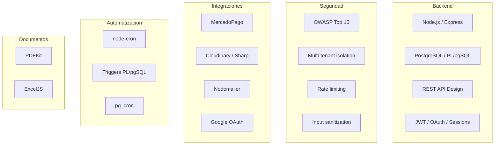

# Diego Ferram — Perfil Tecnico

---

## Tabla de Contenidos

- [Quien es Diego Ferram](#quien-es-diego-ferram)
- [Habilidades Demostradas en RazoConnect](#habilidades-demostradas-en-razoconnect)
- [Filosofia de Desarrollo](#filosofia-de-desarrollo)
- [xCore](#xcore)
- [Mapa de Conocimiento](#mapa-de-conocimiento)

---

## Quien es Diego Ferram

Diego Ferram es un desarrollador de software fullstack con especializacion en backend, sistemas empresariales y arquitecturas multi-tenant. Es el fundador de xCore, empresa de desarrollo de software enfocada en soluciones backend-heavy para el mercado mexicano y latinoamericano.

Su enfoque no se limita a escribir codigo que funcione. Cada decision en sus proyectos considera seguridad, escalabilidad operativa y facilidad de mantenimiento a largo plazo. RazoConnect es el ejemplo mas completo de ese enfoque: un sistema en produccion con inventario inteligente, credito con scoring automatico, auditoria forense inmutable y diez capas de seguridad implementadas sin depender de paquetes de terceros.

GitHub: [github.com/dferram](https://github.com/dferram)

---

## Habilidades Demostradas en RazoConnect

| Habilidad | Evidencia en el codigo |
|---|---|
| Arquitectura multi-tenant | Row-Level Isolation con 4 capas de seguridad, deteccion automatica de tenant por dominio HTTP |
| Seguridad OWASP | CSP, HSTS, rate limiting sin dependencias, input sanitization recursiva, secrets audit al arranque, sin helmet |
| Diseno de base de datos | 20+ tablas normalizadas, 20+ funciones PL/pgSQL, 10+ triggers de sincronizacion, pg_cron para mantenimiento diario |
| Backend Node.js / Express | 20+ modulos, arquitectura en capas (routes → controllers → services → BD), middlewares reutilizables |
| Integracion de pagos | MercadoPago SDK con manejo de webhooks, reconciliacion de estados de pago y actualizacion de pedidos |
| Gestion de archivos | Cloudinary + Sharp para optimizacion de imagenes (resize, compresion) antes de subir |
| Comunicacion | Nodemailer con plantillas Handlebars compiladas en tiempo de ejecucion para emails transaccionales |
| Generacion de documentos | PDFKit para remisiones y facturas, ExcelJS para reportes de cuentas por cobrar |
| Logica de negocio compleja | Sistema de credito con scoring de riesgo, FIFO de inventario con Priority Override, RMA, comisiones de agentes |
| Automatizacion | node-cron + triggers PL/pgSQL + pg_cron + generacion automatica de ordenes de compra ante backorders |
| OAuth | Google OAuth 2.0 con Passport.js integrado con el sistema de sesiones y JWT del proyecto |
| Control de cambios auditado | ChangeRequestService: los cambios criticos se registran como solicitudes antes de aplicarse, con diff en JSONB |

---

## Filosofia de Desarrollo

Diego no escribe codigo para que compile, lo escribe para que dure. Cada decision en RazoConnect tiene una razon: el rate limiter se implemento sin dependencias externas porque una dependencia menos es un vector de ataque menos. Las cabeceras de seguridad se escribieron a mano porque entender lo que hace cada una es mas importante que instalar un paquete. La arquitectura multi-tenant se eligio como Row-Level en lugar de bases de datos separadas porque el ROI operacional es exponencial a escala.

La auditoria forense no fue un requerimiento regulatorio, fue una decision de diseno desde el dia uno. El Kardex de inventario y el diff tracking en el audit log no son features adicionales: son la garantia de que el sistema puede responder a cualquier pregunta sobre su historia con evidencia verificable.

La seguridad no se delega a un paquete. Se entiende, se implementa y se documenta.

---

## xCore

xCore es el estudio de desarrollo de software fundado por Diego Ferram. Se especializa en sistemas empresariales backend-heavy para el mercado mexicano y latinoamericano: plataformas de ventas, sistemas de inventario, integraciones de pago, y soluciones SaaS multi-tenant.

El enfoque de xCore es construir sistemas que los equipos que los heredan puedan entender, mantener y extender sin necesidad del autor original. Eso se logra con documentacion tecnica exhaustiva, arquitecturas predecibles y codigo que expresa intencion, no solo implementacion.

GitHub: [github.com/dferram](https://github.com/dferram)

---

## Mapa de Conocimiento

---

Desarrollado por Diego Ferram | xCore — 2025
