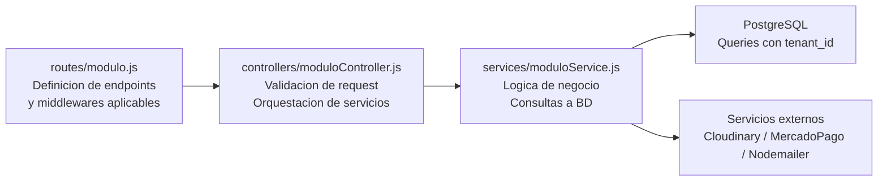

# Modulos del Sistema

RazoConnect esta organizado en mas de 20 modulos funcionales, cada uno con sus propias rutas, controladores y servicios. Los modulos se agrupan por el actor principal que los utiliza: clientes, administradores, agentes de venta y el sistema automatizado.

---

## Tabla de Contenidos

- [Mapa de Modulos por Actor](#mapa-de-modulos-por-actor)
- [Inventario Completo de Modulos](#inventario-completo-de-modulos)
- [Arquitectura de un Modulo](#arquitectura-de-un-modulo)

---

## Mapa de Modulos por Actor

---

## Inventario Completo de Modulos

| Modulo | Actor Principal | Descripcion |
|---|---|---|
| auth | Todos | Login con email/password, registro, Google OAuth 2.0 y logout. Maneja sesion con express-session y JWT simultaneamente |
| productos | Admin / Cliente | Catalogo de productos con variantes (talla, color, etc.), gestion de imagenes con procesamiento Sharp antes de subir a Cloudinary |
| carrito | Cliente | Agregar, quitar y calcular el carrito de compras con validacion de stock en tiempo real |
| pedidos | Cliente / Admin | Creacion de pedidos, actualizacion de estatus, generacion de PDF de remision con PDFKit |
| direcciones | Cliente | Gestion de multiples direcciones de envio por cliente |
| admin | Admin | Panel administrativo central con acceso a todos los recursos del tenant |
| reportes | Admin | Exportacion de reportes a Excel con ExcelJS: cuentas por cobrar, movimientos, ventas por periodo |
| public | Todos | Landing page del tenant configurable desde el panel admin; soporta temas visuales por temporada |
| notificaciones | Todos | Sistema de notificaciones in-app con lectura, archivo y conteo de no leidas |
| clientes | Admin / Agente | Gestion completa de clientes: alta, edicion, historial de compras, estado de credito |
| staff | Admin | Gestion de usuarios internos del tenant (admins, agentes, viewers) con control de roles |
| creditos | Admin / Cliente | Lineas de credito: solicitud, analisis de riesgo, aprobacion, historial de pagos y estado de deuda |
| pagos | Cliente / Sistema | Integracion con MercadoPago: crear preferencias de pago, manejar webhooks y actualizar estado de pedidos |
| cupones | Admin / Cliente | Descuentos por porcentaje o monto fijo, con fecha de expiracion y limite de usos |
| developer | Sistema | Rutas de mantenimiento y herramientas internas: auditoria de secretos, migraciones, diagnosticos |
| remisiones | Admin | Documentos de remision para entrega fisica de mercancia; generacion de PDF con folio unico |
| agente | Agente | Portal de agentes de ventas: ver clientes asignados, crear pedidos en nombre de clientes, ver comisiones |
| inventario | Admin | Gestion de stock: entradas, salidas, ajustes, Kardex, toma fisica y sesiones de conteo |
| devoluciones | Cliente / Admin | RMA completo: solicitud, validacion de elegibilidad, aprobacion con reintegro automatico de stock |
| favoritos | Cliente | Lista de deseos con alertas de restock activables por variante |

---

## Arquitectura de un Modulo

Todos los modulos siguen la misma estructura de capas, lo que facilita el onboarding y el mantenimiento.

Los middlewares de seguridad (tenantGuard, authMiddleware, tenantSessionGuard) se aplican en el router antes de que la peticion llegue al controlador. Los controladores validan el request y coordinan los servicios, pero no contienen logica de negocio. Los servicios son los unicos que hablan con la base de datos o con servicios externos.

---

Desarrollado por Diego Ferram | xCore — 2025
