# Modulos del Sistema / System Modules

🇲🇽 Español

RazoConnect está organizado en más de 20 módulos funcionales, cada uno con sus propias rutas, controladores y servicios. Los módulos se agrupan por el actor principal que los utiliza: clientes, administradores, agentes de venta y el sistema automatizado.

---

## Tabla de Contenidos

- [Mapa de Módulos por Actor](#mapa-de-módulos-por-actor)
- [Inventario Completo de Módulos](#inventario-completo-de-módulos)
- [Arquitectura de un Módulo](#arquitectura-de-un-módulo)

---

## Mapa de Módulos por Actor

```mermaid
flowchart TD
    subgraph Cliente
        C1[Catálogo de productos]
        C2[Carrito y pedidos]
        C3[Crédito y pagos]
        C4[Devoluciones RMA]
        C5[Favoritos y alertas]
        C6[Notificaciones]
    end

    subgraph Admin
        A1[Panel de gestión]
        A2[Inventario y Kardex]
        A3[Ordenes de compra]
        A4[Clientes y créditos]
        A5[Reportes Excel y PDF]
        A6[Cupones y descuentos]
        A7[Landing configurable]
    end

    subgraph Agente
        AG1[Portal de agentes]
        AG2[Mis clientes]
        AG3[Comisiones]
        AG4[Crear pedidos para clientes]
    end

    subgraph Sistema
        S1[Cron jobs diarios]
        S2[Triggers de BD]
        S3[Emails automáticos]
        S4[Notificaciones de restock]
        S5[Auditoría y bitacora]
    end
```

---

## Inventario Completo de Módulos

| Módulo | Actor Principal | Descripción |
|---|---|---|
| auth | Todos | Login con email/password, registro, Google OAuth 2.0 y logout. Maneja sesión con express-session y JWT simultáneamente |
| productos | Admin / Cliente | Catálogo de productos con variantes (talla, color, etc.), gestión de imagenes con procesamiento Sharp antes de subir a Cloudinary |
| carrito | Cliente | Agregar, quitar y calcular el carrito de compras con validación de stock en tiempo real |
| pedidos | Cliente / Admin | Creación de pedidos, actualización de estatus, generación de PDF de remision con PDFKit |
| direcciones | Cliente | Gestión de múltiples direcciones de envio por cliente |
| admin | Admin | Panel administrativo central con acceso a todos los recursos del tenant |
| reportes | Admin | Exportación de reportes a Excel con ExcelJS: cuentas por cobrar, movimientos, ventas por período |
| public | Todos | Landing page del tenant configurable desde el panel admin; soporta temas visuales por temporada |
| notificaciones | Todos | Sistema de notificaciones in-app con lectura, archivo y conteo de no leidas |
| clientes | Admin / Agente | Gestión completa de clientes: alta, edición, historial de compras, estado de crédito |
| staff | Admin | Gestión de usuarios internos del tenant (admins, agentes, viewers) con control de roles |
| inventario | Admin / Agente | Kardex de movimientos, sesiones de inventario con asignación de agentes, ajustes y auditorías |
| devoluciones | Admin / Cliente | Sistema RMA: solicitudes, evidencias fotograficas, reintegro de stock y ajuste de cuentas por cobrar |
| créditos | Admin / Cliente | Solicitud de crédito, scoring de riesgo automático, aprobación manual, suspensión por vencimiento |
| comisiones | Admin / Agente | Cálculo automático de comisiones al entregar pedidos, esquemas configurables por agente, reportes |
| agentes | Admin | Gestión de agentes de venta: alta, cartera de clientes asignada, metas y métricas |
| ordenes-compra | Admin | Ordenes de compra a proveedores con Smart Reordering, recepción y validación de empaque |
| favoritos | Cliente | Lista de productos favoritos con alertas de restock automáticas cuando el stock se repone |
| cupones | Admin / Cliente | Creación y aplicación de cupones de descuento: porcentaje, monto fijo, con fecha de vencimiento |
| pagos | Cliente | Integración con MercadoPago SDK: checkout, webhooks de confirmación, reconciliación de estado |
| developer | Super Admin | Panel global para crear y gestionar tenants, configurar dominios y monitorear salud del sistema |

---

## Arquitectura de un Módulo

Todos los módulos siguen la misma estructura de capas, lo que facilita el onboarding y el mantenimiento.

Los middlewares de seguridad (tenantGuard, authMiddleware, tenantSessionGuard) se aplican en el router antes de que la petición llegue al controlador. Los controladores validan el request y coordinan los servicios, pero no contienen lógica de negocio. Los servicios son los únicos que hablan con la base de datos o con servicios externos.

---

Desarrollado por Fernando Ramírez | <a href="https://xcore-byg8fkdve4eyatbz.mexicocentral-01.azurewebsites.net/">xCore</a>

🇺🇸 English

RazoConnect is organized into more than 20 functional modules, each with its own routes, controllers, and services. Modules are grouped by the primary actor that uses them: clients, administrators, sales agents, and the automated system.

---

## Table of Contents

- [Module Map by Actor](#module-map-by-actor)
- [Complete Module Inventory](#complete-module-inventory)
- [Module Architecture](#module-architecture)

---

## Module Map by Actor

---

## Complete Module Inventory

| Module | Primary Actor | Description |
|---|---|---|
| auth | All | Login with email/password, registration, Google OAuth 2.0, and logout. Handles session with express-session and JWT simultaneously |
| productos | Admin / Client | Product catalog with variants (size, color, etc.), image management with Sharp processing before uploading to Cloudinary |
| carrito | Client | Add, remove, and calculate the shopping cart with real-time stock validation |
| pedidos | Client / Admin | Order creation, status updates, PDF generation of delivery receipts with PDFKit |
| direcciones | Client | Management of multiple shipping addresses per client |
| admin | Admin | Central administrative panel with access to all tenant resources |
| reportes | Admin | Export reports to Excel with ExcelJS: accounts receivable, movements, sales by period |
| public | All | Configurable tenant landing page from the admin panel; supports seasonal visual themes |
| notificaciones | All | In-app notification system with read, archive, and unread count |
| clientes | Admin / Agent | Complete client management: registration, editing, purchase history, credit status |
| staff | Admin | Management of internal tenant users (admins, agents, viewers) with role control |
| inventario | Admin / Agent | Movement Kardex, inventory sessions with agent assignment, adjustments, and audits |
| devoluciones | Admin / Client | RMA system: requests, photographic evidence, stock reintegration, and accounts receivable adjustment |
| creditos | Admin / Client | Credit request, automatic risk scoring, manual approval, suspension for overdue |
| comisiones | Admin / Agent | Automatic commission calculation on order delivery, configurable schemes per agent, reports |
| agentes | Admin | Sales agent management: registration, assigned client portfolio, goals, and metrics |
| ordenes-compra | Admin | Purchase orders to suppliers with Smart Reordering, reception, and packaging validation |
| favoritos | Client | Product favorites list with automatic restock alerts when stock is replenished |
| cupones | Admin / Client | Creation and application of discount coupons: percentage, fixed amount, with expiration date |
| pagos | Client | Integration with MercadoPago SDK: checkout, confirmation webhooks, status reconciliation |
| developer | Super Admin | Global panel to create and manage tenants, configure domains, and monitor system health |

---

## Module Architecture

All modules follow the same layered structure, which facilitates onboarding and maintenance.

The security middlewares (tenantGuard, authMiddleware, tenantSessionGuard) are applied at the router level before the request reaches the controller. Controllers validate the request and coordinate services, but do not contain business logic. Services are the only ones that communicate with the database or external services.

---

Developed by Fernando Ramírez | <a href="https://xcore-byg8fkdve4eyatbz.mexicocentral-01.azurewebsites.net/">xCore</a>

