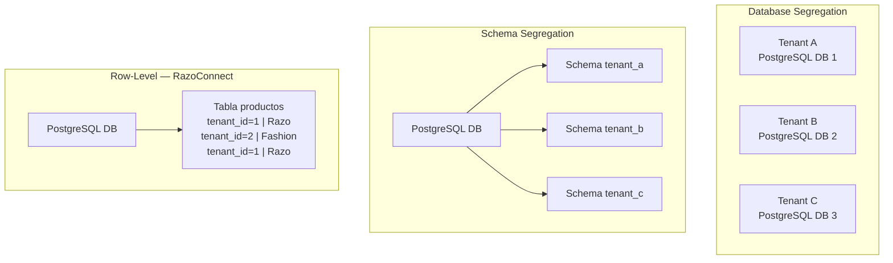
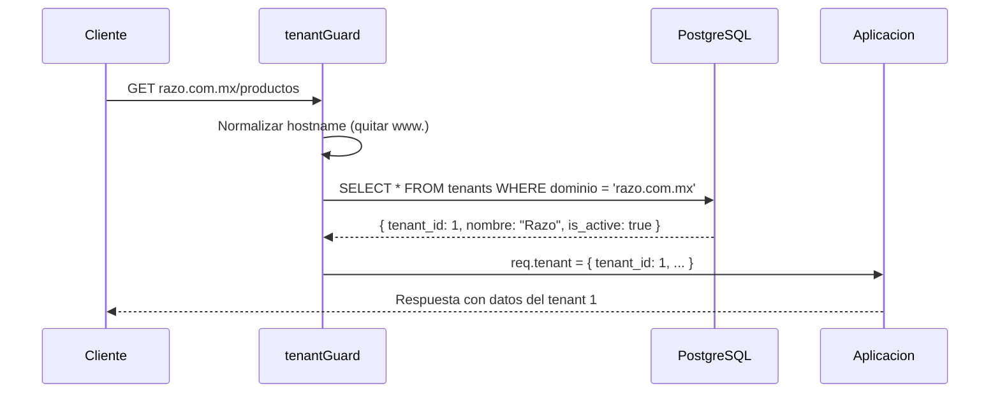
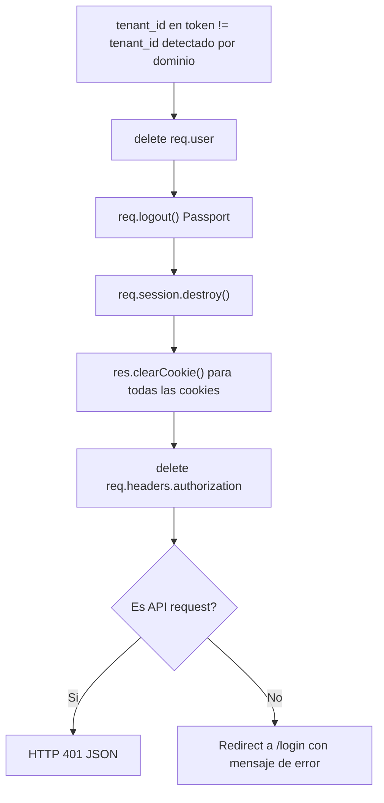

# Multi-Tenancy en RazoConnect

RazoConnect sirve a multiples negocios desde una sola instancia de aplicacion y una sola base de datos. Cada negocio opera de forma completamente aislada: sus productos, clientes, pedidos y configuracion nunca son visibles para otro negocio, aunque compartan servidor, proceso y esquema de base de datos.

---

## Tabla de Contenidos

- [Que es Multi-Tenancy](#que-es-multi-tenancy)
- [Los Tres Niveles de Segregacion](#los-tres-niveles-de-segregacion)
- [Por Que Row-Level](#por-que-row-level)
- [Deteccion de Tenant por Dominio](#deteccion-de-tenant-por-dominio)
- [Las Cuatro Capas de Aislamiento](#las-cuatro-capas-de-aislamiento)
- [Destruccion de Sesion ante Mismatch](#destruccion-de-sesion-ante-mismatch)
- [Escenarios de Ataque y Mitigacion](#escenarios-de-ataque-y-mitigacion)

---

## Que es Multi-Tenancy

Multi-tenancy es una arquitectura donde una unica instancia de aplicacion atiende a multiples clientes (tenants), con cada cliente creyendo que tiene su propia aplicacion privada. En RazoConnect, un tenant es un negocio mayorista: Razo, Fashion Plus, TechPro. Todos comparten el mismo servidor y la misma base de datos, pero sus datos estan completamente separados.

---

## Los Tres Niveles de Segregacion

Existen tres enfoques principales para lograr aislamiento en sistemas multi-tenant. La decision de cual usar tiene consecuencias operativas y de costo significativas.

| Nivel | Descripcion | Ventajas | Desventajas |
|---|---|---|---|
| Database Segregation | Cada tenant tiene su propia base de datos | Aislamiento perfecto, escalabilidad independiente | Triple costo de infraestructura, migrations multiplicadas por tenant |
| Schema Segregation | Misma base de datos, esquemas separados por tenant | Un PostgreSQL, menor costo que BD separadas | Migrations en multiples esquemas, queries deben conocer el esquema |
| Row-Level Isolation | Misma BD, mismo esquema, cada fila tiene tenant_id | Un codebase, un deployment, features escalan a todos automaticamente | Requiere disciplina: cada query debe filtrar por tenant_id |

---

## Por Que Row-Level

RazoConnect implementa Row-Level Isolation porque el ROI operativo es exponencial. Un nuevo feature desplegado una vez aparece en todos los tenants automaticamente. Una sola migracion de base de datos actualiza la plataforma completa. Un solo servidor cubre la operacion de todos los negocios. Las desventajas (disciplina en queries, riesgo de olvidar el filtro) se controlan con capas adicionales de middleware, no con infraestructura adicional.

---

## Deteccion de Tenant por Dominio

El primer punto de entrada al sistema es el `tenantGuard`. Este middleware extrae el hostname de la peticion HTTP, lo normaliza (elimina el prefijo `www.`) y lo busca en la tabla `tenants`.

Si el dominio no existe en la tabla o el tenant tiene `is_active = false`, la peticion es rechazada antes de llegar a cualquier controlador. El objeto `req.tenant` esta disponible para todos los middlewares y handlers que se ejecuten despues.

---

## Las Cuatro Capas de Aislamiento

RazoConnect no depende de una sola capa de validacion. Cuatro mecanismos independientes protegen el aislamiento, de modo que si uno fallara, los demas lo contienen.

**Capa 1 — tenantGuard:** Detecta el tenant a partir del dominio HTTP. Sin esta capa, el sistema no sabe a quien pertenece la peticion.

**Capa 2 — authMiddleware:** Verifica el JWT contra la base de datos. Un token expirado, revocado o malformado es rechazado antes de llegar a la logica de negocio.

**Capa 3 — tenantSessionGuard:** Compara el `tenant_id` codificado en el token JWT contra el `tenant_id` detectado por el dominio. Si no coinciden, la sesion es destruida activamente.

**Capa 4 — Row-Level Security:** Cada query de base de datos incluye `WHERE tenant_id = $1`. Incluso si las tres capas anteriores fallaran, la base de datos solo retorna filas del tenant correcto.

---

## Destruccion de Sesion ante Mismatch

Cuando el `tenant_id` del token no coincide con el `tenant_id` detectado por dominio, el sistema no se limita a retornar un error. Destruye activamente todos los artefactos de sesion para evitar que una sesion comprometida pueda reutilizarse.

Este comportamiento garantiza que una cookie robada de un tenant no pueda ser usada en otro tenant, ni siquiera de forma transitoria.

---

## Escenarios de Ataque y Mitigacion

| Escenario | Capa que lo detiene | Mecanismo |
|---|---|---|
| Cookie robada usada en otro tenant | Capa 3 — tenantSessionGuard | tenant_id del token != tenant_id del dominio, sesion destruida |
| Token JWT reutilizado en otro dominio | Capa 3 — tenantSessionGuard | Mismo mecanismo de comparacion |
| Acceso directo a PostgreSQL con credenciales comprometidas | Capa 4 — Row-Level | WHERE tenant_id filtra los datos |
| SQL Injection que intenta escapar el filtro | Capa 4 + inputValidator | Queries parametrizadas + sanitizacion de inputs |
| Dominio inexistente o tenant inactivo | Capa 1 — tenantGuard | Peticion rechazada antes de llegar a auth |

---

Desarrollado por Fernando | xCore
