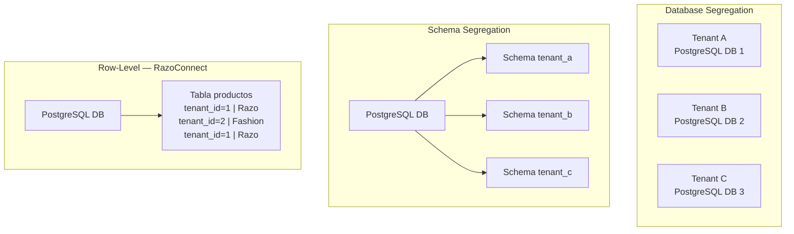
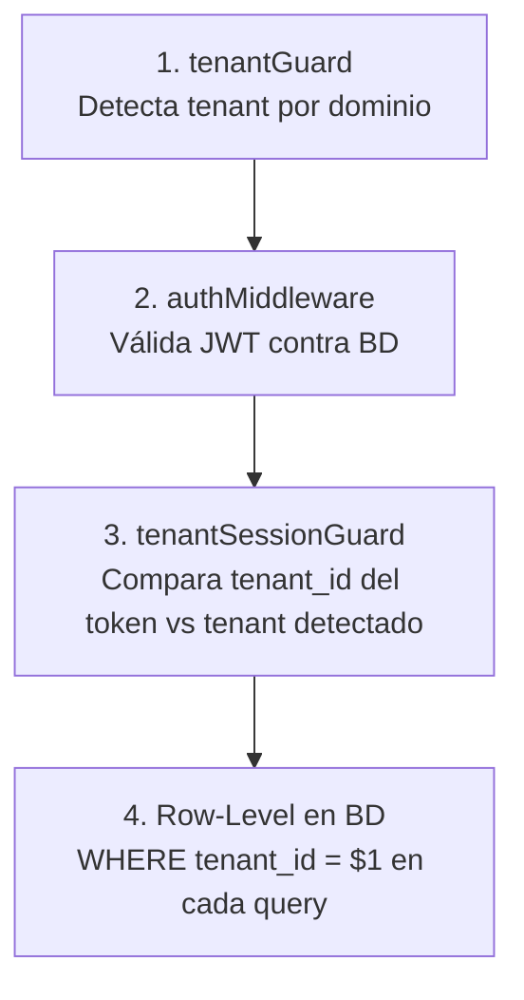
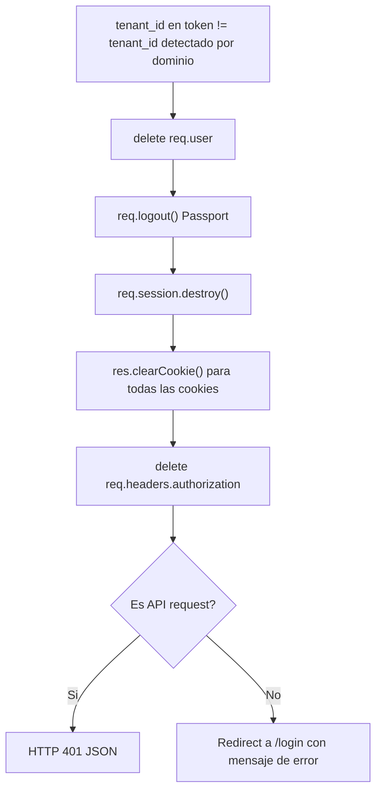
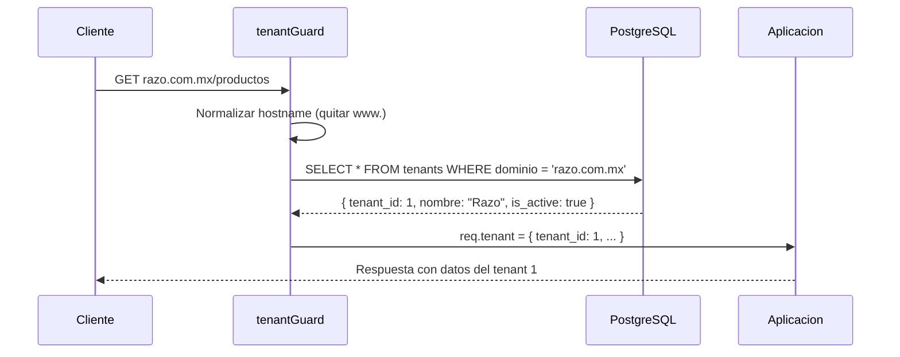

# Multi-Tenancy en RazoConnect / Multi-Tenancy in RazoConnect

<details open>
<summary>🇲🇽 Español</summary>

RazoConnect sirve a múltiples negocios desde una sola instancia de aplicación y una sola base de datos. Cada negocio opera de forma completamente aislada: sus productos, clientes, pedidos y configuración nunca son visibles para otro negocio, aunque compartan servidor, proceso y esquema de base de datos.

---

## Tabla de Contenidos

- [Que es Multi-Tenancy](#que-es-multi-tenancy)
- [Los Tres Niveles de Segregación](#los-tres-niveles-de-segregación)
- [Por Que Row-Level](#por-que-row-level)
- [Detección de Tenant por Dominio](#detección-de-tenant-por-dominio)
- [Las Cuatro Capas de Aislamiento](#las-cuatro-capas-de-aislamiento)
- [Destrucción de Sesión ante Mismatch](#destrucción-de-sesión-ante-mismatch)
- [Escenarios de Ataque y Mitigación](#escenarios-de-ataque-y-mitigación)

---

## Que es Multi-Tenancy

Multi-tenancy es una arquitectura donde una única instancia de aplicación atiende a múltiples clientes (tenants), con cada cliente creyendo que tiene su propia aplicación privada. En RazoConnect, un tenant es un negocio mayorista: Razo, Fashion Plus, TechPro. Todos comparten el mismo servidor y la misma base de datos, pero sus datos están completamente separados.

---

## Los Tres Niveles de Segregación

Existen tres enfoques principales para lograr aislamiento en sistemas multi-tenant. La decisión de cuál usar tiene consecuencias operativas y de costo significativas.

| Nivel | Descripción | Ventajas | Desventajas |
|---|---|---|---|
| Database Segregation | Cada tenant tiene su propia base de datos | Aislamiento perfecto, escalabilidad independiente | Triple costo de infraestructura, migrations multiplicadas por tenant |
| Schema Segregation | Misma base de datos, esquemas separados por tenant | Un PostgreSQL, menor costo que BD separadas | Migrations en múltiples esquemas, queries deben conocer el esquema |
| Row-Level Isolation | Misma BD, mismo esquema, cada fila tiene tenant_id | Un codebase, un deployment, features escalan a todos automáticamente | Requiere disciplina: cada query debe filtrar por tenant_id |


```mermaid
flowchart TD
    subgraph DB_SEG["Database Segregation"]
        T1["Tenant A\nPostgreSQL DB 1"]
        T2["Tenant B\nPostgreSQL DB 2"]
        T3["Tenant C\nPostgreSQL DB 3"]
    end

    subgraph SCH_SEG["Schema Segregation"]
        PG["PostgreSQL DB"]
        S1["Schema tenant_a"]
        S2["Schema tenant_b"]
        S3["Schema tenant_c"]
        PG --> S1
        PG --> S2
        PG --> S3
    end

    subgraph ROW_SEG["Row-Level — RazoConnect"]
        DB["PostgreSQL DB"]
        TAB["Tabla productos\ntenant_id=1 | Razo\ntenant_id=2 | Fashion\ntenant_id=1 | Razo"]
        DB --> TAB
    end
```

---

## Por Que Row-Level

RazoConnect implementa Row-Level Isolation porque el ROI operativo es exponencial. Un nuevo feature desplegado una vez aparece en todos los tenants automáticamente. Una sola migración de base de datos actualiza la plataforma completa. Un solo servidor cubre la operación de todos los negocios. Las desventajas (disciplina en queries, riesgo de olvidar el filtro) se controlan con capas adicionales de middleware, no con infraestructura adicional.

---

## Detección de Tenant por Dominio

El primer punto de entrada al sistema es el `tenantGuard`. Este middleware extrae el hostname de la petición HTTP, lo normaliza (elimina el prefijo `www.`) y lo busca en la tabla `tenants`.


```mermaid
sequenceDiagram
    participant C as Cliente
    participant TG as tenantGuard
    participant DB as PostgreSQL
    participant App as Aplicación

    C->>TG: GET razo.com.mx/productos
    TG->>TG: Normalizar hostname (quitar www.)
    TG->>DB: SELECT * FROM tenants WHERE dominio = 'razo.com.mx'
    DB-->>TG: { tenant_id: 1, nombre: "Razo", is_active: true }
    TG->>App: req.tenant = { tenant_id: 1, ... }
    App-->>C: Respuesta con datos del tenant 1
```

Si el dominio no existe en la tabla o el tenant tiene `is_active = false`, la petición es rechazada antes de llegar a cualquier controlador. El objeto `req.tenant` está disponible para todos los middlewares y handlers que se ejecuten después.

---

## Las Cuatro Capas de Aislamiento

RazoConnect no depende de una sola capa de validación. Cuatro mecanismos independientes protegen el aislamiento, de modo que si uno fallara, los demás lo contienen.


```mermaid
flowchart TD
    P1["1. tenantGuard\nDetecta tenant por dominio"]
    P2["2. authMiddleware\nVálida JWT contra BD"]
    P3["3. tenantSessionGuard\nCompara tenant_id del token vs tenant detectado"]
    P4["4. Row-Level en BD\nWHERE tenant_id = $1 en cada query"]

    P1 --> P2 --> P3 --> P4
```

**Capa 1 — tenantGuard:** Detecta el tenant a partir del dominio HTTP. Sin esta capa, el sistema no sabe a quién pertenece la petición.

**Capa 2 — authMiddleware:** Verifica el JWT contra la base de datos. Un token expirado, revocado o malformado es rechazado antes de llegar a la lógica de negocio.

**Capa 3 — tenantSessionGuard:** Compara el `tenant_id` codificado en el token JWT contra el `tenant_id` detectado por el dominio. Si no coinciden, la sesión es destruida activamente.

**Capa 4 — Row-Level Security:** Cada query de base de datos incluye `WHERE tenant_id = $1`. Incluso si las tres capas anteriores fallaran, la base de datos solo retorna filas del tenant correcto.

---

## Destrucción de Sesión ante Mismatch

Cuando el `tenant_id` del token no coincide con el `tenant_id` detectado por dominio, el sistema no se limita a retornar un error. Destruye activamente todos los artefactos de sesión para evitar que una sesión comprometida pueda reutilizarse.


```mermaid
flowchart TD
    Check["tenant_id en token != tenant_id detectado por dominio"] --> D1["delete req.user"]
    D1 --> D2["req.logout() Passport"]
    D2 --> D3["req.session.destroy()"]
    D3 --> D4["res.clearCookie() para todas las cookies"]
    D4 --> D5["delete req.headers.authorization"]
    D5 --> API{"Es API request?"}
    API -->|Si| R401["HTTP 401 JSON"]
    API -->|No| Redirect["Redirect a /login con mensaje de error"]
```

Este comportamiento garantiza que una cookie robada de un tenant no pueda ser usada en otro tenant, ni siquiera de forma transitoria.

---

## Escenarios de Ataque y Mitigación

| Escenario | Capa que lo detiene | Mecanismo |
|---|---|---|
| Cookie robada usada en otro tenant | Capa 3 — tenantSessionGuard | tenant_id del token != tenant_id del dominio, sesión destruida |
| Token JWT reutilizado en otro dominio | Capa 3 — tenantSessionGuard | Mismo mecanismo de comparación |
| Acceso directo a PostgreSQL con credenciales comprometidas | Capa 4 — Row-Level | WHERE tenant_id filtra los datos |
| SQL Injection que intenta escapar el filtro | Capa 4 + inputValidator | Queries parametrizadas + sanitización de inputs |
| Dominio inexistente o tenant inactivo | Capa 1 — tenantGuard | Petición rechazada antes de llegar a auth |

---

## Implementación Real en RazoConnect

### Código Real de tenantGuard.js

El `tenantGuard` implementa el flujo descrito arriba con cache in-memory (TTL 5 minutos), normalización de `www.`, soporte para `FORCE_TENANT_ID` en desarrollo y manejo especial para dominios `*.azurewebsites.net`.

```javascript
// middlewares/tenantGuard.js
const pool = require('../config/database');

const tenantCache = new Map();
const TENANT_CACHE_TTL = 5 * 60 * 1000; // 5 minutos

async function tenantGuard(req, res, next) {
    try {
        // Bypass en desarrollo con FORCE_TENANT_ID
        if (process.env.NODE_ENV === 'development' && process.env.FORCE_TENANT_ID) {
            const tenantId = parseInt(process.env.FORCE_TENANT_ID);
            const cached = getCached(`force:${tenantId}`);
            if (cached) { req.tenant = cached; return next(); }
            const { rows } = await pool.query(
                'SELECT * FROM tenants WHERE id = $1 AND is_active = true', [tenantId]
            );
            if (rows[0]) { setCache(`force:${tenantId}`, rows[0]); req.tenant = rows[0]; return next(); }
        }

        // Normalizar hostname
        let hostname = (req.hostname || '').toLowerCase();
        if (hostname.startsWith('www.')) hostname = hostname.substring(4);

        // Caso especial: *.azurewebsites.net
        if (hostname.endsWith('.azurewebsites.net')) {
            if (process.env.STAGING_TENANT_ID) {
                const stagingId = parseInt(process.env.STAGING_TENANT_ID);
                const { rows } = await pool.query(
                    'SELECT * FROM tenants WHERE id = $1 AND is_active = true', [stagingId]
                );
                if (rows[0]) { req.tenant = rows[0]; return next(); }
            }
            return res.status(404).json({ error: 'Dominio no reconocido' });
        }

        // Verificar cache
        const cached = getCached(hostname);
        if (cached) { req.tenant = cached; return next(); }

        // Consultar base de datos
        const { rows } = await pool.query(
            'SELECT * FROM tenants WHERE dominio = $1', [hostname]
        );
        if (!rows[0]) return res.status(404).json({ error: 'Dominio no reconocido' });
        if (!rows[0].is_active) return res.status(404).json({ error: 'Tenant no disponible' });

        setCache(hostname, rows[0]);
        req.tenant = rows[0];
        next();
    } catch (error) {
        res.status(500).json({ error: 'Error interno al identificar el tenant' });
    }
}

function getCached(key) {
    const entry = tenantCache.get(key);
    if (!entry || Date.now() > entry.expiresAt) { tenantCache.delete(key); return null; }
    return entry.tenant;
}

function setCache(key, tenant) {
    tenantCache.set(key, { tenant, expiresAt: Date.now() + TENANT_CACHE_TTL });
}

module.exports = tenantGuard;
```

### Flujo en 4 Capas con Referencias de Archivo

| Capa | Archivo | Función | Qué verifica |
|---|---|---|---|
| 1 — tenantGuard | `middlewares/tenantGuard.js` | `tenantGuard()` | Dominio HTTP → tenant_id en tabla `tenants` |
| 2 — authMiddleware | `middlewares/authMiddleware.js` | `authMiddleware()` | JWT válido, usuario existe en BD, token no revocado |
| 3 — tenantSessionGuard | `middlewares/tenantSessionGuard.js` | `tenantSessionGuard()` | `req.user.tenant_id === req.tenant.id` |
| 4 — Row-Level en BD | Todos los servicios en `services/` | Queries parametrizadas | `WHERE tenant_id = $1` en cada query |

### Tabla de Protecciones Implementadas

| Protección | Implementada | Ubicación | Cobertura |
|---|:---:|---|---|
| Detección de tenant por dominio | ✅ | `tenantGuard.js` | 100% de requests |
| Cache de tenant con TTL | ✅ | `tenantGuard.js` | Evita query a BD por request |
| Normalización www. | ✅ | `tenantGuard.js` | www.dominio → dominio |
| FORCE_TENANT_ID solo en dev | ✅ | `tenantGuard.js` | Solo cuando `NODE_ENV=development` |
| Soporte *.azurewebsites.net | ✅ | `tenantGuard.js` | Staging/review environments |
| Verificación JWT contra BD | ✅ | `authMiddleware.js` | Detecta usuarios revocados |
| Cross-tenant session validation | ✅ | `tenantSessionGuard.js` | 100% de rutas autenticadas |
| Destrucción activa de sesión | ✅ | `tenantSessionGuard.js` | Borra sesión, cookies, headers |
| Row-Level WHERE tenant_id | ✅ | Todos los `services/*.js` | 100% de queries de negocio |
| Tenant inactivo rechazado | ✅ | `tenantGuard.js` | Antes de llegar a auth |

Ver [TENANT_DETECTION.md](TENANT_DETECTION.md) para el detalle completo del mecanismo de detección.
Ver [SESSION_MANAGEMENT.md](SESSION_MANAGEMENT.md) para la gestión de sesiones dual.
Ver [MULTITENANCY_DATABASE_SEPARATION.md](MULTITENANCY_DATABASE_SEPARATION.md) para la estrategia de migración a BD separadas.

---

Desarrollado por Fernando Ramírez | <a href="https://xcore-byg8fkdve4eyatbz.mexicocentral-01.azurewebsites.net/">xCore</a>

</details>

<details>
<summary>🇺🇸 English</summary>

RazoConnect serves multiple businesses from a single application instance and a single database. Each business operates in complete isolation: its products, clients, orders, and configuration are never visible to another business, even though they share the same server, process, and database schema.

---

## Table of Contents

- [What is Multi-Tenancy](#what-is-multi-tenancy)
- [The Three Levels of Segregation](#the-three-levels-of-segregation)
- [Why Row-Level](#why-row-level)
- [Tenant Detection by Domain](#tenant-detection-by-domain)
- [The Four Isolation Layers](#the-four-isolation-layers)
- [Session Destruction on Mismatch](#session-destruction-on-mismatch)
- [Attack Scenarios and Mitigation](#attack-scenarios-and-mitigation)

---

## What is Multi-Tenancy

Multi-tenancy is an architecture where a single application instance serves multiple clients (tenants), with each client believing they have their own private application. In RazoConnect, a tenant is a wholesale business: Razo, Fashion Plus, TechPro. They all share the same server and the same database, but their data is completely separate.

---

## The Three Levels of Segregation

There are three main approaches to achieving isolation in multi-tenant systems. The decision of which to use has significant operational and cost consequences.

| Level | Description | Advantages | Disadvantages |
|---|---|---|---|
| Database Segregation | Each tenant has its own database | Perfect isolation, independent scalability | Triple infrastructure cost, migrations multiplied per tenant |
| Schema Segregation | Same database, separate schemas per tenant | One PostgreSQL, lower cost than separate DBs | Migrations across multiple schemas, queries must know the schema |
| Row-Level Isolation | Same DB, same schema, each row has tenant_id | One codebase, one deployment, features scale to all automatically | Requires discipline: every query must filter by tenant_id |


```mermaid
flowchart TD
    subgraph DB_SEG["Database Segregation"]
        T1["Tenant A\nPostgreSQL DB 1"]
        T2["Tenant B\nPostgreSQL DB 2"]
        T3["Tenant C\nPostgreSQL DB 3"]
    end

    subgraph SCH_SEG["Schema Segregation"]
        PG["PostgreSQL DB"]
        S1["Schema tenant_a"]
        S2["Schema tenant_b"]
        S3["Schema tenant_c"]
        PG --> S1
        PG --> S2
        PG --> S3
    end

    subgraph ROW_SEG["Row-Level — RazoConnect"]
        DB["PostgreSQL DB"]
        TAB["Tabla productos\ntenant_id=1 | Razo\ntenant_id=2 | Fashion\ntenant_id=1 | Razo"]
        DB --> TAB
    end
```

---

## Why Row-Level

RazoConnect implements Row-Level Isolation because the operational ROI is exponential. A new feature deployed once appears in all tenants automatically. A single database migration updates the entire platform. A single server covers the operation of all businesses. The disadvantages (query discipline, risk of forgetting the filter) are managed with additional middleware layers, not with additional infrastructure.

---

## Tenant Detection by Domain

The first entry point to the system is `tenantGuard`. This middleware extracts the hostname from the HTTP request, normalizes it (removes the `www.` prefix), and looks it up in the `tenants` table.


```mermaid
sequenceDiagram
    participant C as Cliente
    participant TG as tenantGuard
    participant DB as PostgreSQL
    participant App as Aplicacion

    C->>TG: GET razo.com.mx/productos
    TG->>TG: Normalizar hostname (quitar www.)
    TG->>DB: SELECT * FROM tenants WHERE dominio = 'razo.com.mx'
    DB-->>TG: { tenant_id: 1, nombre: "Razo", is_active: true }
    TG->>App: req.tenant = { tenant_id: 1, ... }
    App-->>C: Respuesta con datos del tenant 1
```

If the domain does not exist in the table or the tenant has `is_active = false`, the request is rejected before reaching any controller. The `req.tenant` object is available to all middlewares and handlers that execute after.

---

## The Four Isolation Layers

RazoConnect does not rely on a single validation layer. Four independent mechanisms protect isolation, so that if one were to fail, the others contain it.


```mermaid
flowchart TD
    P1["1. tenantGuard\nDetecta tenant por dominio"]
    P2["2. authMiddleware\nValida JWT contra BD"]
    P3["3. tenantSessionGuard\nCompara tenant_id del token vs tenant detectado"]
    P4["4. Row-Level en BD\nWHERE tenant_id = $1 en cada query"]

    P1 --> P2 --> P3 --> P4
```

**Layer 1 — tenantGuard:** Detects the tenant from the HTTP domain. Without this layer, the system does not know who the request belongs to.

**Layer 2 — authMiddleware:** Verifies the JWT against the database. An expired, revoked, or malformed token is rejected before reaching business logic.

**Layer 3 — tenantSessionGuard:** Compares the `tenant_id` encoded in the JWT token against the `tenant_id` detected by the domain. If they don't match, the session is actively destroyed.

**Layer 4 — Row-Level Security:** Every database query includes `WHERE tenant_id = $1`. Even if the three previous layers were to fail, the database only returns rows for the correct tenant.

---

## Session Destruction on Mismatch

When the `tenant_id` in the token does not match the `tenant_id` detected by domain, the system does not simply return an error. It actively destroys all session artifacts to prevent a compromised session from being reused.


```mermaid
flowchart TD
    Check["tenant_id en token != tenant_id detectado por dominio"] --> D1["delete req.user"]
    D1 --> D2["req.logout() Passport"]
    D2 --> D3["req.session.destroy()"]
    D3 --> D4["res.clearCookie() para todas las cookies"]
    D4 --> D5["delete req.headers.authorization"]
    D5 --> API{"Es API request?"}
    API -->|Si| R401["HTTP 401 JSON"]
    API -->|No| Redirect["Redirect a /login con mensaje de error"]
```

This behavior guarantees that a cookie stolen from one tenant cannot be used in another tenant, not even transiently.

---

## Attack Scenarios and Mitigation

| Scenario | Layer that stops it | Mechanism |
|---|---|---|
| Stolen cookie used in another tenant | Layer 3 — tenantSessionGuard | token tenant_id != domain tenant_id, session destroyed |
| JWT token reused in another domain | Layer 3 — tenantSessionGuard | Same comparison mechanism |
| Direct access to PostgreSQL with compromised credentials | Layer 4 — Row-Level | WHERE tenant_id filters the data |
| SQL Injection attempting to escape the filter | Layer 4 + inputValidator | Parameterized queries + input sanitization |
| Non-existent domain or inactive tenant | Layer 1 — tenantGuard | Request rejected before reaching auth |

---

## Real Implementation in RazoConnect

### 4-Layer Flow with File References

| Layer | File | Function | What it verifies |
|---|---|---|---|
| 1 — tenantGuard | `middlewares/tenantGuard.js` | `tenantGuard()` | HTTP domain → tenant_id in `tenants` table |
| 2 — authMiddleware | `middlewares/authMiddleware.js` | `authMiddleware()` | Valid JWT, user exists in DB, token not revoked |
| 3 — tenantSessionGuard | `middlewares/tenantSessionGuard.js` | `tenantSessionGuard()` | `req.user.tenant_id === req.tenant.id` |
| 4 — Row-Level in DB | All services in `services/` | Parameterized queries | `WHERE tenant_id = $1` in every query |

### Implemented Protections Table

| Protection | Implemented | Location | Coverage |
|---|:---:|---|---|
| Tenant detection by domain | ✅ | `tenantGuard.js` | 100% of requests |
| Tenant cache with TTL | ✅ | `tenantGuard.js` | Avoids DB query per request |
| www. normalization | ✅ | `tenantGuard.js` | www.domain → domain |
| FORCE_TENANT_ID dev-only | ✅ | `tenantGuard.js` | Only when `NODE_ENV=development` |
| *.azurewebsites.net support | ✅ | `tenantGuard.js` | Staging/review environments |
| JWT verification against DB | ✅ | `authMiddleware.js` | Detects revoked users |
| Cross-tenant session validation | ✅ | `tenantSessionGuard.js` | 100% of authenticated routes |
| Active session destruction | ✅ | `tenantSessionGuard.js` | Clears session, cookies, headers |
| Row-Level WHERE tenant_id | ✅ | All `services/*.js` | 100% of business queries |
| Inactive tenant rejected | ✅ | `tenantGuard.js` | Before reaching auth |

See [TENANT_DETECTION.md](TENANT_DETECTION.md) for the complete tenant detection mechanism.
See [SESSION_MANAGEMENT.md](SESSION_MANAGEMENT.md) for dual session management.
See [MULTITENANCY_DATABASE_SEPARATION.md](MULTITENANCY_DATABASE_SEPARATION.md) for the migration strategy to separate databases.

---

Developed by Fernando Ramírez | <a href="https://xcore-byg8fkdve4eyatbz.mexicocentral-01.azurewebsites.net/">xCore</a>

</details>
