# Rate Limiting Distribuido / Distributed Rate Limiting

🇲🇽 Español

RazoConnect migro su rate limiter en memoria a una solución distribuida basada en `express-rate-limit` con `RedisStore` respaldado por **Azure Cache for Redis**. El cambio fue necesario porque Azure App Service puede escalar horizontalmente a múltiples instancias: un rate limiter en memoria es por instancia y no garantiza el limite global entre todas las instancias del servicio.

---

## Tabla de Contenidos

- [Por Que Distribuido](#por-que-distribuido)
- [Conexión Redis TLS](#conexión-redis-tls)
- [globalLimiter](#globallimiter)
- [authLimiter](#authlimiter)
- [Flujo de Rate Limiting](#flujo-de-rate-limiting)
- [Variables de Entorno Requeridas](#variables-de-entorno-requeridas)

---

## Por Que Distribuido

| Escenario | Rate limiter en memoria | Rate limiter con Redis |
|---|---|---|
| Una sola instancia de App Service | Funciona correctamente | Funciona correctamente |
| Múltiples instancias de App Service | Cada instancia tiene su propio contador — un atacante puede enviar N peticiones a cada instancia | Un solo contador compartido en Redis — el limite se aplica globalmente |
| Reinicio de instancia | El contador se reinicia | El contador persiste en Redis |
| Revocación inmediata | No posible | Posible vaciando la clave en Redis |

---

## Conexión Redis TLS

Azure Cache for Redis requiere conexión TLS en el **puerto 6380** (no el puerto 6379 sin TLS). La conexión se configura con las siguientes variables de entorno y el flag `tls: true` en el cliente Redis.

---

## globalLimiter

Aplicado a todas las rutas `/api`. Reemplaza el `apiLimiter` legacy que usaba un Map en memoria.

| Parámetro | Valor |
|---|---|
| Maximo de peticiones | 300 |
| Ventana de tiempo | 15 minutos |
| Store | RedisStore (Azure Cache for Redis) |
| Alcance | Todas las rutas `/api` |
| Respuesta al exceder | HTTP 429 con mensaje estandar |

---

## authLimiter

Aplicado exclusivamente a las rutas de login de administrador para prevenir ataques de fuerza bruta.

| Parámetro | Valor |
|---|---|
| Maximo de intentos | 10 |
| Ventana de tiempo | 15 minutos |
| `skipSuccessfulRequests` | `true` — los logins exitosos no consumen el contador |
| Store | RedisStore (Azure Cache for Redis) |
| Alcance | Solo rutas de login de admin |
| Respuesta al exceder | HTTP 429 con mensaje estandar |

`skipSuccessfulRequests: true` garantiza que solo los intentos fallidos consumen el limite. Un admin que ingresa correctamente no se ve penalizado por sus propios logins exitosos.

---

## Flujo de Rate Limiting

```mermaid
flowchart LR
    Client["Cliente"] --> Request["HTTP Request"]
    Request --> Global["globalLimiter\nRedis — 300 req / 15min"]
    Global -->|Limite excedido| R429A["HTTP 429\nToo Many Requests"]
    Global -->|Dentro del limite| Auth["authLimiter\nSolo rutas /login de admin"]
    Auth -->|Limite excedido| R429B["HTTP 429\nToo Many Requests"]
    Auth -->|Dentro del limite| Endpoint["Endpoint"]
```

---

## Variables de Entorno Requeridas

Las siguientes variables deben estar definidas para la conexión Redis con TLS:

| Variable | Descripción |
|---|---|
| `REDIS_HOST` | Hostname de la instancia de Azure Cache for Redis |
| `REDIS_PORT` | Puerto TLS — debe ser `6380` |
| `REDIS_PASSWORD` | Clave de acceso de la instancia Redis |
| `REDIS_TLS` | Flag que habilita TLS en el cliente (`true`) |

La ausencia de cualquiera de estas variables es detectada por `secretsValidator` al arrancar la aplicación, que termina el proceso antes de abrir el puerto.

---

Desarrollado por Fernando Ramírez | <a href="https://xcore-byg8fkdve4eyatbz.mexicocentral-01.azurewebsites.net/">xCore</a>

🇺🇸 English

RazoConnect migrated its in-memory rate limiter to a distributed solution based on `express-rate-limit` with `RedisStore` backed by **Azure Cache for Redis**. The change was necessary because Azure App Service can scale horizontally to multiple instances: an in-memory rate limiter is per-instance and does not guarantee the global limit across all instances of the service.

---

## Table of Contents

- [Why Distributed](#why-distributed)
- [Redis TLS Connection](#redis-tls-connection)
- [globalLimiter](#globallimiter)
- [authLimiter](#authlimiter)
- [Rate Limiting Flow](#rate-limiting-flow)
- [Required Environment Variables](#required-environment-variables)

---

## Why Distributed

| Scenario | In-memory rate limiter | Redis rate limiter |
|---|---|---|
| Single App Service instance | Works correctly | Works correctly |
| Multiple App Service instances | Each instance has its own counter — an attacker can send N requests to each instance | A single shared counter in Redis — the limit is enforced globally |
| Instance restart | Counter resets | Counter persists in Redis |
| Immediate revocation | Not possible | Possible by clearing the key in Redis |

---

## Redis TLS Connection

Azure Cache for Redis requires a TLS connection on **port 6380** (not port 6379 without TLS). The connection is configured with the following environment variables and the `tls: true` flag in the Redis client.

---

## globalLimiter

Applied to all `/api` routes. Replaces the legacy `apiLimiter` that used an in-memory Map.

| Parameter | Value |
|---|---|
| Maximum requests | 300 |
| Time window | 15 minutes |
| Store | RedisStore (Azure Cache for Redis) |
| Scope | All `/api` routes |
| Response on exceed | HTTP 429 with standard message |

---

## authLimiter

Applied exclusively to administrator login routes to prevent brute force attacks.

| Parameter | Value |
|---|---|
| Maximum attempts | 10 |
| Time window | 15 minutes |
| `skipSuccessfulRequests` | `true` — successful logins do not consume the counter |
| Store | RedisStore (Azure Cache for Redis) |
| Scope | Admin login routes only |
| Response on exceed | HTTP 429 with standard message |

`skipSuccessfulRequests: true` ensures that only failed attempts consume the limit. An admin who logs in correctly is not penalized by their own successful logins.

---

## Rate Limiting Flow

```mermaid
flowchart LR
    Client["Client"] --> Request["HTTP Request"]
    Request --> Global["globalLimiter\nRedis — 300 req / 15min"]
    Global -->|Limit exceeded| R429A["HTTP 429\nToo Many Requests"]
    Global -->|Within limit| Auth["authLimiter\nAdmin /login routes only"]
    Auth -->|Limit exceeded| R429B["HTTP 429\nToo Many Requests"]
    Auth -->|Within limit| Endpoint["Endpoint"]
```

---

## Required Environment Variables

The following variables must be defined for the Redis TLS connection:

| Variable | Description |
|---|---|
| `REDIS_HOST` | Hostname of the Azure Cache for Redis instance |
| `REDIS_PORT` | TLS port — must be `6380` |
| `REDIS_PASSWORD` | Access key for the Redis instance |
| `REDIS_TLS` | Flag that enables TLS in the client (`true`) |

The absence of any of these variables is detected by `secretsValidator` on application startup, which terminates the process before opening the port.

---

Developed by Fernando Ramírez | <a href="https://xcore-byg8fkdve4eyatbz.mexicocentral-01.azurewebsites.net/">xCore</a>

