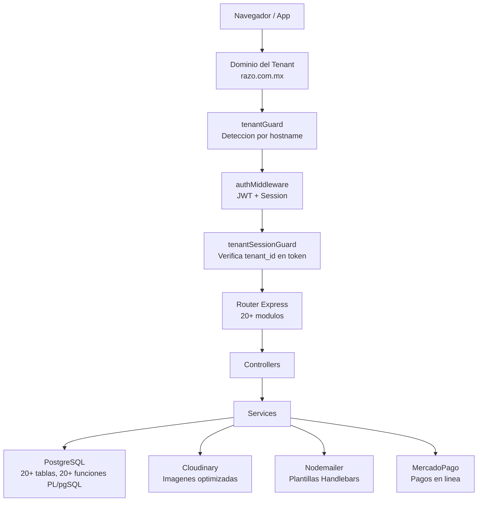

# RazoConnect — Architecture Showcase

🇲🇽 Español

RazoConnect es una plataforma SaaS B2B multi-tenant en produccion que permite a negocios mayoristas operar con su propia marca, catalogo de productos, clientes y configuracion, compartiendo infraestructura con otros negocios de forma completamente aislada. El codigo fuente es privado al ser un producto comercial, pero toda la arquitectura, patrones de diseno y decisiones tecnicas estan documentadas en este repositorio.

---

## Tabla de Contenidos

- [Arquitectura General](#arquitectura-general)
- [Stack Tecnologico](#stack-tecnologico)
- [Puntos Fuertes del Proyecto](#puntos-fuertes-del-proyecto)
- [Documentacion Tecnica](#documentacion-tecnica)

---

## Arquitectura General

El flujo comienza en el dominio del tenant. Cada hostname se resuelve a un registro de tenant en la base de datos antes de que cualquier logica de negocio se ejecute. La sesion y el token JWT se validan independientemente y se comparan contra el tenant detectado, de modo que un token valido para un negocio no puede operar en otro. Las rutas de Express estan organizadas en mas de 20 modulos funcionales que delegan a una capa de servicios, y esos servicios se comunican exclusivamente con PostgreSQL, Cloudinary, Nodemailer y MercadoPago.

---

## Stack Tecnologico

| Categoria | Tecnologia |
|---|---|
| Runtime | Node.js + Express |
| Base de datos | PostgreSQL con 20+ funciones PL/pgSQL y pg_cron |
| Autenticacion | JWT + express-session + Passport.js + Google OAuth 2.0 |
| Pagos | MercadoPago SDK con manejo de webhooks |
| Almacenamiento de imagenes | Cloudinary + Multer + Sharp (procesamiento antes de subir) |
| Email | Nodemailer con plantillas Handlebars |
| Generacion de documentos | PDFKit (facturas PDF) + ExcelJS (reportes Excel) |
| Tareas programadas | node-cron + pg_cron |
| Deployment | Azure App Service (trust proxy configurado) |
| Seguridad | Implementacion manual de OWASP: CSP, HSTS, rate limiting, input sanitization, secrets audit |
| Arquitectura | Multi-tenant Row-Level con 4 capas de aislamiento en middleware |

---

## Puntos Fuertes del Proyecto

**Seguridad sin dependencias de terceros.** Las cabeceras de seguridad (CSP, HSTS, X-Frame-Options), el rate limiter y el validador de inputs estan escritos a mano siguiendo OWASP Top 10. No se usa helmet ni ningun paquete de seguridad de terceros. Esto reduce la superficie de ataque y garantiza comprension completa de cada medida. Ver [SECURITY_LAYERS.md](SECURITY_LAYERS.md).

**Multi-tenancy con aislamiento real.** La deteccion de tenant por dominio, la validacion cruzada de JWT, la destruccion activa de sesion ante mismatch y el filtrado por `tenant_id` en cada query de base de datos forman cuatro capas independientes de aislamiento. Ver [MULTI_TENANCY.md](MULTI_TENANCY.md).

**Base de datos que se valida a si misma.** Mas de 20 funciones PL/pgSQL y 10+ triggers garantizan consistencia ACID sin delegar esa responsabilidad al codigo de aplicacion. pg_cron ejecuta mantenimiento diario directamente en la base de datos. Ver [DATABASE_DESIGN.md](DATABASE_DESIGN.md).

**Inventario inteligente con FIFO y reordenamiento automatico.** El sistema de asignacion de stock respeta orden de llegada pero permite prioridad para clientes VIP con efecto cascada documentado. El reordenamiento normaliza cantidades a multiplos del empaque del proveedor. Ver [SMART_INVENTORY.md](SMART_INVENTORY.md).

**Sistema de credito con scoring de riesgo.** El analisis de riesgo crediticio evalua antiguedad, historial de compras, maximo historico y pagos vencidos para generar una recomendacion antes de que el admin tome la decision final. Ver [CREDIT_SYSTEM.md](CREDIT_SYSTEM.md).

**Auditoria forense inmutable.** El Kardex registra cada movimiento de inventario con stock previo y posterior. El auditLogger genera diffs de cambios en formato JSONB. Ninguna de las dos tablas permite UPDATE ni DELETE. Ver [AUDIT_LOGGING.md](AUDIT_LOGGING.md).

**Automatizacion de extremo a extremo.** node-cron, pg_cron y triggers de base de datos trabajan en conjunto para actualizar deudas vencidas, notificar restock a favoritos y generar ordenes de compra automaticas ante backorders. Ver [AUTOMATION.md](AUTOMATION.md).

**Control de cambios con confirmacion obligatoria.** Las modificaciones criticas de negocio no se aplican directamente. El ChangeRequestService registra un diff entre el estado actual y el propuesto, requiere confirmacion explicita del administrador y genera automaticamente un registro en audit_log con referencia cruzada. Ver [CHANGE_REQUEST.md](CHANGE_REQUEST.md).

---

## Documentacion Tecnica

| Documento | Descripcion |
|---|---|
| [MULTI_TENANCY.md](MULTI_TENANCY.md) | Como funciona el aislamiento multi-tenant: los tres niveles de segregacion y por que RazoConnect elige Row-Level con proteccion adicional en middleware |
| [SECURITY_LAYERS.md](SECURITY_LAYERS.md) | Las 10 capas de seguridad implementadas manualmente siguiendo OWASP: desde securityHeaders hasta Row-Level Security en base de datos |
| [DATABASE_DESIGN.md](DATABASE_DESIGN.md) | Diseno del schema: 6 dominios, diagrama ER, 20+ funciones PL/pgSQL, triggers de sincronizacion y tareas pg_cron |
| [SMART_INVENTORY.md](SMART_INVENTORY.md) | Algoritmo FIFO con Priority Override, Smart Reordering por empaque de proveedor y notificaciones de restock a favoritos |
| [CREDIT_SYSTEM.md](CREDIT_SYSTEM.md) | Flujo de solicitud de credito, scoring de riesgo automatico, flujo RMA de devoluciones y estados del ciclo de vida del credito |
| [AUDIT_LOGGING.md](AUDIT_LOGGING.md) | Kardex inmutable append-only, diff tracking de cambios en JSONB y tipos de eventos auditados |
| [AUTOMATION.md](AUTOMATION.md) | Todas las automatizaciones del sistema: tareas cron, triggers de base de datos, generacion automatica de ordenes de compra y notificaciones |
| [MODULES.md](MODULES.md) | Inventario completo de los 20+ modulos del sistema organizados por actor: cliente, admin, agente y sistema |
| [DEVELOPER.md](DEVELOPER.md) | Perfil tecnico del desarrollador Fernando Ramírez y descripcion de <a href="https://xcore-byg8fkdve4eyatbz.mexicocentral-01.azurewebsites.net/">xCore</a> |
| [CHANGE_REQUEST.md](CHANGE_REQUEST.md) | Patron de control de cambios auditado: ChangeRequestService registra diffs antes de aplicar modificaciones criticas, con confirmacion obligatoria |

---

Desarrollado por Fernando Ramírez | <a href="https://xcore-byg8fkdve4eyatbz.mexicocentral-01.azurewebsites.net/">xCore</a>

🇺🇸 English

RazoConnect is a multi-tenant B2B SaaS platform in production that allows wholesale businesses to operate under their own brand, product catalog, clients, and configuration, sharing infrastructure with other businesses in complete isolation. The source code is private as it is a commercial product, but the entire architecture, design patterns, and technical decisions are documented in this repository.

---

## Table of Contents

- [General Architecture](#general-architecture)
- [Technology Stack](#technology-stack)
- [Project Highlights](#project-highlights)
- [Technical Documentation](#technical-documentation)

---

## General Architecture

The flow begins at the tenant's domain. Each hostname is resolved to a tenant record in the database before any business logic is executed. The session and JWT token are validated independently and compared against the detected tenant, so a valid token for one business cannot operate in another. Express routes are organized into more than 20 functional modules that delegate to a service layer, and those services communicate exclusively with PostgreSQL, Cloudinary, Nodemailer, and MercadoPago.

---

## Technology Stack

| Category | Technology |
|---|---|
| Runtime | Node.js + Express |
| Database | PostgreSQL with 20+ PL/pgSQL functions and pg_cron |
| Authentication | JWT + express-session + Passport.js + Google OAuth 2.0 |
| Payments | MercadoPago SDK with webhook handling |
| Image storage | Cloudinary + Multer + Sharp (processing before uploading) |
| Email | Nodemailer with Handlebars templates |
| Document generation | PDFKit (PDF invoices) + ExcelJS (Excel reports) |
| Scheduled tasks | node-cron + pg_cron |
| Deployment | Azure App Service (trust proxy configured) |
| Security | Manual OWASP implementation: CSP, HSTS, rate limiting, input sanitization, secrets audit |
| Architecture | Multi-tenant Row-Level with 4 middleware isolation layers |

---

## Project Highlights

**Security without third-party dependencies.** Security headers (CSP, HSTS, X-Frame-Options), the rate limiter, and the input validator are written by hand following OWASP Top 10. No helmet or any third-party security package is used. This reduces the attack surface and guarantees complete understanding of each measure. See [SECURITY_LAYERS.md](SECURITY_LAYERS.md).

**Multi-tenancy with real isolation.** Tenant detection by domain, cross-validated JWT, active session destruction on mismatch, and `tenant_id` filtering in every database query form four independent isolation layers. See [MULTI_TENANCY.md](MULTI_TENANCY.md).

**A database that validates itself.** More than 20 PL/pgSQL functions and 10+ triggers guarantee ACID consistency without delegating that responsibility to application code. pg_cron runs daily maintenance directly in the database. See [DATABASE_DESIGN.md](DATABASE_DESIGN.md).

**Smart inventory with FIFO and automatic reordering.** The stock allocation system respects arrival order but allows priority for VIP clients with documented cascading effects. Reordering normalizes quantities to multiples of the supplier's packaging. See [SMART_INVENTORY.md](SMART_INVENTORY.md).

**Credit system with risk scoring.** Credit risk analysis evaluates tenure, purchase history, historical maximum, and overdue payments to generate a recommendation before the admin makes the final decision. See [CREDIT_SYSTEM.md](CREDIT_SYSTEM.md).

**Immutable forensic audit.** The Kardex records every inventory movement with previous and subsequent stock. The auditLogger generates change diffs in JSONB format. Neither table allows UPDATE or DELETE. See [AUDIT_LOGGING.md](AUDIT_LOGGING.md).

**End-to-end automation.** node-cron, pg_cron, and database triggers work together to update overdue debts, notify favorites restock, and generate automatic purchase orders on backorders. See [AUTOMATION.md](AUTOMATION.md).

**Change control with mandatory confirmation.** Critical business modifications are not applied directly. The ChangeRequestService records a diff between the current and proposed state, requires explicit administrator confirmation, and automatically generates an audit_log entry with cross-reference. See [CHANGE_REQUEST.md](CHANGE_REQUEST.md).

---

## Technical Documentation

| Document | Description |
|---|---|
| [MULTI_TENANCY.md](MULTI_TENANCY.md) | How multi-tenant isolation works: the three levels of segregation and why RazoConnect chooses Row-Level with additional middleware protection |
| [SECURITY_LAYERS.md](SECURITY_LAYERS.md) | The 10 security layers implemented manually following OWASP: from securityHeaders to Row-Level Security in the database |
| [DATABASE_DESIGN.md](DATABASE_DESIGN.md) | Schema design: 6 domains, ER diagram, 20+ PL/pgSQL functions, synchronization triggers, and pg_cron tasks |
| [SMART_INVENTORY.md](SMART_INVENTORY.md) | FIFO algorithm with Priority Override, Smart Reordering by supplier packaging, and restock notifications to favorites |
| [CREDIT_SYSTEM.md](CREDIT_SYSTEM.md) | Credit request flow, automatic risk scoring, RMA returns flow, and credit lifecycle states |
| [AUDIT_LOGGING.md](AUDIT_LOGGING.md) | Immutable append-only Kardex, JSONB change diff tracking, and types of audited events |
| [AUTOMATION.md](AUTOMATION.md) | All system automations: cron tasks, database triggers, automatic purchase order generation, and notifications |
| [MODULES.md](MODULES.md) | Complete inventory of the 20+ system modules organized by actor: client, admin, agent, and system |
| [DEVELOPER.md](DEVELOPER.md) | Technical profile of developer Fernando Ramírez and description of <a href="https://xcore-byg8fkdve4eyatbz.mexicocentral-01.azurewebsites.net/">xCore</a> |
| [CHANGE_REQUEST.md](CHANGE_REQUEST.md) | Audited change control pattern: ChangeRequestService records diffs before applying critical modifications, with mandatory confirmation |

---

Developed by Fernando Ramírez | <a href="https://xcore-byg8fkdve4eyatbz.mexicocentral-01.azurewebsites.net/">xCore</a>

