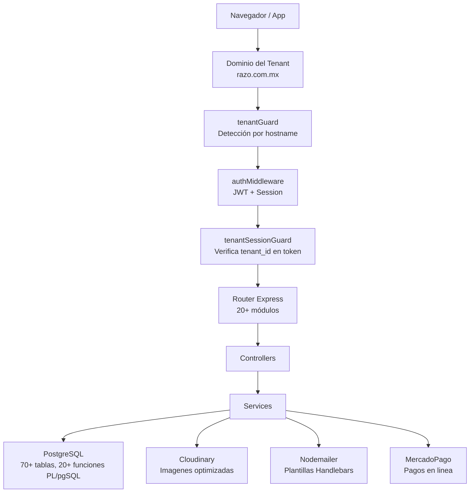
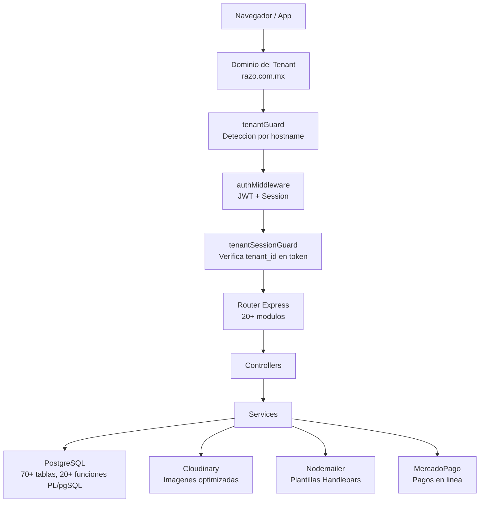

# RazoConnect — Architecture Showcase

🇲🇽 Español

**Este repositorio NO es open-source. Es un showcase de arquitectura de RazoConnect**, una plataforma SaaS B2B multi-tenant en producción activa. El código fuente es privado al ser un producto comercial. Esta documentación existe para demostrar la sofisticación arquitectónica del sistema: aislamiento multi-tenant en 4 capas, base de datos con 70+ tablas y 20+ funciones PL/pgSQL, y lógica de negocio compleja ejecutándose en producción con múltiples tenants simultáneamente.

---

## Tabla de Contenidos

- [Arquitectura General](#arquitectura-general)
- [Stack Tecnológico](#stack-tecnológico)
- [Puntos Fuertes del Proyecto](#puntos-fuertes-del-proyecto)
- [Documentación Técnica](#documentación-técnica)

---

## Arquitectura General

```mermaid
flowchart TD
    Cliente["Navegador / App"] --> Dominio["Dominio del Tenant\nrazo.com.mx"]
    Dominio --> TG["tenantGuard\nDetección por hostname"]
    TG --> Auth["authMiddleware\nJWT + Session"]
    Auth --> TSG["tenantSessionGuard\nVerifica tenant_id en token"]
    TSG --> Rutas["Router Express\n20+ módulos"]
    Rutas --> Controllers["Controllers"]
    Controllers --> Services["Services"]
    Services --> PG["PostgreSQL\n70+ tablas, 20+ funciones PL/pgSQL"]
    Services --> Cloudinary["Cloudinary\nImagenes optimizadas"]
    Services --> Email["Nodemailer\nPlantillas Handlebars"]
    Services --> MP["MercadoPago\nPagos en linea"]
```

El flujo comienza en el dominio del tenant. Cada hostname se resuelve a un registro de tenant en la base de datos antes de que cualquier lógica de negocio se ejecute. La sesión y el token JWT se validan independientemente y se comparan contra el tenant detectado, de modo que un token válido para un negocio no puede operar en otro. Las rutas de Express están organizadas en más de 20 módulos funcionales que delegan a una capa de servicios, y esos servicios se comunican exclusivamente con PostgreSQL, Cloudinary, Nodemailer y MercadoPago.

---

## Stack Tecnológico

| Categoría | Tecnología |
|---|---|
| Runtime | Node.js + Express |
| Base de datos | PostgreSQL con 70+ tablas, 20+ funciones PL/pgSQL y pg_cron |
| Autenticación | JWT + express-session + Passport.js + Google OAuth 2.0 |
| Pagos | MercadoPago SDK con manejo de webhooks |
| Almacenamiento de imágenes | Cloudinary + Multer + Sharp (procesamiento antes de subir) |
| Email | Nodemailer con plantillas Handlebars |
| Generación de documentos | PDFKit (facturas PDF) + ExcelJS (reportes Excel) |
| Tareas programadas | node-cron + pg_cron |
| Deployment | Azure App Service |
| Seguridad | Implementación manual de OWASP: CSP, HSTS, rate limiting, input sanitization, secrets audit |
| Arquitectura | Multi-tenant Row-Level con 4 capas de aislamiento en middleware |
| Logging estructurado | Winston con transports para Azure Log Analytics |
| Validación de inputs | express-validator integrado como middleware |

---

## Puntos Fuertes del Proyecto

**Seguridad sin dependencias de terceros.** Las cabeceras de seguridad (CSP, HSTS, X-Frame-Options), el rate limiter y el validador de inputs están escritos a mano siguiendo OWASP Top 10. No se usa helmet ni ningún paquete de seguridad de terceros. Esto reduce la superficie de ataque y garantiza comprensión completa de cada medida. Ver [SECURITY_LAYERS.md](SECURITY_LAYERS.md).

**Multi-tenancy con aislamiento real.** La detección de tenant por dominio, la validación cruzada de JWT, la destrucción activa de sesión ante mismatch y el filtrado por `tenant_id` en cada query de base de datos forman cuatro capas independientes de aislamiento. Ver [MULTI_TENANCY.md](MULTI_TENANCY.md).

**Base de datos que se valida a sí misma.** 70+ tablas distribuidas en 6 dominios funcionales, 20+ funciones PL/pgSQL y 10+ triggers garantizan consistencia ACID sin delegar esa responsabilidad al código de aplicación. pg_cron ejecuta mantenimiento diario directamente en la base de datos. Ver [DATABASE_DESIGN.md](DATABASE_DESIGN.md).

**Inventario inteligente con FIFO y reordenamiento automático.** El sistema de asignación de stock respeta orden de llegada pero permite prioridad para clientes VIP con efecto cascada documentado. El reordenamiento normaliza cantidades a múltiplos del empaque del proveedor. Ver [SMART_INVENTORY.md](SMART_INVENTORY.md).

**Sistema de crédito con scoring de riesgo.** El análisis de riesgo crediticio evalúa antigüedad, historial de compras, máximo histórico y pagos vencidos para generar una recomendación antes de que el admin tome la decisión final. Ver [CREDIT_SYSTEM.md](CREDIT_SYSTEM.md).

**Auditoría forense inmutable.** El Kardex registra cada movimiento de inventario con stock previo y posterior. El auditLogger genera diffs de cambios en formato JSONB. Ninguna de las dos tablas permite UPDATE ni DELETE. Ver [AUDIT_LOGGING.md](AUDIT_LOGGING.md).

**Automatización de extremo a extremo.** node-cron, pg_cron y triggers de base de datos trabajan en conjunto para actualizar deudas vencidas, notificar restock a favoritos y generar ordenes de compra automáticas ante backorders. Ver [AUTOMATION.md](AUTOMATION.md).

**Gobernanza de roles empresariales.** 7 roles mapeados a perfiles reales de empresa (CEO, CFO, Director de Operaciones, VP Ventas, Agente, Almacenista), con matriz de permisos granular por módulo y aislamiento absoluto entre tenants. Ver [ROLES.md](ROLES.md).

---

## Documentación Técnica

| Documento | Descripción |
|---|---|
| [MULTI_TENANCY.md](MULTI_TENANCY.md) | Aislamiento multi-tenant en 4 capas independientes: detección por hostname, validación cruzada JWT, destrucción de sesión ante mismatch y Row-Level filtering |
| [SECURITY_LAYERS.md](SECURITY_LAYERS.md) | 10 capas de seguridad implementadas manualmente siguiendo OWASP: desde cabeceras HTTP hasta Row-Level Security en base de datos |
| [DATABASE_DESIGN.md](DATABASE_DESIGN.md) | Base de datos con 70+ tablas en 6 dominios funcionales, 20+ funciones PL/pgSQL críticas, 10+ triggers automáticos y tareas pg_cron |
| [SMART_INVENTORY.md](SMART_INVENTORY.md) | Algoritmo FIFO con Priority Override para clientes VIP, Smart Reordering por empaque de proveedor y notificaciones automáticas de restock |
| [CREDIT_SYSTEM.md](CREDIT_SYSTEM.md) | Flujo de solicitud de crédito, scoring de riesgo automático basado en historial, flujo RMA de devoluciones y estados del ciclo de vida |
| [AUDIT_LOGGING.md](AUDIT_LOGGING.md) | Kardex inmutable append-only, diff tracking de cambios en JSONB y trail forense que no puede ser alterado |
| [AUTOMATION.md](AUTOMATION.md) | Automatizaciones E2E: node-cron en aplicación, pg_cron en base de datos y triggers para consistencia sin intervención manual |
| [ROLES.md](ROLES.md) | 7 roles empresariales mapeados a perfiles reales (CEO, CFO, Director Ops, VP Ventas), matriz de permisos por módulo y aislamiento RBAC por tenant |

---

Desarrollado por Fernando Ramírez | <a href="https://xcore-byg8fkdve4eyatbz.mexicocentral-01.azurewebsites.net/">xCore</a>

🇺🇸 English

**This repository is NOT open-source. It is an architecture showcase for RazoConnect**, a multi-tenant B2B SaaS platform in active production. The source code is private as it is a commercial product. This documentation exists to demonstrate the architectural sophistication of the system: 4-layer multi-tenant isolation, a database with 70+ tables and 20+ PL/pgSQL functions, and complex business logic running in production with multiple simultaneous tenants.

---

## Table of Contents

- [General Architecture](#general-architecture)
- [Technology Stack](#technology-stack)
- [Project Highlights](#project-highlights)
- [Technical Documentation](#technical-documentation)

---

## General Architecture

```mermaid
flowchart TD
    Cliente["Navegador / App"] --> Dominio["Dominio del Tenant\nrazo.com.mx"]
    Dominio --> TG["tenantGuard\nDeteccion por hostname"]
    TG --> Auth["authMiddleware\nJWT + Session"]
    Auth --> TSG["tenantSessionGuard\nVerifica tenant_id en token"]
    TSG --> Rutas["Router Express\n20+ modulos"]
    Rutas --> Controllers["Controllers"]
    Controllers --> Services["Services"]
    Services --> PG["PostgreSQL\n70+ tablas, 20+ funciones PL/pgSQL"]
    Services --> Cloudinary["Cloudinary\nImagenes optimizadas"]
    Services --> Email["Nodemailer\nPlantillas Handlebars"]
    Services --> MP["MercadoPago\nPagos en linea"]
```

The flow begins at the tenant's domain. Each hostname is resolved to a tenant record in the database before any business logic is executed. The session and JWT token are validated independently and compared against the detected tenant, so a valid token for one business cannot operate in another. Express routes are organized into more than 20 functional modules that delegate to a service layer, and those services communicate exclusively with PostgreSQL, Cloudinary, Nodemailer, and MercadoPago.

---

## Technology Stack

| Category | Technology |
|---|---|
| Runtime | Node.js + Express |
| Database | PostgreSQL with 70+ tables, 20+ PL/pgSQL functions and pg_cron |
| Authentication | JWT + express-session + Passport.js + Google OAuth 2.0 |
| Payments | MercadoPago SDK with webhook handling |
| Image storage | Cloudinary + Multer + Sharp (processing before uploading) |
| Email | Nodemailer with Handlebars templates |
| Document generation | PDFKit (PDF invoices) + ExcelJS (Excel reports) |
| Scheduled tasks | node-cron + pg_cron |
| Deployment | Azure App Service |
| Security | Manual OWASP implementation: CSP, HSTS, rate limiting, input sanitization, secrets audit |
| Architecture | Multi-tenant Row-Level with 4 middleware isolation layers |

---

## Project Highlights

**Security without third-party dependencies.** Security headers (CSP, HSTS, X-Frame-Options), the rate limiter, and the input validator are written by hand following OWASP Top 10. No helmet or any third-party security package is used. This reduces the attack surface and guarantees complete understanding of each measure. See [SECURITY_LAYERS.md](SECURITY_LAYERS.md).

**Multi-tenancy with real isolation.** Tenant detection by domain, cross-validated JWT, active session destruction on mismatch, and `tenant_id` filtering in every database query form four independent isolation layers. See [MULTI_TENANCY.md](MULTI_TENANCY.md).

**A database that validates itself.** 70+ tables across 6 functional domains, 20+ PL/pgSQL functions and 10+ triggers guarantee ACID consistency without delegating that responsibility to application code. pg_cron runs daily maintenance directly in the database. See [DATABASE_DESIGN.md](DATABASE_DESIGN.md).

**Smart inventory with FIFO and automatic reordering.** The stock allocation system respects arrival order but allows priority for VIP clients with documented cascading effects. Reordering normalizes quantities to multiples of the supplier's packaging. See [SMART_INVENTORY.md](SMART_INVENTORY.md).

**Credit system with risk scoring.** Credit risk analysis evaluates tenure, purchase history, historical maximum, and overdue payments to generate a recommendation before the admin makes the final decision. See [CREDIT_SYSTEM.md](CREDIT_SYSTEM.md).

**Immutable forensic audit.** The Kardex records every inventory movement with previous and subsequent stock. The auditLogger generates change diffs in JSONB format. Neither table allows UPDATE or DELETE. See [AUDIT_LOGGING.md](AUDIT_LOGGING.md).

**End-to-end automation.** node-cron, pg_cron, and database triggers work together to update overdue debts, notify favorites restock, and generate automatic purchase orders on backorders. See [AUTOMATION.md](AUTOMATION.md).

**Enterprise role governance.** 7 roles mapped to real company profiles (CEO, CFO, Director of Operations, VP Sales, Agent, Warehouse Operator), with a granular permission matrix per module and absolute isolation between tenants. See [ROLES.md](ROLES.md).

---

## Technical Documentation

| Document | Description |
|---|---|
| [MULTI_TENANCY.md](MULTI_TENANCY.md) | 4-layer multi-tenant isolation: hostname detection, cross-validated JWT, session destruction on mismatch, and Row-Level filtering |
| [SECURITY_LAYERS.md](SECURITY_LAYERS.md) | 10 security layers implemented manually following OWASP: from HTTP headers to Row-Level Security in the database |
| [DATABASE_DESIGN.md](DATABASE_DESIGN.md) | Database with 70+ tables across 6 functional domains, 20+ critical PL/pgSQL functions, 10+ automatic triggers, and pg_cron tasks |
| [SMART_INVENTORY.md](SMART_INVENTORY.md) | FIFO algorithm with Priority Override for VIP clients, Smart Reordering by supplier packaging, and automatic restock notifications |
| [CREDIT_SYSTEM.md](CREDIT_SYSTEM.md) | Credit request flow, automatic risk scoring based on history, RMA returns flow, and credit lifecycle states |
| [AUDIT_LOGGING.md](AUDIT_LOGGING.md) | Immutable append-only Kardex, JSONB change diff tracking, and a forensic trail that cannot be altered |
| [AUTOMATION.md](AUTOMATION.md) | E2E automations: node-cron in application, pg_cron in database, and triggers for consistency without manual intervention |
| [ROLES.md](ROLES.md) | 7 business roles mapped to real profiles (CEO, CFO, Director Ops, VP Sales), module permission matrix, and per-tenant RBAC isolation |

---

Developed by Fernando Ramírez | <a href="https://xcore-byg8fkdve4eyatbz.mexicocentral-01.azurewebsites.net/">xCore</a>

