# Arquitectura de Refresh Tokens / Refresh Token Architecture

<details open>
<summary>🇲🇽 Español</summary>

RazoConnect migro de tokens de larga duración (365d para admin, 30d para usuarios) a una arquitectura dual de tokens: **access tokens de corta duración** (1 hora) y **refresh tokens de larga duración** (30 dias) almacenados en **Azure Cache for Redis**. Esta migración reduce la superficie de ataque sin sacrificar la experiencia del usuario mediante el silent refresh automático implementado en el frontend.

---

## Tabla de Contenidos

- [Arquitectura Dual de Tokens](#arquitectura-dual-de-tokens)
- [jwtHelper.js](#jwthelperjs)
- [authMiddleware.js](#authmiddlewarejs)
- [Frontend — AuthManager](#frontend--authmanager)
- [Flujo Completo](#flujo-completo)
- [Ventajas de Seguridad](#ventajas-de-seguridad)

---

## Arquitectura Dual de Tokens

| Tipo | Duración | Almacenamiento | Propósito |
|---|---|---|---|
| Access Token | 1 hora | Solo en cliente (header Authorization) | Autoriza cada request HTTP |
| Refresh Token | 30 dias | Azure Cache for Redis (server-side) | Renueva access tokens sin requerir login |

La separación elimina el compromiso entre seguridad y usabilidad: los access tokens de corta duración minimizan el tiempo de exposición ante robo, mientras que los refresh tokens almacenados en Redis permiten revocación centralizada y experiencia continua.

---

## jwtHelper.js

`jwtHelper.js` expone dos funciones principales con payloads normalizados:

```
generateAccessToken({ id, rol, email, tenant_id })  →  JWT firmado, expira en 1h
generateRefreshToken({ id, rol, email, tenant_id })  →  JWT firmado, expira en 30d + guardado en Redis
```

**Normalización del payload:** La migración elimino los campos legacy `userId`, `roles` y `codigoAgente` del payload. Todos los tokens ahora usan el esquema unificado `{ id, rol, email, tenant_id }`, lo que simplifica la validación en todos los middlewares y elimina ambiguedad de nombres de campo.

---

## authMiddleware.js

`authMiddleware.js` extrae y válida los campos directamente del payload del access token usando la estructura normalizada:

- Extrae `id` y `rol` del payload (no `userId` ni `roles`)
- Verifica la firma y la expiración del access token
- Válida la existencia del usuario en la base de datos
- Si el access token expiro, retorna 401 para que el cliente ejecute el silent refresh

---

## Frontend — AuthManager

El frontend detecta la presencia de `AuthManager` mediante el flag `useAuthManager` y ajusta el metodo de obtención del token:

| Modo | Metodo de obtención de token |
|---|---|
| `useAuthManager = true` | `getAccessToken()` con silent refresh automático |
| `useAuthManager = false` (legacy) | Lectura directa desde `localStorage` |

**Silent refresh automático:** Cuando `getAccessToken()` detecta que el access token ha expirado o está próximo a expirar, llama automáticamente a `/api/auth/refresh` antes de retornar el token al código que lo solicito. El usuario no percibe interrupciones.

---

## Flujo Completo


---

## Ventajas de Seguridad

| Aspecto | Tokens de larga duración (antes) | Arquitectura dual (ahora) |
|---|---|---|
| Ventana de exposición ante robo | 365 dias | 1 hora |
| Revocación | No posible sin BD adicional | Inmediata en Redis |
| Superficie de ataque | Alta (token válido por anos) | Reducida (token expira en 1h) |
| Experiencia de usuario | Sin interrupciones | Sin interrupciones (silent refresh) |
| Escalabilidad en multi-instancia | Sin estado compartido | Redis centraliza el estado |

---

Desarrollado por Fernando Ramírez | <a href="https://xcore-byg8fkdve4eyatbz.mexicocentral-01.azurewebsites.net/">xCore</a>

</details>

<details>
<summary>🇺🇸 English</summary>

RazoConnect migrated from long-lived tokens (365d for admin, 30d for users) to a dual token architecture: **short-lived access tokens** (1 hour) and **long-lived refresh tokens** (30 days) stored in **Azure Cache for Redis**. This migration reduces the attack surface without sacrificing user experience through automatic silent refresh implemented on the frontend.

---

## Table of Contents

- [Dual Token Architecture](#dual-token-architecture)
- [jwtHelper.js](#jwthelperjs)
- [authMiddleware.js](#authmiddlewarejs)
- [Frontend — AuthManager](#frontend--authmanager)
- [Full Flow](#full-flow)
- [Security Advantages](#security-advantages)

---

## Dual Token Architecture

| Type | Duration | Storage | Purpose |
|---|---|---|---|
| Access Token | 1 hour | Client only (Authorization header) | Authorizes each HTTP request |
| Refresh Token | 30 days | Azure Cache for Redis (server-side) | Renews access tokens without requiring login |

The separation eliminates the trade-off between security and usability: short-lived access tokens minimize exposure time on theft, while refresh tokens stored in Redis allow centralized revocation and a continuous user experience.

---

## jwtHelper.js

`jwtHelper.js` exposes two main functions with normalized payloads:

```
generateAccessToken({ id, rol, email, tenant_id })  →  signed JWT, expires in 1h
generateRefreshToken({ id, rol, email, tenant_id })  →  signed JWT, expires in 30d + saved in Redis
```

**Payload normalization:** The migration removed the legacy fields `userId`, `roles`, and `codigoAgente` from the payload. All tokens now use the unified schema `{ id, rol, email, tenant_id }`, which simplifies validation across all middlewares and eliminates field name ambiguity.

---

## authMiddleware.js

`authMiddleware.js` extracts and validates fields directly from the access token payload using the normalized structure:

- Extracts `id` and `rol` from the payload (not `userId` or `roles`)
- Verifies the signature and expiration of the access token
- Validates the existence of the user in the database
- If the access token expired, returns 401 so the client executes the silent refresh

---

## Frontend — AuthManager

The frontend detects the presence of `AuthManager` via the `useAuthManager` flag and adjusts the token retrieval method:

| Mode | Token retrieval method |
|---|---|
| `useAuthManager = true` | `getAccessToken()` with automatic silent refresh |
| `useAuthManager = false` (legacy) | Direct read from `localStorage` |

**Automatic silent refresh:** When `getAccessToken()` detects that the access token has expired or is about to expire, it automatically calls `/api/auth/refresh` before returning the token to the requesting code. The user perceives no interruptions.

---

## Full Flow

```mermaid
flowchart TD
    Login["POST /api/auth/login\nValid credentials"] --> GenTokens["jwtHelper.js\ngenerateAccessToken + generateRefreshToken"]
    GenTokens --> AccessToken["Access Token (1h)\nSent to client"]
    GenTokens --> RefreshToken["Refresh Token (30d)\nSaved in Redis"]
    AccessToken --> Request["Authenticated request\nAuthorization: Bearer access_token"]
    Request --> Validate["authMiddleware.js\nValidates signature and expiration"]
    Validate -->|Valid token| Response["Successful response"]
    Validate -->|Expired token| Expired["HTTP 401 — Token expired"]
    Expired --> AuthMgr["AuthManager.getAccessToken()\nDetects expiration"]
    AuthMgr --> Refresh["POST /api/auth/refresh\nSends refresh token"]
    Refresh --> Redis["Azure Cache for Redis\nValidates refresh token"]
    Redis -->|Valid token| NewAccess["New Access Token (1h)"]
    Redis -->|Invalid or expired token| ForceLogout["Forced logout\nSession terminated"]
    NewAccess --> Request
```



---

## Security Advantages

| Aspect | Long-lived tokens (before) | Dual architecture (now) |
|---|---|---|
| Exposure window on theft | 365 days | 1 hour |
| Revocation | Not possible without additional DB | Immediate in Redis |
| Attack surface | High (token valid for years) | Reduced (token expires in 1h) |
| User experience | No interruptions | No interruptions (silent refresh) |
| Multi-instance scalability | No shared state | Redis centralizes state |

---

Developed by Fernando Ramírez | <a href="https://xcore-byg8fkdve4eyatbz.mexicocentral-01.azurewebsites.net/">xCore</a>

</details>
