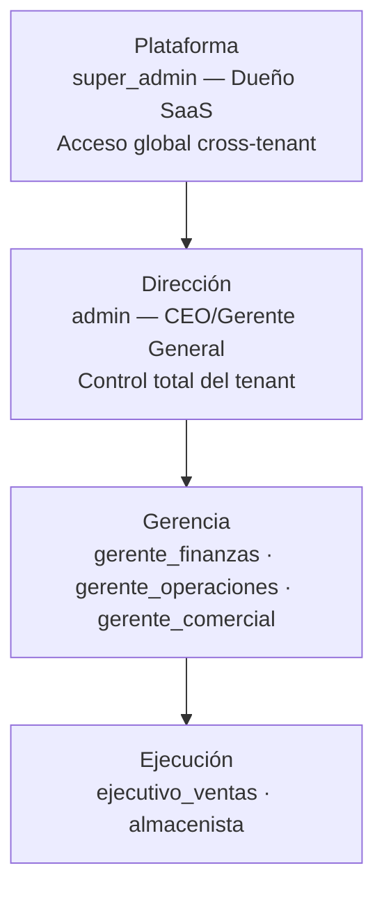
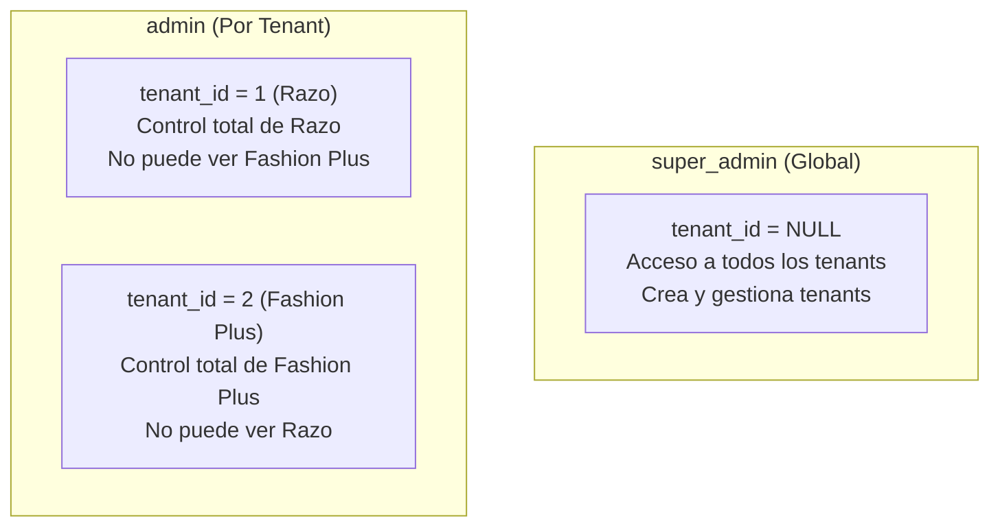
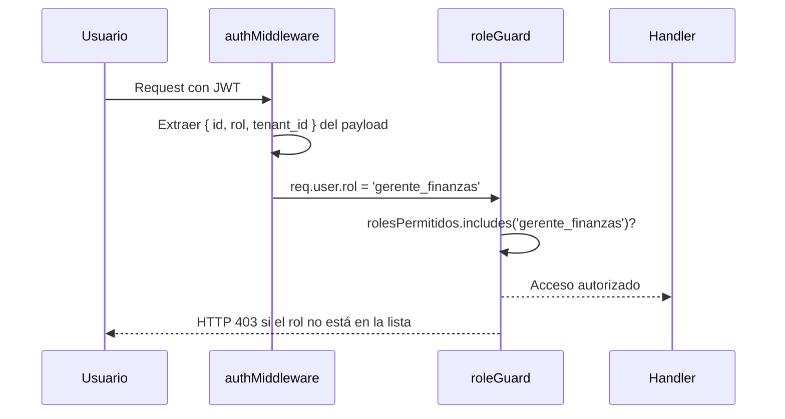
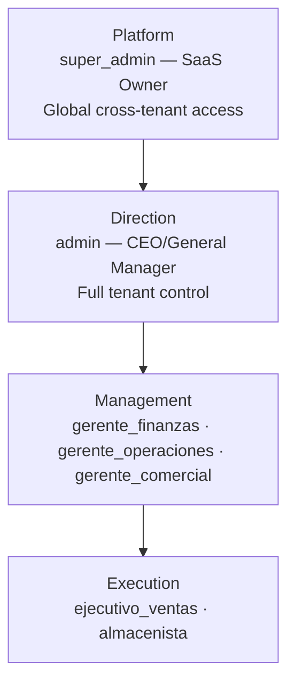
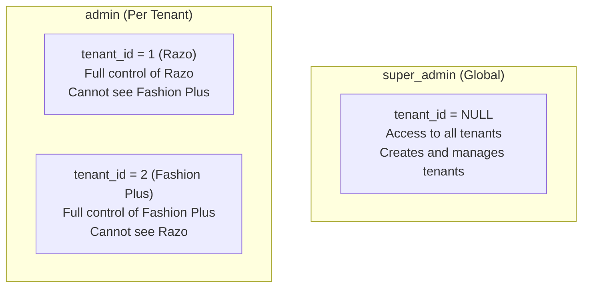
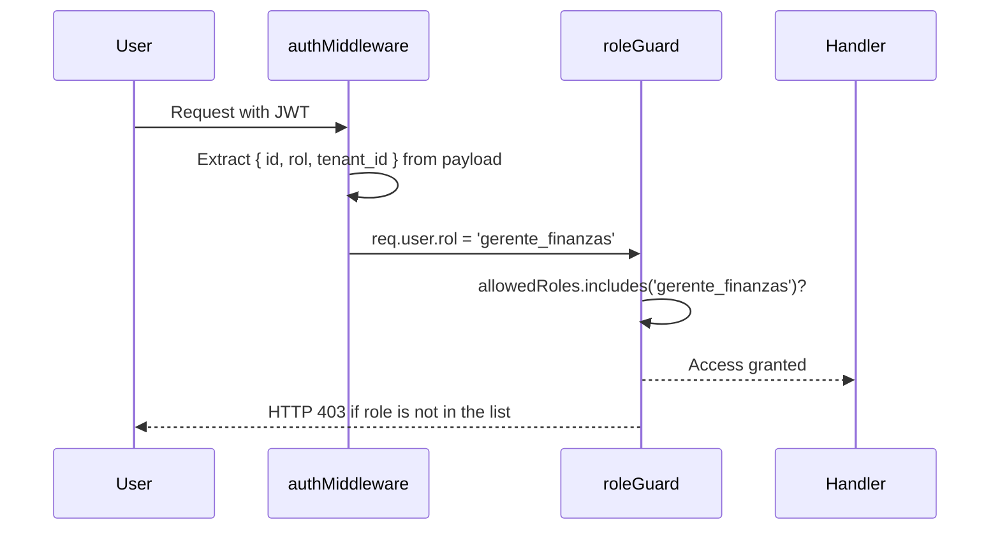

# Gobernanza y Control de Acceso / Access Governance and Control

🇲🇽 Español

RazoConnect implementa un sistema de control de acceso basado en roles (RBAC) con 7 roles mapeados a perfiles reales de empresa. Cada rol representa una función específica dentro del negocio y determina qué módulos, acciones y datos son accesibles para el usuario que lo ostenta.

---

## Tabla de Contenidos

- [Roles Empresariales](#roles-empresariales-7-niveles)
- [Diseño del Modelo RBAC](#diseño-del-modelo-rbac)
- [Matriz de Acceso a Módulos](#matriz-de-acceso-a-módulos-7-roles)
- [Decisiones de Diseño RBAC](#decisiones-de-diseño-rbac)

---

## Roles Empresariales (7 Niveles)

RazoConnect implementa RBAC con 7 roles mapeados a perfiles reales de empresa:

| Nivel | Rol | Perfil Real | Responsabilidades |
|---|---|---|---|
| **Plataforma** | super_admin | Dueño SaaS | Gestión global de tenants, creación de negocios |
| **Dirección** | admin | CEO/Gerente General | Control total del tenant, aprobaciones finales |
| **Finanzas** | gerente_finanzas | CFO/Director Financiero | Crédito, cobranza, reportes, límites |
| **Operaciones** | gerente_operaciones | Director de Operaciones | Inventario, compras, almacén, logística |
| **Comercial** | gerente_comercial | Director Comercial/VP Ventas | Agentes, clientes, comisiones, carteras |
| **Ejecución** | ejecutivo_ventas | Agente de Ventas | Pedidos de clientes, cartera asignada |
| **Ejecución** | almacenista | Operador de Almacén | Movimientos físicos, kardex, recepción |

---

## Diseño del Modelo RBAC

**Un rol por usuario, no array de roles.**
Simplifica evaluación: `rolesPermitidos.includes(req.user.rol)` en lugar de iterar arrays.

**Aislamiento explícito: gerentes no heredan operaciones.**
`gerente_finanzas` puede VER crédito pero no puede operar inventario.
No es inversión de control de acceso: es una decisión de negocio clara.

**Roles mapeados a funciones reales de empresa.**
No es RBAC genérico (viewer, editor, admin). Es: CFO, Director Ops, VP Sales.
Esto refleja que el sistema entiende el negocio, no solo "usuarios y permisos".

**super_admin es el único cross-tenant.**
Un admin de Razo no ve datos de Fashion Plus. Segregación total.
super_admin puede operar en cualquier tenant pasando tenant_id explícito.

---

## Matriz de Acceso a Módulos (7 Roles)

| Módulo | super_admin | admin | gte_finanzas | gte_operaciones | gte_comercial | ej_ventas | almacenista |
|---|:---:|:---:|:---:|:---:|:---:|:---:|:---:|
| Panel Admin | ✓ | ✓ | ver | ver | ver | — | — |
| Catálogo/Inventario | ✓ | ✓ | — | ✓ | ver | ver | ver |
| Crédito/Cobranza | ✓ | ✓ | ✓ | — | — | — | — |
| Pedidos | ✓ | ✓ | ver | ver | ✓ | ✓ | — |
| Compras/Proveedores | ✓ | ✓ | — | ✓ | — | — | — |
| Clientes | ✓ | ✓ | — | — | ✓ | ver | — |
| Comisiones | ✓ | ✓ | ver | — | ✓ | ver | — |
| Reportes | ✓ | ✓ | ✓ | ✓ | ver | — | — |
| Audit Log | ✓ | ✓ | — | — | — | — | — |

**Leyenda:** ✓ = acceso completo (CRUD) | ver = solo lectura | — = sin acceso

---

## Decisiones de Diseño RBAC

**No herencia automática entre niveles.**
Cada rol tiene permisos explícitamente asignados. Un gerente no "hereda" permisos de ejecutivo. Evita escalación de privilegios accidental.

**Aislamiento a nivel middleware + BD.**
El rol se valida en Express middleware ANTES de llegar al handler.
Además, queries de BD incluyen `WHERE tenant_id = $1` automáticamente.
Defensa en profundidad: dos capas de validación.

**Un solo rol activo por sesión.**
No puedes ser CFO y VP Ventas simultáneamente en la misma sesión.
Simplifica auditoría: cada acción tiene un rol claro asociado.

---

Desarrollado por Fernando Ramírez | <a href="https://xcore-byg8fkdve4eyatbz.mexicocentral-01.azurewebsites.net/">xCore</a>

🇺🇸 English

RazoConnect implements a Role-Based Access Control (RBAC) system with 7 roles mapped to real company profiles. Each role represents a specific function within the business and determines which modules, actions, and data are accessible to the user holding it.

---

## Table of Contents

- [Business Roles](#business-roles-7-levels)
- [RBAC Model Design](#rbac-model-design)
- [Module Access Matrix](#module-access-matrix-7-roles)
- [RBAC Design Decisions](#rbac-design-decisions)

---

## Business Roles (7 Levels)

RazoConnect implements RBAC with 7 roles mapped to real company profiles:

| Level | Role | Real Profile | Responsibilities |
|---|---|---|---|
| **Platform** | super_admin | SaaS Owner | Global tenant management, business creation |
| **Direction** | admin | CEO/General Manager | Full tenant control, final approvals |
| **Finance** | gerente_finanzas | CFO/Financial Director | Credit, collections, reports, limits |
| **Operations** | gerente_operaciones | Director of Operations | Inventory, purchasing, warehouse, logistics |
| **Commercial** | gerente_comercial | Commercial Director/VP Sales | Agents, clients, commissions, portfolios |
| **Execution** | ejecutivo_ventas | Sales Agent | Client orders, assigned portfolio |
| **Execution** | almacenista | Warehouse Operator | Physical movements, kardex, reception |

---

## RBAC Model Design

**One role per user, not an array of roles.**
Simplifies evaluation: `allowedRoles.includes(req.user.rol)` instead of iterating arrays.

**Explicit isolation: managers do not inherit operational permissions.**
`gerente_finanzas` can VIEW credit but cannot operate inventory.
This is not an access control inversion: it is a clear business decision.

**Roles mapped to real company functions.**
Not generic RBAC (viewer, editor, admin). It is: CFO, Director Ops, VP Sales.
This reflects that the system understands the business, not just "users and permissions".

**super_admin is the only cross-tenant role.**
A Razo admin cannot see Fashion Plus data. Total segregation.
super_admin can operate in any tenant by passing tenant_id explicitly.

---

## Module Access Matrix (7 Roles)

| Module | super_admin | admin | gte_finanzas | gte_operaciones | gte_comercial | ej_ventas | almacenista |
|---|:---:|:---:|:---:|:---:|:---:|:---:|:---:|
| Admin Panel | ✓ | ✓ | ver | ver | ver | — | — |
| Catalog/Inventory | ✓ | ✓ | — | ✓ | ver | ver | ver |
| Credit/Collections | ✓ | ✓ | ✓ | — | — | — | — |
| Orders | ✓ | ✓ | ver | ver | ✓ | ✓ | — |
| Purchasing/Suppliers | ✓ | ✓ | — | ✓ | — | — | — |
| Clients | ✓ | ✓ | — | — | ✓ | ver | — |
| Commissions | ✓ | ✓ | ver | — | ✓ | ver | — |
| Reports | ✓ | ✓ | ✓ | ✓ | ver | — | — |
| Audit Log | ✓ | ✓ | — | — | — | — | — |

**Legend:** ✓ = full access (CRUD) | ver = read-only | — = no access

---

## RBAC Design Decisions

**No automatic inheritance between levels.**
Each role has explicitly assigned permissions. A manager does not "inherit" executor permissions. Prevents accidental privilege escalation.

**Isolation at middleware + DB level.**
The role is validated in Express middleware BEFORE reaching the handler.
Additionally, DB queries automatically include `WHERE tenant_id = $1`.
Defense in depth: two validation layers.

**One active role per session.**
You cannot be CFO and VP Sales simultaneously in the same session.
Simplifies auditing: every action has a clear associated role.

---

Developed by Fernando Ramírez | <a href="https://xcore-byg8fkdve4eyatbz.mexicocentral-01.azurewebsites.net/">xCore</a>

