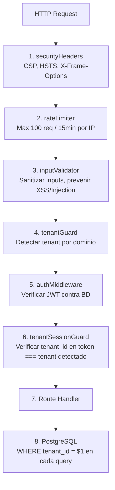
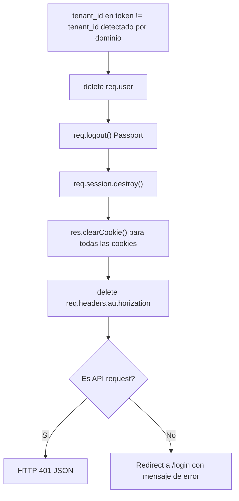

# Capas de Seguridad en RazoConnect

RazoConnect implementa seguridad en profundidad: diez mecanismos independientes que protegen la aplicacion en distintos niveles. Ninguno depende de que el anterior sea perfecto. Todos estan escritos a mano siguiendo OWASP Top 10, sin depender de paquetes de terceros como helmet.

---

## Tabla de Contenidos

- [Flujo de Seguridad](#flujo-de-seguridad)
- [Capa 1 — securityHeaders](#capa-1--securityheaders)
- [Capa 2 — rateLimiter](#capa-2--ratelimiter)
- [Capa 3 — inputValidator](#capa-3--inputvalidator)
- [Capa 4 — tenantGuard](#capa-4--tenantguard)
- [Capa 5 — authMiddleware](#capa-5--authmiddleware)
- [Capa 6 — tenantSessionGuard](#capa-6--tenantsessionguard)
- [Capa 7 — validateUserTenant](#capa-7--validateusertenant)
- [Capa 8 — Row-Level Security en BD](#capa-8--row-level-security-en-bd)
- [Capa 9 — secretsValidator](#capa-9--secretsvalidator)
- [Capa 10 — checkCreditAccess y checkCreditStatus](#capa-10--checkcreditaccess-y-checkcreditstatus)
- [Destruccion de Sesion ante Mismatch](#destruccion-de-sesion-ante-mismatch)
- [Matriz de Amenazas](#matriz-de-amenazas)

---

## Flujo de Seguridad

Cada peticion HTTP atraviesa las capas en orden. Una peticion que falla en cualquier punto es rechazada sin continuar.

---

## Capa 1 — securityHeaders

El middleware `securityHeaders` adjunta cabeceras de seguridad HTTP a cada respuesta. Esta implementado a mano, sin helmet, para garantizar comprension exacta de lo que hace cada cabecera.

| Cabecera | Valor | Proposito |
|---|---|---|
| Content-Security-Policy | Directivas restrictivas por tipo de recurso | Previene XSS al limitar origenes de scripts, estilos e iframes |
| Strict-Transport-Security | max-age=31536000; includeSubDomains | Fuerza HTTPS durante un ano completo |
| X-Frame-Options | DENY | Previene clickjacking al prohibir embeder la app en iframes |
| X-XSS-Protection | 1; mode=block | Activa el filtro XSS del navegador (compatibilidad) |
| X-Content-Type-Options | nosniff | Previene MIME sniffing |
| Referrer-Policy | strict-origin-when-cross-origin | Controla que informacion se envia en el header Referer |

---

## Capa 2 — rateLimiter

El rate limiter esta implementado sin dependencias externas. Usa un Map en memoria con limpieza automatica para rastrear el numero de peticiones por IP en una ventana de tiempo.

Caracteristicas clave:
- Maximo 100 peticiones por IP cada 15 minutos en rutas generales
- Limites mas estrictos en rutas de autenticacion
- Limpieza automatica de entradas expiradas para evitar fugas de memoria
- Responde con cabeceras `X-RateLimit-Limit`, `X-RateLimit-Remaining` y `X-RateLimit-Reset`
- No depende de Redis ni de ningun servicio externo

---

## Capa 3 — inputValidator

El validador de inputs sanitiza recursivamente todos los campos del body, query y params antes de que lleguen a cualquier controlador.

Operaciones que realiza:
- Sanitizacion recursiva de objetos anidados
- Prevencion de prototype pollution (bloquea claves como `__proto__`, `constructor`, `prototype`)
- Eliminacion de null bytes (`\0`) que pueden evadir validaciones downstream
- Escape de caracteres HTML para prevenir XSS reflejado
- Rechazo de inputs que superan limites de longitud configurables

---

## Capa 4 — tenantGuard

Detecta el tenant de la peticion a partir del hostname HTTP. Normaliza el dominio (elimina `www.`), lo busca en la tabla `tenants` y lo adjunta a `req.tenant`. Si el dominio no existe o el tenant esta inactivo, la peticion es rechazada con error 404 antes de llegar a auth.

---

## Capa 5 — authMiddleware

Verifica el JWT adjunto a la peticion. La verificacion incluye:
- Firma criptografica del token
- Fecha de expiracion
- Existencia del usuario en la base de datos (el token no es puramente stateless: se valida contra BD para detectar usuarios revocados)
- Rol del usuario en el contexto del tenant

---

## Capa 6 — tenantSessionGuard

Compara el `tenant_id` embebido en el JWT contra el `tenant_id` detectado por el dominio en la capa 4. Si no coinciden, ejecuta una secuencia de destruccion completa de la sesion.

---

## Capa 7 — validateUserTenant

Middleware adicional que verifica que `user.tenant_id === request.tenant_id` en el nivel de handler. Es una segunda verificacion, independiente de tenantSessionGuard, aplicada en rutas que operan sobre recursos del tenant.

---

## Capa 8 — Row-Level Security en BD

Cada query de base de datos incluye `WHERE tenant_id = $1` como parametro. Esta es la ultima linea de defensa: incluso si todas las capas anteriores fueran comprometidas, la base de datos solo retorna filas del tenant correcto.

El patron se aplica sin excepciones en todas las tablas que contienen datos de negocio: productos, clientes, pedidos, inventario, creditos, notificaciones y audit_log.

---

## Capa 9 — secretsValidator

Al arrancar la aplicacion, `runSecurityAudit` ejecuta una auditoria de variables de entorno antes de que el servidor acepte peticiones:

- Verifica que todas las variables de entorno criticas esten definidas (JWT_SECRET, DATABASE_URL, CLOUDINARY_*, MERCADOPAGO_*, etc.)
- Valida que los secretos tengan suficiente entropia (longitud minima configurable)
- Si alguna validacion falla, el proceso termina con un mensaje descriptivo antes de abrir el puerto

Esto previene arranques accidentales con configuracion incompleta o secretos debiles.

---

## Capa 10 — checkCreditAccess y checkCreditStatus

Middlewares especializados que se aplican antes de confirmar pedidos con pago a credito:

**checkCreditAccess:** Verifica que el cliente tiene una linea de credito activa y que el tenant tiene habilitado el modulo de credito.

**checkCreditStatus:** Verifica el estado actual del credito del cliente (ACTIVO, SUSPENDIDO, CANCELADO), el limite disponible y la ausencia de deudas vencidas. Si el cliente tiene deuda vencida o el credito esta suspendido, el pedido es rechazado antes de procesarse.

---

## Destruccion de Sesion ante Mismatch

La destruccion de sesion en la capa 6 no es un simple `return res.status(401)`. Es una secuencia de limpieza que elimina todos los artefactos de autenticacion de la peticion y de la sesion del servidor:

1. `delete req.user` — elimina el objeto de usuario de la peticion
2. `req.logout()` — notifica a Passport que la sesion termino
3. `req.session.destroy()` — destruye la sesion en el store del servidor
4. `res.clearCookie()` — elimina todas las cookies de sesion y JWT
5. `delete req.headers.authorization` — elimina el header de autorizacion

Despues de esta secuencia, la peticion devuelve 401 (API) o redirige a `/login` (web).

---

## Matriz de Amenazas

| Amenaza | Capas que la mitigan |
|---|---|
| XSS reflejado o almacenado | securityHeaders (CSP), inputValidator |
| Clickjacking | securityHeaders (X-Frame-Options) |
| Brute force en login | rateLimiter |
| Prototype pollution | inputValidator |
| Null byte injection | inputValidator |
| Cookie robada en otro tenant | tenantSessionGuard |
| JWT reutilizado en otro tenant | tenantSessionGuard |
| Token de usuario revocado | authMiddleware (valida contra BD) |
| Acceso a datos de otro tenant por SQL | Row-Level Security en BD |
| Arranque con secretos debiles | secretsValidator |
| Pedido con credito suspendido | checkCreditStatus |
| MITM / HTTP en texto plano | securityHeaders (HSTS) |

---

Desarrollado por Diego Ferram | xCore — 2025
