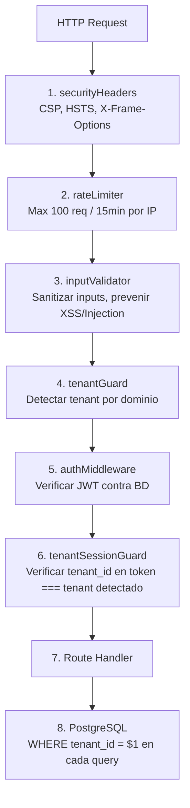
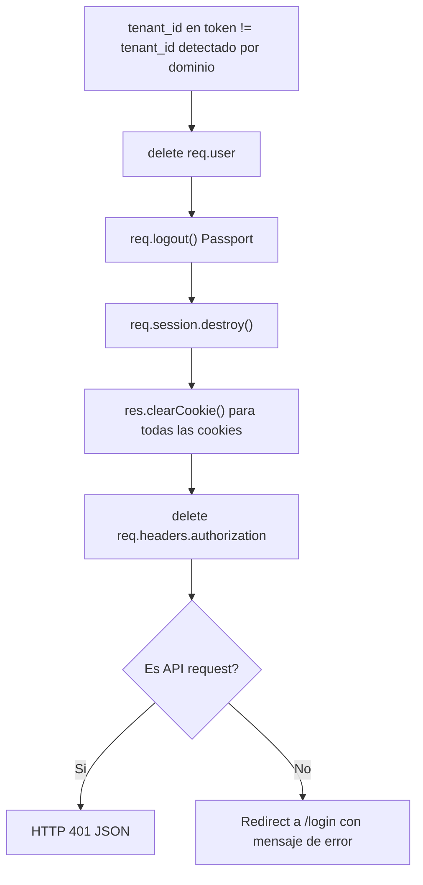

# Capas de Seguridad en RazoConnect / Security Layers in RazoConnect

🇲🇽 Español

RazoConnect implementa seguridad en profundidad: diez mecanismos independientes que protegen la aplicación en distintos niveles. Ninguno depende de que el anterior sea perfecto. Todos están escritos a mano siguiendo OWASP Top 10, sin depender de paquetes de terceros como helmet.

---

## Tabla de Contenidos

- [Flujo de Seguridad](#flujo-de-seguridad)
- [Capa 1 — securityHeaders](#capa-1--securityheaders)
- [Capa 2 — rateLimiter](#capa-2--ratelimiter)
- [Capa 3 — inputValidator](#capa-3--inputvalidator)
- [Capa 4 — tenantGuard](#capa-4--tenantguard)
- [Capa 5 — authMiddleware](#capa-5--authmiddleware)
- [Capa 6 — tenantSessionGuard](#capa-6--tenantsessionguard)
- [Capa 7 — validateUserTenant](#capa-7--validateusertenant)
- [Capa 8 — Row-Level Security en BD](#capa-8--row-level-security-en-bd)
- [Capa 9 — secretsValidator](#capa-9--secretsvalidator)
- [Capa 10 — checkCreditAccess y checkCreditStatus](#capa-10--checkcreditaccess-y-checkcreditstatus)
- [Destrucción de Sesión ante Mismatch](#destrucción-de-sesión-ante-mismatch)
- [Matriz de Amenazas](#matriz-de-amenazas)

---

## Flujo de Seguridad

Cada petición HTTP atraviesa las capas en orden. Una petición que falla en cualquier punto es rechazada sin continuar.

---

## Capa 1 — securityHeaders

El middleware `securityHeaders` adjunta cabeceras de seguridad HTTP a cada respuesta. Está implementado a mano, sin helmet, para garantizar comprensión exacta de lo que hace cada cabecera.

| Cabecera | Valor | Propósito |
|---|---|---|
| Content-Security-Policy | Directivas restrictivas por tipo de recurso | Previene XSS al limitar origenes de scripts, estilos e iframes |
| Strict-Transport-Security | max-age=31536000; includeSubDomains | Fuerza HTTPS durante un ano completo |
| X-Frame-Options | DENY | Previene clickjacking al prohibir embeder la app en iframes |
| X-XSS-Protection | 1; mode=block | Activa el filtro XSS del navegador (compatibilidad) |
| X-Content-Type-Options | nosniff | Previene MIME sniffing |
| Referrer-Policy | strict-origin-when-cross-origin | Controla que información se envia en el header Referer |

---

## Capa 2 — rateLimiter

El rate limiter utiliza `express-rate-limit` con `RedisStore` respaldado por **Azure Cache for Redis** (TLS obligatorio en puerto 6380). Al correr en Azure App Service con múltiples instancias, un Map en memoria no garantiza el limite global; Redis centraliza el contador entre todas las instancias.

Caracteristicas clave:
- **globalLimiter**: 300 peticiones por IP cada 15 minutos en todas las rutas `/api`
- **authLimiter**: 10 intentos por IP cada 15 minutos en rutas de login de admin, con `skipSuccessfulRequests: true`
- Limite aplicado globalmente en todas las instancias del App Service
- Revocación inmediata posible vaciando la clave en Redis

Ver [RATE_LIMITING.md](RATE_LIMITING.md) para la arquitectura detallada.

---

## Capa 3 — inputValidator

El validador de inputs sanitiza recursivamente todos los campos del body, query y params antes de que lleguen a cualquier controlador.

Operaciones que realiza:
- Sanitización recursiva de objetos anidados
- Prevención de prototype pollution (bloquea claves como `__proto__`, `constructor`, `prototype`)
- Eliminación de null bytes (`\0`) que pueden evadir validaciones downstream
- Escape de caracteres HTML para prevenir XSS reflejado
- Rechazo de inputs que superan limites de longitud configurables

---

## Capa 4 — tenantGuard

Detecta el tenant de la petición a partir del hostname HTTP. Normaliza el dominio (elimina `www.`), lo busca en la tabla `tenants` y lo adjunta a `req.tenant`. Si el dominio no existe o el tenant está inactivo, la petición es rechazada con error 404 antes de llegar a auth.

---

## Capa 5 — authMiddleware

Verifica el JWT adjunto a la petición. La verificación incluye:
- Firma criptográfica del token
- Fecha de expiración
- Existencia del usuario en la base de datos (el token no es puramente stateless: se válida contra BD para detectar usuarios revocados)
- Extracción de `id` y `rol` del payload normalizado `{ id, rol, email, tenant_id }`

Los access tokens tienen duración de 1 hora. Cuando expiran, el cliente ejecuta el silent refresh via `/api/auth/refresh` para obtener un nuevo access token sin interrumpir la sesión. Los refresh tokens (30 dias) se almacenan en Azure Cache for Redis para permitir revocación centralizada.

Ver [REFRESH_TOKENS.md](REFRESH_TOKENS.md) para la arquitectura de tokens duales.

---

## Capa 6 — tenantSessionGuard

Compara el `tenant_id` embebido en el JWT contra el `tenant_id` detectado por el dominio en la capa 4. Si no coinciden, ejecuta una secuencia de destrucción completa de la sesión.

---

## Capa 7 — validateUserTenant

Middleware adicional que verifica que `user.tenant_id === request.tenant_id` en el nivel de handler. Es una segunda verificación, independiente de tenantSessionGuard, aplicada en rutas que operan sobre recursos del tenant.

---

## Capa 8 — Row-Level Security en BD

Cada query de base de datos incluye `WHERE tenant_id = $1` como parámetro. Esta es la última linea de defensa: incluso si todas las capas anteriores fueran comprometidas, la base de datos solo retorna filas del tenant correcto.

El patrón se aplica sin excepciones en todas las tablas que contienen datos de negocio: productos, clientes, pedidos, inventario, créditos, notificaciones y audit_log.

---

## Capa 9 — secretsValidator

Al arrancar la aplicación, `runSecurityAudit` ejecuta una auditoría de variables de entorno antes de que el servidor acepte peticiones:

- Verifica que todas las variables de entorno críticas esten definidas (JWT_SECRET, DATABASE_URL, CLOUDINARY_*, MERCADOPAGO_*, etc.)
- Válida que los secretos tengan suficiente entropia (longitud mínima configurable)
- Si alguna validación falla, el proceso termina con un mensaje descriptivo antes de abrir el puerto

Esto previene arranques accidentales con configuración incompleta o secretos debiles.

---

## Capa 10 — checkCreditAccess y checkCreditStatus

Middlewares especializados que se aplican antes de confirmar pedidos con pago a crédito:

**checkCreditAccess:** Verifica que el cliente tiene una linea de crédito activa y que el tenant tiene habilitado el módulo de crédito.

**checkCreditStatus:** Verifica el estado actual del crédito del cliente (ACTIVO, SUSPENDIDO, CANCELADO), el limite disponible y la ausencia de deudas vencidas. Si el cliente tiene deuda vencida o el crédito está suspendido, el pedido es rechazado antes de procesarse.

---

## Destrucción de Sesión ante Mismatch

La destrucción de sesión en la capa 6 no es un simple `return res.status(401)`. Es una secuencia de limpieza que elimina todos los artefactos de autenticación de la petición y de la sesión del servidor:

1. `delete req.user` — elimina el objeto de usuario de la petición
2. `req.logout()` — notifica a Passport que la sesión termino
3. `req.session.destroy()` — destruye la sesión en el store del servidor
4. `res.clearCookie()` — elimina todas las cookies de sesión y JWT
5. `delete req.headers.authorization` — elimina el header de autorización

Despues de esta secuencia, la petición devuelve 401 (API) o redirige a `/login` (web).

---

## Matriz de Amenazas

| Amenaza | Capas que la mitigan |
|---|---|
| XSS reflejado o almacenado | securityHeaders (CSP), inputValidator |
| Clickjacking | securityHeaders (X-Frame-Options) |
| Brute force en login | rateLimiter (authLimiter — 10 intentos / 15min con Redis) |
| Prototype pollution | inputValidator |
| Null byte injection | inputValidator |
| Cookie robada en otro tenant | tenantSessionGuard |
| JWT reutilizado en otro tenant | tenantSessionGuard |
| Token de usuario revocado | authMiddleware (válida contra BD) |
| Refresh token robado | Revocación inmediata en Redis |
| Access token de larga duración comprometido | Arquitectura dual — access tokens de 1h (REFRESH_TOKENS.md) |
| Limite global eludido en multi-instancia | Rate limiting distribuido con Redis (RATE_LIMITING.md) |
| Acceso a datos de otro tenant por SQL | Row-Level Security en BD |
| Arranque con secretos debiles | secretsValidator |
| Pedido con crédito suspendido | checkCreditStatus |
| MITM / HTTP en texto plano | securityHeaders (HSTS) |

---

Desarrollado por Fernando Ramírez | <a href="https://xcore-byg8fkdve4eyatbz.mexicocentral-01.azurewebsites.net/">xCore</a>

🇺🇸 English

RazoConnect implements defense in depth: ten independent mechanisms that protect the application at different levels. None depends on the previous one being perfect. All are written by hand following OWASP Top 10, without relying on third-party packages like helmet.

---

## Table of Contents

- [Security Flow](#security-flow)
- [Layer 1 — securityHeaders](#layer-1--securityheaders)
- [Layer 2 — rateLimiter](#layer-2--ratelimiter)
- [Layer 3 — inputValidator](#layer-3--inputvalidator)
- [Layer 4 — tenantGuard](#layer-4--tenantguard)
- [Layer 5 — authMiddleware](#layer-5--authmiddleware)
- [Layer 6 — tenantSessionGuard](#layer-6--tenantsessionguard)
- [Layer 7 — validateUserTenant](#layer-7--validateusertenant)
- [Layer 8 — Row-Level Security in DB](#layer-8--row-level-security-in-db)
- [Layer 9 — secretsValidator](#layer-9--secretsvalidator)
- [Layer 10 — checkCreditAccess and checkCreditStatus](#layer-10--checkcreditaccess-and-checkcreditstatus)
- [Session Destruction on Mismatch](#session-destruction-on-mismatch)
- [Threat Matrix](#threat-matrix)

---

## Security Flow

Every HTTP request traverses the layers in order. A request that fails at any point is rejected without continuing.

---

## Layer 1 — securityHeaders

The `securityHeaders` middleware attaches HTTP security headers to every response. It is implemented by hand, without helmet, to guarantee exact understanding of what each header does.

| Header | Value | Purpose |
|---|---|---|
| Content-Security-Policy | Restrictive directives by resource type | Prevents XSS by restricting origins for scripts, styles, and iframes |
| Strict-Transport-Security | max-age=31536000; includeSubDomains | Forces HTTPS for a full year |
| X-Frame-Options | DENY | Prevents clickjacking by prohibiting embedding the app in iframes |
| X-XSS-Protection | 1; mode=block | Activates the browser XSS filter (compatibility) |
| X-Content-Type-Options | nosniff | Prevents MIME sniffing |
| Referrer-Policy | strict-origin-when-cross-origin | Controls what information is sent in the Referer header |

---

## Layer 2 — rateLimiter

The rate limiter uses `express-rate-limit` with `RedisStore` backed by **Azure Cache for Redis** (TLS required on port 6380). Running on Azure App Service with multiple instances, an in-memory Map does not guarantee the global limit; Redis centralizes the counter across all instances.

Key characteristics:
- **globalLimiter**: 300 requests per IP every 15 minutes on all `/api` routes
- **authLimiter**: 10 attempts per IP every 15 minutes on admin login routes, with `skipSuccessfulRequests: true`
- Limit enforced globally across all App Service instances
- Immediate revocation possible by clearing the key in Redis

See [RATE_LIMITING.md](RATE_LIMITING.md) for the detailed architecture.

---

## Layer 3 — inputValidator

The input validator recursively sanitizes all body, query, and params fields before they reach any controller.

Operations performed:
- Recursive sanitization of nested objects
- Prevention of prototype pollution (blocks keys like `__proto__`, `constructor`, `prototype`)
- Removal of null bytes (`\0`) that can bypass downstream validations
- Escaping HTML characters to prevent reflected XSS
- Rejection of inputs exceeding configurable length limits

---

## Layer 4 — tenantGuard

Detects the tenant of the request from the HTTP hostname. Normalizes the domain (removes `www.`), looks it up in the `tenants` table, and attaches it to `req.tenant`. If the domain doesn't exist or the tenant is inactive, the request is rejected with error 404 before reaching auth.

---

## Layer 5 — authMiddleware

Verifies the JWT attached to the request. The verification includes:
- Cryptographic signature of the token
- Expiration date
- Existence of the user in the database (the token is not purely stateless: it is validated against the DB to detect revoked users)
- Extraction of `id` and `rol` from the normalized payload `{ id, rol, email, tenant_id }`

Access tokens have a duration of 1 hour. When they expire, the client executes the silent refresh via `/api/auth/refresh` to obtain a new access token without interrupting the session. Refresh tokens (30 days) are stored in Azure Cache for Redis to allow centralized revocation.

See [REFRESH_TOKENS.md](REFRESH_TOKENS.md) for the dual token architecture.

---

## Layer 6 — tenantSessionGuard

Compares the `tenant_id` embedded in the JWT against the `tenant_id` detected by the domain in layer 4. If they don't match, it executes a complete session destruction sequence.

---

## Layer 7 — validateUserTenant

Additional middleware that verifies `user.tenant_id === request.tenant_id` at the handler level. It is a second verification, independent of tenantSessionGuard, applied to routes that operate on tenant resources.

---

## Layer 8 — Row-Level Security in DB

Every database query includes `WHERE tenant_id = $1` as a parameter. This is the last line of defense: even if all previous layers were compromised, the database only returns rows for the correct tenant.

The pattern is applied without exception in all tables containing business data: productos, clientes, pedidos, inventario, creditos, notificaciones, and audit_log.

---

## Layer 9 — secretsValidator

On application startup, `runSecurityAudit` runs an environment variable audit before the server accepts requests:

- Verifies that all critical environment variables are defined (JWT_SECRET, DATABASE_URL, CLOUDINARY_*, MERCADOPAGO_*, etc.)
- Validates that secrets have sufficient entropy (configurable minimum length)
- If any validation fails, the process terminates with a descriptive message before opening the port

This prevents accidental starts with incomplete configuration or weak secrets.

---

## Layer 10 — checkCreditAccess and checkCreditStatus

Specialized middlewares applied before confirming orders with credit payment:

**checkCreditAccess:** Verifies that the client has an active credit line and that the tenant has the credit module enabled.

**checkCreditStatus:** Verifies the current credit status of the client (ACTIVO, SUSPENDIDO, CANCELADO), the available limit, and the absence of overdue debts. If the client has overdue debt or the credit is suspended, the order is rejected before processing.

---

## Session Destruction on Mismatch

The session destruction in layer 6 is not a simple `return res.status(401)`. It is a cleanup sequence that removes all authentication artifacts from the request and the server session:

1. `delete req.user` — removes the user object from the request
2. `req.logout()` — notifies Passport that the session ended
3. `req.session.destroy()` — destroys the session in the server store
4. `res.clearCookie()` — removes all session and JWT cookies
5. `delete req.headers.authorization` — removes the authorization header

After this sequence, the request returns 401 (API) or redirects to `/login` (web).

---

## Threat Matrix

| Threat | Layers that mitigate it |
|---|---|
| Reflected or stored XSS | securityHeaders (CSP), inputValidator |
| Clickjacking | securityHeaders (X-Frame-Options) |
| Login brute force | rateLimiter (authLimiter — 10 attempts / 15min with Redis) |
| Prototype pollution | inputValidator |
| Null byte injection | inputValidator |
| Cookie stolen in another tenant | tenantSessionGuard |
| JWT reused in another tenant | tenantSessionGuard |
| Revoked user token | authMiddleware (validates against DB) |
| Stolen refresh token | Immediate revocation in Redis |
| Long-lived access token compromised | Dual architecture — 1h access tokens (REFRESH_TOKENS.md) |
| Global limit bypassed in multi-instance | Distributed rate limiting with Redis (RATE_LIMITING.md) |
| SQL access to another tenant's data | Row-Level Security in DB |
| Startup with weak secrets | secretsValidator |
| Order with suspended credit | checkCreditStatus |
| MITM / plaintext HTTP | securityHeaders (HSTS) |

---

Developed by Fernando Ramírez | <a href="https://xcore-byg8fkdve4eyatbz.mexicocentral-01.azurewebsites.net/">xCore</a>

