# Sistema de Inventario Inteligente / Smart Inventory System

🇲🇽 Español

RazoConnect gestiona el inventario con tres mecanismos que trabajan en conjunto: asignacion FIFO con Priority Override para distribuir el stock disponible entre ordenes pendientes, Smart Reordering para normalizar cantidades de compra al empaque del proveedor, y notificaciones de restock a clientes con alertas activas en favoritos.

---

## Tabla de Contenidos

- [FIFO con Priority Override](#fifo-con-priority-override)
- [Flujo de Asignacion de Inventario](#flujo-de-asignacion-de-inventario)
- [Smart Reordering](#smart-reordering)
- [Notificaciones de Restock a Favoritos](#notificaciones-de-restock-a-favoritos)
- [OptimizationService](#optimizationservice)

---

## FIFO con Priority Override

El algoritmo base es FIFO (First In, First Out): las ordenes se surten en el orden en que llegaron. Sin embargo, las ordenes de clientes VIP pueden adelantarse en la fila. Cuando una orden VIP toma stock que estaba asignado a una orden normal, esa orden normal es degradada automaticamente y el cliente recibe una notificacion.

Este comportamiento es deliberado. FIFO puro es justo pero ignorante del valor comercial de cada cliente. Priority Override permite que el negocio honre sus compromisos con clientes estrategicos sin abandonar la transparencia: cada degradacion queda registrada y notificada.

```mermaid
flowchart TD
    Stock["Stock disponible: 1000 unidades"]
    OrdenA["Orden A — Normal — 500u — hace 5 dias"]
    OrdenB["Orden B — Normal — 300u — hace 3 dias"]
    OrdenC["Orden C — VIP — 250u — hace 1 dia"]

    Stock --> OrdenA
    OrdenA --> Surtida_A["Orden A Surtida\nStock restante: 500"]
    Surtida_A --> OrdenB
    OrdenB --> Surtida_B["Orden B Surtida\nStock restante: 200"]
    Surtida_B --> OrdenC
    OrdenC --> VIP_Check{"VIP con stock insuficiente\nToma stock de normales"}
    VIP_Check --> Degradacion["Orden B degradada a PARCIAL\nOrden C Surtida"]
    Degradacion --> Notificacion["Notificacion automatica a cliente de Orden B"]
```

---

## Flujo de Asignacion de Inventario

---

## Smart Reordering

Los proveedores venden en multiplos de empaque: cajas de 12, packs de 24, paquetes de 6. Cuando el sistema genera una orden de compra automatica, normaliza la cantidad solicitada al siguiente multiplo del empaque del proveedor.

El sobrante no se desperdicia. Queda disponible en el inventario para cubrir otras ordenes pendientes o futuras. Esto reduce el numero de ordenes de compra necesarias y optimiza el costo logistico por unidad.

---

## Notificaciones de Restock a Favoritos

Cuando un cliente agrega una variante de producto a favoritos con la alerta de restock activa, el sistema la registra. Cuando esa variante recibe nueva entrada de stock, el servicio de inventario notifica automaticamente a todos los clientes con alerta activa y desactiva la alerta para evitar notificaciones duplicadas.

---

## OptimizationService

El OptimizationService analiza las ordenes de compra pendientes del sistema y detecta oportunidades de consolidacion. Cuando hay multiples ordenes pendientes para el mismo proveedor y el mismo producto, el servicio calcula el ahorro potencial de consolidarlas en una sola orden y la cantidad optima considerando el empaque del proveedor.

El resultado es una sugerencia que el administrador puede aprobar o rechazar. Si la aprueba, el sistema crea un grupo de ordenes consolidadas manteniendo el tracking individual de cada orden para efectos de facturacion y recepcion.

---

Desarrollado por Fernando Ramírez | <a href="https://xcore-byg8fkdve4eyatbz.mexicocentral-01.azurewebsites.net/">xCore</a>

🇺🇸 English

RazoConnect manages inventory with three mechanisms working together: FIFO allocation with Priority Override to distribute available stock among pending orders, Smart Reordering to normalize purchase quantities to the supplier's packaging, and restock notifications to clients with active alerts in favorites.

---

## Table of Contents

- [FIFO with Priority Override](#fifo-with-priority-override)
- [Inventory Allocation Flow](#inventory-allocation-flow)
- [Smart Reordering](#smart-reordering-1)
- [Restock Notifications to Favorites](#restock-notifications-to-favorites)
- [OptimizationService](#optimizationservice-1)

---

## FIFO with Priority Override

The base algorithm is FIFO (First In, First Out): orders are fulfilled in the order they arrived. However, VIP client orders can move ahead in the queue. When a VIP order takes stock that was assigned to a normal order, that normal order is automatically downgraded and the client receives a notification.

This behavior is deliberate. Pure FIFO is fair but ignorant of the commercial value of each client. Priority Override allows the business to honor its commitments to strategic clients without abandoning transparency: each downgrade is recorded and notified.

---

## Inventory Allocation Flow

---

## Smart Reordering

Suppliers sell in packaging multiples: boxes of 12, packs of 24, packages of 6. When the system generates an automatic purchase order, it normalizes the requested quantity to the next multiple of the supplier's packaging.

The surplus is not wasted. It remains available in inventory to cover other pending or future orders. This reduces the number of required purchase orders and optimizes the logistics cost per unit.

---

## Restock Notifications to Favorites

When a client adds a product variant to favorites with the restock alert active, the system records it. When that variant receives new stock, the inventory service automatically notifies all clients with an active alert and deactivates the alert to avoid duplicate notifications.

---

## OptimizationService

The OptimizationService analyzes the system's pending purchase orders and detects consolidation opportunities. When there are multiple pending orders for the same supplier and the same product, the service calculates the potential savings from consolidating them into a single order and the optimal quantity considering the supplier's packaging.

The result is a suggestion that the administrator can approve or reject. If approved, the system creates a consolidated order group while maintaining individual tracking of each order for billing and receiving purposes.

---

Developed by Fernando Ramírez | <a href="https://xcore-byg8fkdve4eyatbz.mexicocentral-01.azurewebsites.net/">xCore</a>

