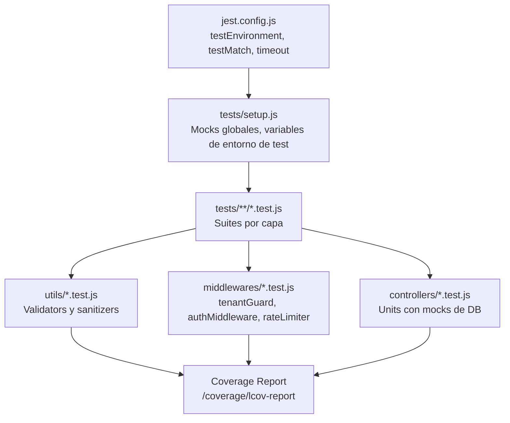
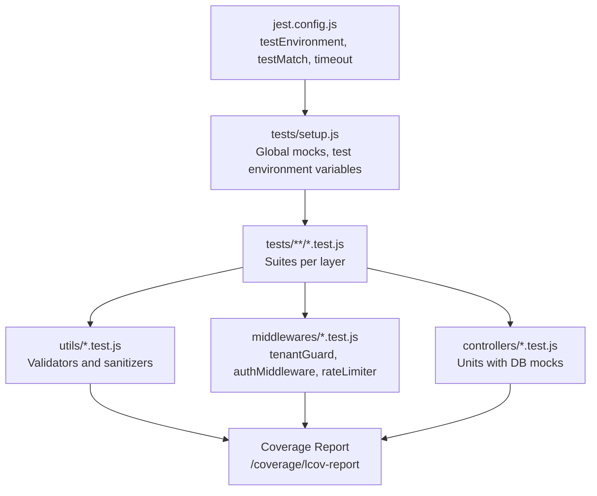

# Testing con Jest en RazoConnect / Testing with Jest in RazoConnect

🇲🇽 Español

RazoConnect utiliza Jest como framework de testing con cobertura de codigo configurada para controllers, middlewares y utils. Los tests validan la logica de negocio critica de forma aislada mediante mocks de base de datos, garantizando que cada capa pueda verificarse independientemente.

---

## Tabla de Contenidos

- [Configuracion de Jest](#configuracion-de-jest)
- [Scripts de NPM](#scripts-de-npm)
- [Flujo de Ejecucion](#flujo-de-ejecucion)
- [Que se Testea](#que-se-testea)

---

## Configuracion de Jest

El archivo `jest.config.js` centraliza toda la configuracion del runner:

| Opcion | Valor | Proposito |
|---|---|---|
| `testEnvironment` | `node` | Ejecuta los tests en entorno Node.js sin simular DOM |
| `testMatch` | `**/tests/**/*.test.js` | Detecta archivos de test dentro de la carpeta `/tests/` |
| `coverageDirectory` | `/coverage` | Directorio de salida para los reportes de cobertura |
| `collectCoverageFrom` | `utils/**`, `middlewares/**`, `controllers/**` excluyendo `node_modules` | Define el alcance del analisis de cobertura |
| `setupFilesAfterEnv` | `tests/setup.js` | Archivo de configuracion global ejecutado antes de cada suite |
| `testTimeout` | `10000` ms | Tiempo maximo de espera por test para operaciones async |

---

## Scripts de NPM

Definidos en `package.json` para los tres modos de ejecucion:

| Script | Comando | Uso |
|---|---|---|
| `test` | `jest --testEnvironment=node --detectOpenHandles` | Ejecuta todos los tests una vez; `--detectOpenHandles` detecta handles async sin cerrar |
| `test:watch` | `jest --watch` | Modo interactivo que re-ejecuta tests al detectar cambios en archivos |
| `test:coverage` | `jest --coverage` | Ejecuta los tests y genera el reporte de cobertura en `/coverage` |

---

## Flujo de Ejecucion

---

## Que se Testea

### Utils — Validators y Sanitizers

Los tests de `utils/` cubren las funciones de validacion y sanitizacion de inputs:

- Sanitizacion de strings con caracteres especiales y null bytes
- Validacion de formatos: email, telefono, RUC/RFC
- Prevencion de prototype pollution en objetos anidados
- Escape de caracteres HTML en campos de texto libre

### Middlewares

Los tests de middleware verifican el comportamiento de cada capa de seguridad con escenarios positivos y negativos:

- **tenantGuard**: resolucion correcta de tenant por hostname, rechazo de dominios inexistentes o tenants inactivos
- **authMiddleware**: validacion de JWT con payload normalizado `{ id, rol, email, tenant_id }`, rechazo de tokens expirados o con firma invalida, extraccion correcta de `id` y `rol`
- **rateLimiter**: aplicacion del limite configurado por IP, respuesta 429 al exceder el limite, reset de ventana de tiempo

### Controllers — Tests Unitarios con Mocks de DB

Los tests de controllers ejecutan la logica del controlador con mocks del cliente de base de datos (pg Pool). Se valida:

- Respuesta correcta ante datos validos
- Manejo de errores de base de datos (conexion fallida, constraint violation)
- Aplicacion del filtro `tenant_id` en queries
- Roles autorizados: `admin`, `agente`, `cliente`, `super_admin`

---

Desarrollado por Fernando Ramírez | <a href="https://xcore-byg8fkdve4eyatbz.mexicocentral-01.azurewebsites.net/">xCore</a>

🇺🇸 English

RazoConnect uses Jest as its testing framework with code coverage configured for controllers, middlewares, and utils. Tests validate critical business logic in isolation using database mocks, ensuring each layer can be verified independently.

---

## Table of Contents

- [Jest Configuration](#jest-configuration)
- [NPM Scripts](#npm-scripts)
- [Execution Flow](#execution-flow)
- [What Is Tested](#what-is-tested)

---

## Jest Configuration

The `jest.config.js` file centralizes all runner configuration:

| Option | Value | Purpose |
|---|---|---|
| `testEnvironment` | `node` | Runs tests in a Node.js environment without simulating a DOM |
| `testMatch` | `**/tests/**/*.test.js` | Detects test files inside the `/tests/` folder |
| `coverageDirectory` | `/coverage` | Output directory for coverage reports |
| `collectCoverageFrom` | `utils/**`, `middlewares/**`, `controllers/**` excluding `node_modules` | Defines the scope of the coverage analysis |
| `setupFilesAfterEnv` | `tests/setup.js` | Global configuration file executed before each suite |
| `testTimeout` | `10000` ms | Maximum wait time per test for async operations |

---

## NPM Scripts

Defined in `package.json` for the three execution modes:

| Script | Command | Use |
|---|---|---|
| `test` | `jest --testEnvironment=node --detectOpenHandles` | Runs all tests once; `--detectOpenHandles` detects unclosed async handles |
| `test:watch` | `jest --watch` | Interactive mode that re-runs tests when file changes are detected |
| `test:coverage` | `jest --coverage` | Runs tests and generates the coverage report in `/coverage` |

---

## Execution Flow

---

## What Is Tested

### Utils — Validators and Sanitizers

Tests in `utils/` cover input validation and sanitization functions:

- String sanitization with special characters and null bytes
- Format validation: email, phone, RUC/RFC
- Prototype pollution prevention in nested objects
- HTML character escaping in free-text fields

### Middlewares

Middleware tests verify the behavior of each security layer with positive and negative scenarios:

- **tenantGuard**: correct tenant resolution by hostname, rejection of nonexistent domains or inactive tenants
- **authMiddleware**: JWT validation with normalized payload `{ id, rol, email, tenant_id }`, rejection of expired or invalid-signature tokens, correct extraction of `id` and `rol`
- **rateLimiter**: enforcement of the configured limit per IP, 429 response on limit exceeded, time window reset

### Controllers — Unit Tests with DB Mocks

Controller tests execute the controller logic with mocks of the database client (pg Pool). Validated:

- Correct response with valid data
- Database error handling (failed connection, constraint violation)
- Application of the `tenant_id` filter in queries
- Authorized roles: `admin`, `agente`, `cliente`, `super_admin`

---

Developed by Fernando Ramírez | <a href="https://xcore-byg8fkdve4eyatbz.mexicocentral-01.azurewebsites.net/">xCore</a>

